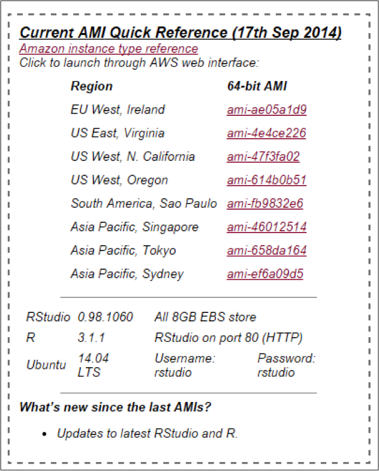
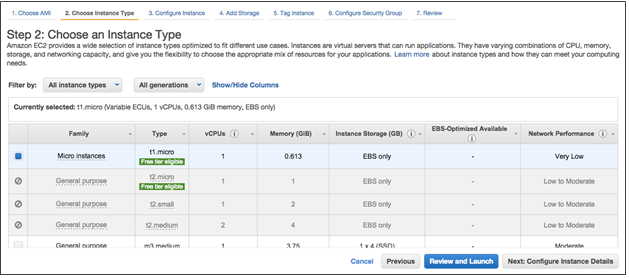
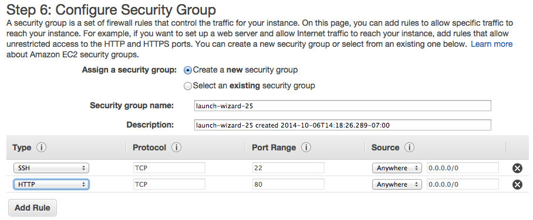
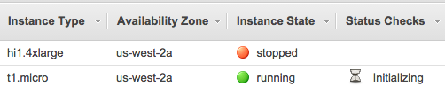
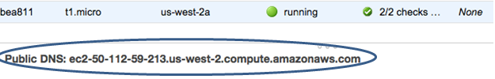
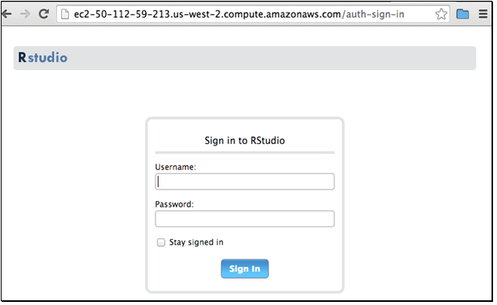
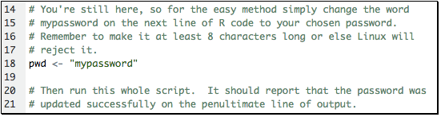
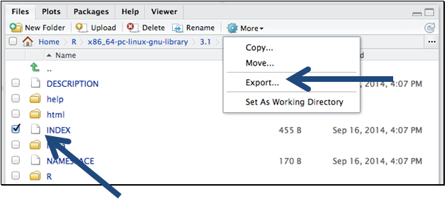

**Getting There**

<a href="https://www.youtube.com/watch?v=NQu3ugUkYTk&list=UUq4pm1i_VZqxKVVOz5qRBIA" target="_blank">Transcription of YouTube walkthrough: 'Brief guide on running RStudio Server's web interface on Amazon Web Services'</a>

There are a lot of great resources on the web, but I didn't find one that covered my needs from end to end, and figured others could benefit from a walk-through.  Here, I'll show how to select, install and run RStudio Server, customize security settings to use the RStudio's web interface, and upload and download data between your local machine and the server.

If you like Kaggle competitions, like I do, this is a great way to quickly add all sorts of computing configurations at your disposal
Our first stop will be at <a href="http://www.louisaslett.com/RStudio_AMI/" target="_blank">Louis Aslet's web page</a>. Louis curates a series of Amazon Machine Images (referred as AMIs):

These are pre-configured images that will install RStudio and common R packages onto a computing instance. This is a huge time and money saver as it automatically installs a whole slew of software under two minutes - and when you're charged by the minute, it all counts big time.    

Louis also has a video, albeit short, on how to setup RStudio and lots of resources. So explore them if you have additional questions. 
We're interested in the upper, right-hand box where you need to select the AMI for your location and click on it. This will take you to the Amazon Web Services page. If you do not have an AWS account, it will prompt you to set one up:

 

Otherwise it will take you to  Step 2. This is the fun part, its like going to the store and picking up a brand new computer. Here you get to choose how much computing muscle you want. The AMI image you selected earlier will get applied to whatever setup you choose. You can go for more GPU, memory, storage, etc. Throwing more memory at a problem is unfortunately not a guarantee to make it go away - and I'm talking from personal experience here.

 

I recommend starting small as it is easy to upgrade an existing instance to something bigger.

**Security**

You need to have two open ports and a key-pair to communicate with your instance. 
Port 22 should be opened by default and we need to add port 80.

`Port 22 is used to connect a command line terminal tool using SSH. I will not be showing that today. Instead, we'll be using port 80 which gives us access to the web interface of RStudio. So add another rule, sleet HTTP and enter 80, leave the rest as it is:

 

After you it 'Launch', the key-pair authenticates client computer's identity to allow it to communicate securely to the AWS instance. If this is your first time using EC2 you'll want to create and download a new key pair:

 

**View Instance**

After launching your instance, once the 'instance state' goes from 'initializing' to 'running', you can copy the public DNS string and paste it in your browser. This is now the official link to your web interface for your instance. While waiting (hit refresh a few times):

<li>Remember where you save this key-pair as you cannot communicate to your instance without it.</li>
<li>If security is a big concern, there are plenty of additional settings and customizations available, please refer to the online RStudio server and Amazon EC2 help files regarding your options.</li>

Once your instance is running, click on it, copy the Public DNS URL and paste it in your browser:

**Using RStudio Server**

You will be prompted for your credentials. By default, the initial account and password for these AMIs is rstudio, rstudio, all lower case:

First thing you should do is run the default script to change the password (minimum length required is 8 characters).  Replace the "mypassword" with your new password and hit the run script button. Then log out and back in with the new password:

**Uploading and Downloading Files**

Now this is the last part I want to cover and is how to upload and download files to your server instance.

Uploading Files (i.e. bringing file from your local machine to EC2 Instance):

Switch to the Files pane
Navigate to the directory you wish to upload files into
Click the Upload toolbar button. A menu box will open and select the file you want to upload.
Choose the file you wish to upload and press OK
Note that if you wish to upload several files or even an entire folder, you should first compress your files or folder into a zip file and then upload the zip file (when RStudio receives an uploaded zip file it automatically uncompresses it).

Downloading Files (i.e. exporting files from EC2 to your local server):

Switch to directory you want to download files from within the Files pane
Select the file(s) and/or folder(s) you want to download
Click More -> Export on the toolbar
You'll then be prompted with a default file name for the download. Either accept the default or specify a custom name then press OK:

**Important**
Don't forget to shut down the server or terminate it to remove it completely - otherwise the meter will keep running and you will keep being charged!
This is my first YouTube video so please leave me feedback if you find anything wrong, annoying, or have tips to improve things. I plan on doing a few more videos on similar advanced advance subjects in the near future.

**Additional Resources (PDFs)**

<a href="https://s3.amazonaws.com/rstudio-server/rstudio-server-pro-0.98.501-admin-guide.pdf" target="_blank">RStudio Server Administrator's Guide</a>

<a href="http://www-personal.umich.edu/~agong/docs/Using%20RStudio%20on%20Amazon%20EC2%20under%20the%20Free%20Usage%20Tier.pdf" target="_blank">Using RStudio on Amazon EC2 under the Free Usage Tier</a>

   
    

            
 <a href="{{page.previous.url}}" title="Previous Post: {{page.previous.title}}"><i class="icon-chevron-left"></i></a>          <a href="{{page.next.url}}" title="Next Post: {{page.next.title}}"><i class="icon-chevron-right"></i></a>    
  
    

   
    
    
        <h2>Comments Section</h2>
        
Feel free to comment on the post but keep it clean and on topic.
 
        

        
        <noscript>Please enable JavaScript to view the <a href="http://disqus.com/?ref_noscript">comments powered by Disqus.</a></noscript>
        <a href="http://disqus.com" class="dsq-brlink">blog comments powered by Disqus</a>
    

