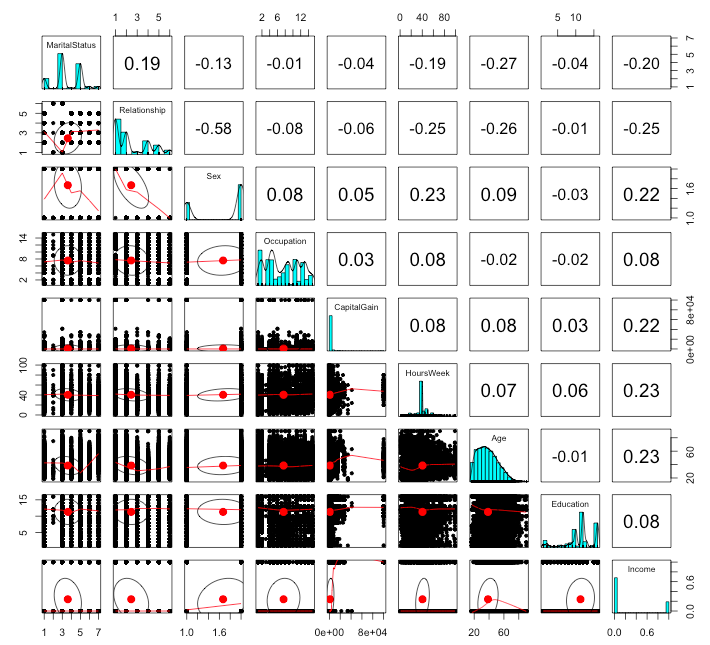

A great way to explore new data is to use a pairwise correlation matrix. This will measure the correlation between every combination of your variables. It doesn't really matter if you have an outcome (or response) variable at this point, it will compare everything against everything else.

For those not familiar with the correlation coefficient, it is simply a measure of similarity between two vectors of numbers. The measure value can range between **1** and **-1**, where **1** is perfectly correlated, -**1** is perfectly inversly correlated, and **0** is not correlated at all: 

```{r}
print(cor(1:5,1:5))
## 1
print(cor(1:5,5:1))
## -1
print(cor(1:5,c(1,2,3,4,4)))
## 0.9701425
```

To help us understand this process, let's download the <a href="https://archive.ics.uci.edu/ml/datasets/Adult" target="_blank">adult.data set</a> from the UCI Machine Learning Repository. The data is from the 1994 Census and attempts to predict those with income under $50,000 a year:

```r
library(RCurl) # download https data
urlfile <- 'https://archive.ics.uci.edu/ml/machine-learning-databases/adult/adult.data'
x <- getURL(urlfile, ssl.verifypeer = FALSE)
adults <- read.csv(textConnection(x), header=F)

# if the above getURL command fails, try this:
# adults <-read.csv('https://archive.ics.uci.edu/ml/machine-learning-databases/adult/adult.data', header=F)
```
<BR>
We fill in the missing headers for the UCI set and cast the outcome variable ``Income`` to a binary format of **1** and **0** (here I am reversing the orginal order, if it is under $50k, it is **0**, and above, **1**; this will make the final correlation-matrix plot easier to understand):

```r
names(adults)=c('Age','Workclass','FinalWeight','Education','EducationNumber',
                'MaritalStatus','Occupation','Relationship','Race',
                'Sex','CapitalGain','CapitalLoss','HoursWeek',
                'NativeCountry','Income')

adults$Income <- ifelse(adults$Income==' <=50K',0,1)
```
<BR>
We load the **caret** package to <a href="http://amunategui.github.io/dummyVar-Walkthrough/" target="_blank">dummify (see my other walkthrough)</a> all factor variables as the ``cor`` function only accepts numerical values:

```r
dmy <- dummyVars(" ~ .", data = adults)
adultsTrsf <- data.frame(predict(dmy, newdata = adults))
```
<BR>
We borrow two very useful functions from <a href="https://gist.github.com/stephenturner/3492773" target="_blank">Stephen Turner</a>: ``cor.prob`` and ``flattenSquareMatrix``. **cor.prob** will create a correlation matrix along with <i>p</i>-values and **flattenSquareMatrix** will flatten all the combinations from the square matrix into a data frame of 4 columns made up of row names, column names, the correlation value and the <i>p</i>-value:

```r
corMasterList <- flattenSquareMatrix (cor.prob(adultsTrsf))
print(head(corMasterList,10))
```

```
##                         i                       j       cor         p
## 1                     age            workclass...  0.042627 1.421e-14
## 2                     age  workclass..Federal.gov  0.051227 0.000e+00
## 3            workclass...  workclass..Federal.gov -0.042606 1.454e-14
## 4                     age    workclass..Local.gov  0.060901 0.000e+00
## 5            workclass...    workclass..Local.gov -0.064070 0.000e+00
## 6  workclass..Federal.gov    workclass..Local.gov -0.045682 2.220e-16
## 7                     age workclass..Never.worked -0.019362 4.759e-04
## 8            workclass... workclass..Never.worked -0.003585 5.178e-01
## 9  workclass..Federal.gov workclass..Never.worked -0.002556 6.447e-01
## 10   workclass..Local.gov workclass..Never.worked -0.003843 4.880e-01
```
<BR>
This final format allows you to easily order the pairs however you want - for example, by those with the highest absolute correlation value:

```r
corList <- corMasterList[order(-abs(corMasterList$cor)),]
print(head(corList,10))
```

```
##                                      i                            j        cor p
## 1953                       sex..Female                    sex..Male -1.0000000 0
## 597                       workclass...                occupation...  0.9979854 0
## 1256 maritalStatus..Married.civ.spouse        relationship..Husband  0.8932103 0
## 1829                       race..Black                  race..White -0.7887475 0
## 527  maritalStatus..Married.civ.spouse maritalStatus..Never.married -0.6448661 0
## 1881             relationship..Husband                  sex..Female -0.5801353 0
## 1942             relationship..Husband                    sex..Male  0.5801353 0
## 1258      maritalStatus..Never.married        relationship..Husband -0.5767295 0
## 1306 maritalStatus..Married.civ.spouse  relationship..Not.in.family -0.5375883 0
## 497                                age maritalStatus..Never.married -0.5343590 0
```
<BR>
The top correlated pair (sex..Female and sex.Male), as seen above, won't be of much use as they are the only two levels of the same factor. We need to process this a little further to be of practical use. We create a single vector of variable names by filtering those with an absolute correlation of 0.2 or higher against the outcome variable of ``Income``:

```r
selectedSub <- subset(corList, (abs(cor) > 0.2 & j == 'Income'))
print(selectedSub)
                                     i      j        cor p
## 5811      MaritalStatus..Never.married Income -0.3184403 0
## 5832           Relationship..Own.child Income -0.2285320 0
## 5840                       Sex..Female Income -0.2159802 0
## 5818       Occupation..Exec.managerial Income  0.2148613 0
## 5841                         Sex..Male Income  0.2159802 0
## 5842                       CapitalGain Income  0.2233288 0
## 5844                         HoursWeek Income  0.2296891 0
## 5779                               Age Income  0.2340371 0
## 5806                  Education.Number Income  0.3351540 0
## 5829             Relationship..Husband Income  0.4010353 0
## 5809 MaritalStatus..Married.civ.spouse Income  0.4446962 0
```
<BR><BR>
We save the most correlated features to the ``bestSub`` variable:<BR>

```r
bestSub <- as.character(selectedSub$i)
```
<BR>
Finally we plot the highly correlated pairs using the **{psych}** package's ``pair.panels`` plot (this can also be done on the original data as ``pair.panels`` can handle factor and character variables):<BR>

```r
library(psych)
pairs.panels(adultsTrsf[c(bestSub, 'Income')])
```
<BR>
 
<BR><BR>
The pairs plot, and in particular the last ``Income`` column, tell us a lot about our data set. Being ``never married`` is the most negatively correlated with income over $50,000/year and ``Hours Worked`` and ``Age`` are the most postively correlated.<BR>  
**Things to keep in mind**<BR>
<li>If you have a huge number of features in your data set, then be ready for extra computing time,</li>
<li>and don't bother plotting it via ``pair.panels``, it will end up hanging R.</li>
<BR><BR>
[Full Source](https://github.com/amunategui/Exploring-Data-With-Correlations/blob/master/Correlations.R):

```r
library(RCurl) # download https data
urlfile <- 'https://archive.ics.uci.edu/ml/machine-learning-databases/adult/adult.data'
x <- getURL(urlfile, ssl.verifypeer = FALSE)
adults <- read.csv(textConnection(x), header=F)

# if the above getURL command fails, try this:
# adults <-read.csv('https://archive.ics.uci.edu/ml/machine-learning-databases/adult/adult.data', header=F)

names(adults)=c('Age','Workclass','FinalWeight','Education','EducationNumber',
                'MaritalStatus','Occupation','Relationship','Race',
                'Sex','CapitalGain','CapitalLoss','HoursWeek',
                'NativeCountry','Income')

adults$Income <- ifelse(adults$Income==' <=50K',0,1)

library(caret)
dmy <- dummyVars(" ~ .", data = adults)
adultsTrsf <- data.frame(predict(dmy, newdata = adults))

## Correlation matrix with p-values. See http://goo.gl/nahmV for documentation of this function
cor.prob <- function (X, dfr = nrow(X) - 2) {
        R <- cor(X, use="pairwise.complete.obs")
        above <- row(R) < col(R)
        r2 <- R[above]^2
        Fstat <- r2 * dfr/(1 - r2)
        R[above] <- 1 - pf(Fstat, 1, dfr)
        R[row(R) == col(R)] <- NA
        R
}

## Use this to dump the cor.prob output to a 4 column matrix
## with row/column indices, correlation, and p-value.
## See StackOverflow question: http://goo.gl/fCUcQ
flattenSquareMatrix <- function(m) {
        if( (class(m) != "matrix") | (nrow(m) != ncol(m))) stop("Must be a square matrix.")
        if(!identical(rownames(m), colnames(m))) stop("Row and column names must be equal.")
        ut <- upper.tri(m)
        data.frame(i = rownames(m)[row(m)[ut]],
                   j = rownames(m)[col(m)[ut]],
                   cor=t(m)[ut],
                   p=m[ut])
}

corMasterList <- flattenSquareMatrix (cor.prob(adultsTrsf))
print(head(corMasterList,10))

corList <- corMasterList[order(-abs(corMasterList$cor)),]
print(head(corList,10))

corList <- corMasterList[order(corMasterList$cor),]
selectedSub <- subset(corList, (abs(cor) > 0.2 & j == 'Income'))
# to get the best variables from original list:
bestSub <-  sapply(strsplit(as.character(selectedSub$i),'[.]'), "[", 1)
bestSub <- unique(bestSub)

# or use the variables from top selectedSub:
bestSub <- as.character(selectedSub$i)

library(psych)
pairs.panels(adultsTrsf[c(bestSub, 'Income')])
```

<div class="row">   
    <div class="span9 column">
            <p class="pull-right"> <a href="{{page.previous.url}}" title="Previous Post: {{page.previous.title}}"><i class="icon-chevron-left"></i></a>          <a href="{{page.next.url}}" title="Next Post: {{page.next.title}}"><i class="icon-chevron-right"></i></a>    </p>  
    </div>
</div>

<div class="row">   
    <div class="span9 columns">    
        <h2>Comments Section</h2>
        <p>Feel free to comment on the post but keep it clean and on topic.</p> 
        <div id="disqus_thread"></div>
        <script type="text/javascript">
            /* * * CONFIGURATION VARIABLES: EDIT BEFORE PASTING INTO YOUR WEBPAGE * * */
            var disqus_shortname = 'amunategui'; // required: replace example with your forum shortname
            var disqus_identifier = '{{ page.url }}';
            var disqus_url = 'http://amunategui.github.com{{ page.url }}';
            
            /* * * DON'T EDIT BELOW THIS LINE * * */
            (function() {
                var dsq = document.createElement('script'); dsq.type = 'text/javascript'; dsq.async = true;
                dsq.src = 'http://' + disqus_shortname + '.disqus.com/embed.js';
                (document.getElementsByTagName('head')[0] || document.getElementsByTagName('body')[0]).appendChild(dsq);
            })();
        </script>
        <noscript>Please enable JavaScript to view the <a href="http://disqus.com/?ref_noscript">comments powered by Disqus.</a></noscript>
        <a href="http://disqus.com" class="dsq-brlink">blog comments powered by <span class="logo-disqus">Disqus</span></a>
    </div>
</div>
