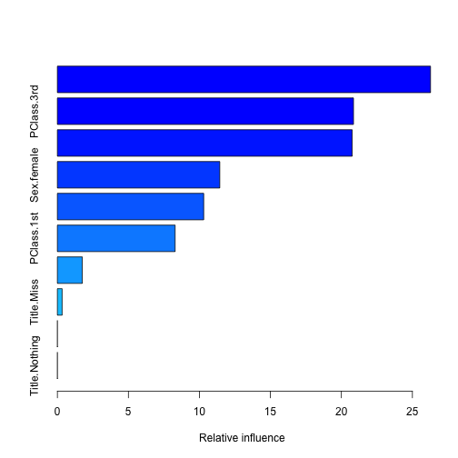
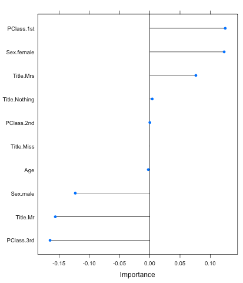

**Resources**
<ul>
<li type="square"><a href="https://www.youtube.com/watch?v=-nai4NBx5zI" target='_blank'>YouTube Companion Video</a></li>
<li type="square"><a href="#sourcecode">Full Source Code</a></li>
</ul>
<BR>
**Packages Used in this Walkthrough**

<ul>
        <li type="square"><b>{caret}</b> - modeling wrapper, functions, commands</li>
        <li type="square"><b>{pROC}</b> - Area Under the Curve (AUC) functions</li>
</ul>
<BR><BR>

This is an introduction to modeling binary outcomes using the <a href='http://topepo.github.io/caret/index.html' target='_blank'>caret library</a>. A binary outcome is a result that has two possible values - true or false, alive or dead, etc. 

We're going to use two models: <a href="http://www.inside-r.org/packages/cran/gbm/docs/gbm" target="_blank">gbm (Generalized Boosted Models)</a> and <a href="http://www.inside-r.org/packages/glmnet" target="_blank">glmnet (Generalized Linear Models)</a>. Approaching a new data set using different models is one way of getting a handle on your data. **Gbm** uses boosted trees while **glmnet**  uses regression. 
<BR><BR>
**Let's code!**

We're going to use the **Titanic** data set from the **University of Colorado Denver**:

```r
titanicDF <- read.csv('http://math.ucdenver.edu/RTutorial/titanic.txt',sep='\t')
print(str(titanicDF))
```

```
## 'data.frame':	1313 obs. of  5 variables:
##  $ Name    : Factor w/ 1310 levels "Abbing, Mr Anthony",..: 22 25 26 27 24 31 45 46 50 54 ...
##  $ PClass  : Factor w/ 3 levels "1st","2nd","3rd": 1 1 1 1 1 1 1 1 1 1 ...
##  $ Age     : num  29 2 30 25 0.92 47 63 39 58 71 ...
##  $ Sex     : Factor w/ 2 levels "female","male": 1 1 2 1 2 2 1 2 1 2 ...
##  $ Survived: int  1 0 0 0 1 1 1 0 1 0 ...
## NULL
```
<br><br>
We need to clean up a few things as is customary with any data science project. The ``Name`` variable is mostly unique so we're going to extract the title and throw the rest away.

```r
titanicDF$Title <- ifelse(grepl('Mr ',titanicDF$Name),'Mr',ifelse(grepl('Mrs ',titanicDF$Name),'Mrs',ifelse(grepl('Miss',titanicDF$Name),'Miss','Nothing'))) 
```
<br><br>
The ``Age`` variable has missing data (i.e. ``NA``'s) so we're going to impute it with the mean value of all the available ages. There are many ways of imputing missing data - we could delete those rows, set the values to 0, etc. Either way, this will neutralize the missing fields with a common value, and allow the models that can't handle them normally to function (**gbm** can handle ``NA``s but **glmnet** cannot):

```r
titanicDF$Age[is.na(titanicDF$Age)] <- median(titanicDF$Age, na.rm=T)
```
<br><br>
It is customary to have the **outcome** variable (also known as response variable) located in the last column of a data set:


```r
titanicDF <- titanicDF[c('PClass', 'Age',    'Sex',   'Title', 'Survived')]
print(str(titanicDF))
```

```
## 'data.frame':	1313 obs. of  5 variables:
##  $ PClass  : Factor w/ 3 levels "1st","2nd","3rd": 1 1 1 1 1 1 1 1 1 1 ...
##  $ Age     : num  29 2 30 25 0.92 47 63 39 58 71 ...
##  $ Sex     : Factor w/ 2 levels "female","male": 1 1 2 1 2 2 1 2 1 2 ...
##  $ Title   : chr  "Miss" "Miss" "Mr" "Mrs" ...
##  $ Survived: int  1 0 0 0 1 1 1 0 1 0 ...
## NULL
```
<br><br>
Our data is starting to look good but we have to fix the **factor** variables as most models only accept **numeric** data. Again, **gbm** can deal with factor variables as it will dummify them internally, but **glmnet** won't. In a nutshell, dummifying factors breaks all the unique values into separate columns (<a href="http://amunategui.github.io/dummyVar-Walkthrough/" target="_blank">see my post on Brief Walkthrough Of The dummyVars function from {caret}</a>). This is a **caret** function:


```r
titanicDF$Title <- as.factor(titanicDF$Title)
titanicDummy <- dummyVars("~.",data=titanicDF, fullRank=F)
titanicDF <- as.data.frame(predict(titanicDummy,titanicDF))
print(names(titanicDF))
```

```
##  [1] "PClass.1st"    "PClass.2nd"    "PClass.3rd"    "Age"          
##  [5] "Sex.female"    "Sex.male"      "Title.Miss"    "Title.Mr"     
##  [9] "Title.Mrs"     "Title.Nothing" "Survived"
```
<br><br>
As you can see, each unique factor is now separated into its own column. Next, we need to understand the proportion of our outcome variable:

```r
prop.table(table(titanicDF$Survived))
```

```
## 
##      0      1 
## 0.6573 0.3427
```
<br><br>
This tells us that <b>34.27%</b> of our data contains survivors of the Titanic tragedy. This is an important step because if the proportion was smaller than 15%, it would be considered a **rare event** and would be more challenging to model.

I like generalizing my variables so that I can easily recycle the code for subsequent needs:

```r
outcomeName <- 'Survived'
predictorsNames <- names(titanicDF)[names(titanicDF) != outcomeName]
```
<br><br>
**Let's model!**

Even though we already know the models we're going to use in this walkthrough, **caret** supports a huge number of models. Here is how to get the current list of supported models:


```r
names(getModelInfo())
```

```
##   [1] "ada"                 "ANFIS"               "avNNet"             
##   [4] "bag"                 "bagEarth"            "bagFDA"             
##   [7] "bayesglm"            "bdk"                 "blackboost"         
##  [10] "Boruta"              "brnn"                "bstLs"              
##  [13] "bstSm"               "bstTree"             "C5.0"               
##  [16] "C5.0Cost"            "C5.0Rules"           "C5.0Tree"           
##  [19] "cforest"             "CSimca"              "ctree"              
##  [22] "ctree2"              "cubist"              "DENFIS"             
##  [25] "dnn"                 "earth"               "elm"                
##  [28] "enet"                "evtree"              "extraTrees"         
##  [31] "fda"                 "FH.GBML"             "FIR.DM"             
##  [34] "foba"                "FRBCS.CHI"           "FRBCS.W"            
##  [37] "FS.HGD"              "gam"                 "gamboost"           
##  [40] "gamLoess"            "gamSpline"           "gaussprLinear"      
##  [43] "gaussprPoly"         "gaussprRadial"       "gbm"                
##  [46] "gcvEarth"            "GFS.FR.MOGAL"        "GFS.GCCL"           
##  [49] "GFS.LT.RS"           "GFS.Thrift"          "glm"                
##  [52] "glmboost"            "glmnet"              "glmStepAIC"         
##  [55] "gpls"                "hda"                 "hdda"               
##  [58] "HYFIS"               "icr"                 "J48"                
##  [61] "JRip"                "kernelpls"           "kknn"               
##  [64] "knn"                 "krlsPoly"            "krlsRadial"         
##  [67] "lars"                "lars2"               "lasso"              
##  [70] "lda"                 "lda2"                "leapBackward"       
##  [73] "leapForward"         "leapSeq"             "Linda"              
##  [76] "lm"                  "lmStepAIC"           "LMT"                
##  [79] "logicBag"            "LogitBoost"          "logreg"             
##  [82] "lssvmLinear"         "lssvmPoly"           "lssvmRadial"        
##  [85] "lvq"                 "M5"                  "M5Rules"            
##  [88] "mda"                 "Mlda"                "mlp"                
##  [91] "mlpWeightDecay"      "multinom"            "nb"                 
##  [94] "neuralnet"           "nnet"                "nodeHarvest"        
##  [97] "oblique.tree"        "OneR"                "ORFlog"             
## [100] "ORFpls"              "ORFridge"            "ORFsvm"             
## [103] "pam"                 "parRF"               "PART"               
## [106] "partDSA"             "pcaNNet"             "pcr"                
## [109] "pda"                 "pda2"                "penalized"          
## [112] "PenalizedLDA"        "plr"                 "pls"                
## [115] "plsRglm"             "ppr"                 "protoclass"         
## [118] "qda"                 "QdaCov"              "qrf"                
## [121] "qrnn"                "rbf"                 "rbfDDA"             
## [124] "rda"                 "relaxo"              "rf"                 
## [127] "rFerns"              "RFlda"               "ridge"              
## [130] "rknn"                "rknnBel"             "rlm"                
## [133] "rocc"                "rpart"               "rpart2"             
## [136] "rpartCost"           "RRF"                 "RRFglobal"          
## [139] "rrlda"               "RSimca"              "rvmLinear"          
## [142] "rvmPoly"             "rvmRadial"           "SBC"                
## [145] "sda"                 "sddaLDA"             "sddaQDA"            
## [148] "simpls"              "SLAVE"               "slda"               
## [151] "smda"                "sparseLDA"           "spls"               
## [154] "stepLDA"             "stepQDA"             "superpc"            
## [157] "svmBoundrangeString" "svmExpoString"       "svmLinear"          
## [160] "svmPoly"             "svmRadial"           "svmRadialCost"      
## [163] "svmRadialWeights"    "svmSpectrumString"   "treebag"            
## [166] "vbmpRadial"          "widekernelpls"       "WM"                 
## [169] "xyf"
```

Plenty to satisfy most needs!!
<br><br>
**Gbm Modeling**

It is important to know what type of modeling a particular model supports. This can be done using the **caret** function ``getModelInfo``:

```r
getModelInfo()$gbm$type
```

```
## [1] "Regression"     "Classification"
```
<br><br>
This tells us that ``gbm`` supports both **regression** and **classification**. As this is a binary classification, we need to force **gbm** into using the classification mode. We do this by changing the **outcome** variable to a factor (we use a copy of the outcome as we'll need the original one for our next model):


```r
titanicDF$Survived2 <- ifelse(titanicDF$Survived==1,'yes','nope')
titanicDF$Survived2 <- as.factor(titanicDF$Survived2)
outcomeName <- 'Survived2'
```
<br><br>
As with most modeling projects, we need to split our data into two portions: a **training** and a **testing** portion. By doing this, we can use one portion to teach the model how to recognize survivors on the Titanic and the other portion to evaluate the model. Setting the **seed** is paramount for reproducibility as ``createDataPartition`` will shuffle the data randomly before splitting it. By using the same seed you will always get the same split in subsequent runs:


```r
set.seed(1234)
splitIndex <- createDataPartition(titanicDF[,outcomeName], p = .75, list = FALSE, times = 1)
trainDF <- titanicDF[ splitIndex,]
testDF  <- titanicDF[-splitIndex,]
```
<br><br>
**Caret** offers many tuning functions to help you get as much as possible out of your models; the <a href='http://www.inside-r.org/packages/cran/caret/docs/trainControl' target='_blank'>trainControl</a> function allows you to control the resampling of your data. This will split the training data set internally and do its own train/test runs to figure out the best settings for your model. In this case, we're going to cross-validate the data 3 times, therefore training it 3 times on different portions of the data before settling on the best tuning parameters (for **gbm** it is ``trees``, ``shrinkage``, and ``interaction depth``). You can also set these values yourself if you don't trust the function.


```r
objControl <- trainControl(method='cv', number=3, returnResamp='none', summaryFunction = twoClassSummary, classProbs = TRUE)
```
<br><br>
This is the heart of our modeling adventure, time to teach our model how to recognize Titanic survivors. Because this is a classification model, we're requesting that our metrics use <a href='http://cran.r-project.org/web/packages/caret/vignettes/caret.pdf' target='_blank'>ROC</a> instead of the default **RMSE**:


```r
objModel <- train(trainDF[,predictorsNames], trainDF[,outcomeName], 
                  method='gbm', 
                  trControl=objControl,  
                  metric = "ROC",
                  preProc = c("center", "scale"))
```
```
## Iter   TrainDeviance   ValidDeviance   StepSize   Improve
##      1        1.2314             nan     0.1000    0.0245
##      2        1.1948             nan     0.1000    0.0192
##      3        1.1594             nan     0.1000    0.0158
...
```
<br><br>
I truncated most of the lines from the training process but you get the idea. We then can call ``summary()`` function on our model to find out what variables were most important:


```r
summary(objModel)
```
 
<BR>


```
##                         var rel.inf
## Title.Mr           Title.Mr 26.2756
## PClass.3rd       PClass.3rd 20.8523
## Sex.male           Sex.male 20.7569
## Sex.female       Sex.female 11.4357
## Age                     Age 10.3042
## PClass.1st       PClass.1st  8.2905
## Title.Mrs         Title.Mrs  1.7515
## Title.Miss       Title.Miss  0.3332
## PClass.2nd       PClass.2nd  0.0000
## Title.Nothing Title.Nothing  0.0000
```

<BR><BR>
We can find out what tuning parameters were most important to the model (notice the last lines about ``trees``, ``shrinkage`` and ``interaction depth``:

```r
print(objModel)
```

```
## Stochastic Gradient Boosting 
## 
## 986 samples
##  10 predictor
##   2 classes: 'nope', 'yes' 
## 
## Pre-processing: centered, scaled 
## Resampling: Cross-Validated (3 fold) 
...
## Tuning parameter 'shrinkage' was held constant at a value of 0.1
## ROC was used to select the optimal model using  the largest value.
## The final values used for the model were n.trees = 100,
##  interaction.depth = 1 and shrinkage = 0.1.
```
<BR><BR>
**Evaluate gbm model**

There are two types of evaluation we can do here, ``raw`` or ``prob``. **Raw** gives you a class prediction, in our case ``yes`` and ``nope``, while **prob** gives you the probability on how sure the model is about its choice. I always use **prob**, as I like to be in control of the threshold and also like to use <a href='https://www.kaggle.com/wiki/AreaUnderCurve' target='_blank'>AUC</a> score  which requires probabilities, not classes. There are situations where having class values can come in handy, such as with multinomial models where you're predicting more than two values. 

We now call the ``predict`` function and pass it our trained model and our testing data. Let's start by looking at class predictions and using the **caret** ``postResample`` function to get an accuracy score:


```r
predictions <- predict(object=objModel, testDF[,predictorsNames], type='raw')
head(predictions)
```

```
## [1] yes  nope yes  nope nope nope
## Levels: nope yes
```

```r
print(postResample(pred=predictions, obs=as.factor(testDF[,outcomeName])))
```

```
## Accuracy    Kappa 
##   0.8135   0.5644
```
<BR>
The accuracy tells us that our model is correct **81.35%** of the time - not bad...
<BR><BR>
Now let's look at probabilities:

```r
# probabilites 
library(pROC)
predictions <- predict(object=objModel, testDF[,predictorsNames], type='prob')
head(predictions)
```

```
##      nope    yes
## 1 0.07292 0.9271
## 2 0.76058 0.2394
## 3 0.43309 0.5669
## 4 0.67279 0.3272
## 5 0.67279 0.3272
## 6 0.54616 0.4538
```
<BR><BR>
To get the **AUC** score, you need to pass the ``yes`` column to the ``roc`` function (each row adds up to 1 but we're interested in the ``yes``, the **survivors**):

```r
auc <- roc(ifelse(testDF[,outcomeName]=="yes",1,0), predictions[[2]])
print(auc$auc)
```

```
## Area under the curve: 0.825
```
The **AUC** is telling us that our model has a **0.825 AUC** score (remember that an **AUC** ranges between **0.5** and **1**, where **0.5** is random and **1** is perfect).

<BR><BR>
**Glmnet Modeling**

Let's change gears and try this out on a regression model. Let's look at what modeling types **glmnet** supports and reset our outcome variable as we're going to be using the numerical outcome instead of the factor.


```r
getModelInfo()$glmnet$type
```

```
## [1] "Regression"     "Classification"
```

```r
outcomeName <- 'Survived'

set.seed(1234)
splitIndex <- createDataPartition(titanicDF[,outcomeName], p = .75, list = FALSE, times = 1)
trainDF <- titanicDF[ splitIndex,]
testDF  <- titanicDF[-splitIndex,]
```
<BR><BR>
We re-run some of the basic training and prediction functions with some slight changes:

```r
objControl <- trainControl(method='cv', number=3, returnResamp='none')
objModel <- train(trainDF[,predictorsNames], trainDF[,outcomeName], method='glmnet',  metric = "RMSE")
```

```r
predictions <- predict(object=objModel, testDF[,predictorsNames])
```


```r
auc <- roc(testDF[,outcomeName], predictions)
print(auc$auc)
```

```
## Area under the curve: 0.857
```
<BR><BR>
This is a stronger **AUC** score than our previous **gbm** model. Testing with different types of models does pay off (take it with a grain of salt as we didn't tune our models much).

You can also call the **caret** function ``varImp`` to figure out the variables that were important to the model. And this is one great feature of the **glmnet** model; it returns positive and negative variable importance unlike most models. This helps deepens your understanding about your variables, such that being in ``PClass.1st`` leans the probabilities in the survivor's favor while ``PClass.3rd`` does the opposite (make sure you set ``scale`` to False):

```r
plot(varImp(objModel,scale=F))
```

 
<BR><BR>

<a id="sourcecode">Full source code (<a href='https://github.com/amunategui/modeling-binary-outcomes' target='_blank'>also on GitHub</a>)</a>:

```r

# load libraries
library(caret)
library(pROC)

#################################################
# data prep
#################################################

# load data
titanicDF <- read.csv('http://math.ucdenver.edu/RTutorial/titanic.txt',sep='\t')
titanicDF$Title <- ifelse(grepl('Mr ',titanicDF$Name),'Mr',ifelse(grepl('Mrs ',titanicDF$Name),'Mrs',ifelse(grepl('Miss',titanicDF$Name),'Miss','Nothing'))) 
titanicDF$Age[is.na(titanicDF$Age)] <- median(titanicDF$Age, na.rm=T)

# miso format
titanicDF <- titanicDF[c('PClass', 'Age',    'Sex',   'Title', 'Survived')]

# dummy variables for factors/characters
titanicDF$Title <- as.factor(titanicDF$Title)
titanicDummy <- dummyVars("~.",data=titanicDF, fullRank=F)
titanicDF <- as.data.frame(predict(titanicDummy,titanicDF))
print(names(titanicDF))


# what is the proportion of your outcome variable?
prop.table(table(titanicDF$Survived))

# save the outcome for the glmnet model
tempOutcome <- titanicDF$Survived  

# generalize outcome and predictor variables
outcomeName <- 'Survived'
predictorsNames <- names(titanicDF)[names(titanicDF) != outcomeName]

#################################################
# model it
#################################################
# get names of all caret supported models 
names(getModelInfo())

titanicDF$Survived <- ifelse(titanicDF$Survived==1,'yes','nope')

# pick model gbm and find out what type of model it is
getModelInfo()$gbm$type

# split data into training and testing chunks
set.seed(1234)
splitIndex <- createDataPartition(titanicDF[,outcomeName], p = .75, list = FALSE, times = 1)
trainDF <- titanicDF[ splitIndex,]
testDF  <- titanicDF[-splitIndex,]

# create caret trainControl object to control the number of cross-validations performed
objControl <- trainControl(method='cv', number=3, returnResamp='none', summaryFunction = twoClassSummary, classProbs = TRUE)


# run model
objModel <- train(trainDF[,predictorsNames], as.factor(trainDF[,outcomeName]), 
                  method='gbm', 
                  trControl=objControl,  
                  metric = "ROC",
                  preProc = c("center", "scale"))
)

# find out variable importance
summary(objModel)

# find out model details
objModel

#################################################
# evalute mdoel
#################################################
# get predictions on your testing data

# class prediction
predictions <- predict(object=objModel, testDF[,predictorsNames], type='raw')
head(predictions)
postResample(pred=predictions, obs=as.factor(testDF[,outcomeName]))

# probabilites 
predictions <- predict(object=objModel, testDF[,predictorsNames], type='prob')
head(predictions)
postResample(pred=predictions, obs=testDF[,outcomeName])

auc <- roc(ifelse(testDF[,outcomeName]=="yes",1,0), predictions[[2]])
print(auc$auc)


################################################
# glmnet model
################################################

# pick model gbm and find out what type of model it is
getModelInfo()$glmnet$type

# save the outcome for the glmnet model
titanicDF$Survived  <- tempOutcome

# split data into training and testing chunks
set.seed(1234)
splitIndex <- createDataPartition(titanicDF[,outcomeName], p = .75, list = FALSE, times = 1)
trainDF <- titanicDF[ splitIndex,]
testDF  <- titanicDF[-splitIndex,]

# create caret trainControl object to control the number of cross-validations performed
objControl <- trainControl(method='cv', number=3, returnResamp='none')

# run model
objModel <- train(trainDF[,predictorsNames], trainDF[,outcomeName], method='glmnet',  metric = "RMSE")

# get predictions on your testing data
predictions <- predict(object=objModel, testDF[,predictorsNames])

library(pROC)
auc <- roc(testDF[,outcomeName], predictions)
print(auc$auc)

postResample(pred=predictions, obs=testDF[,outcomeName])
 
# find out variable importance
summary(objModel)
plot(varImp(objModel,scale=F))

# find out model details
objModel

# display variable importance on a +/- scale 
vimp <- varImp(objModel, scale=F)
results <- data.frame(row.names(vimp$importance),vimp$importance$Overall)
results$VariableName <- rownames(vimp)
colnames(results) <- c('VariableName','Weight')
results <- results[order(results$Weight),]
results <- results[(results$Weight != 0),]

par(mar=c(5,15,4,2)) # increase y-axis margin. 
xx <- barplot(results$Weight, width = 0.85, 
              main = paste("Variable Importance -",outcomeName), horiz = T, 
              xlab = "< (-) importance >  < neutral >  < importance (+) >", axes = FALSE, 
              col = ifelse((results$Weight > 0), 'blue', 'red')) 
axis(2, at=xx, labels=results$VariableName, tick=FALSE, las=2, line=-0.3, cex.axis=0.6)  


################################################
# advanced stuff
################################################

# boosted tree model (gbm) adjust learning rate and and trees
gbmGrid <-  expand.grid(interaction.depth =  c(1, 5, 9),
                        n.trees = 50,
                        shrinkage = 0.01)

# run model
objModel <- train(trainDF[,predictorsNames], trainDF[,outcomeName], method='gbm', trControl=objControl, tuneGrid = gbmGrid, verbose=F)

# get predictions on your testing data
predictions <- predict(object=objModel, testDF[,predictorsNames])

library(pROC)
auc <- roc(testDF[,outcomeName], predictions)
print(auc$auc)
```

<div class="row">   
    <div class="span9 column">
            <p class="pull-right"> <a href="{{page.previous.url}}" title="Previous Post: {{page.previous.title}}"><i class="icon-chevron-left"></i></a>          <a href="{{page.next.url}}" title="Next Post: {{page.next.title}}"><i class="icon-chevron-right"></i></a>    </p>  
    </div>
</div>

<div class="row">   
    <div class="span9 columns">    
        <h2>Comments Section</h2>
        <p>Feel free to comment on the post but keep it clean and on topic.</p> 
        <div id="disqus_thread"></div>
        <script type="text/javascript">
            /* * * CONFIGURATION VARIABLES: EDIT BEFORE PASTING INTO YOUR WEBPAGE * * */
            var disqus_shortname = 'amunategui'; // required: replace example with your forum shortname
            var disqus_identifier = '{{ page.url }}';
            var disqus_url = 'http://amunategui.github.com{{ page.url }}';
            
            /* * * DON'T EDIT BELOW THIS LINE * * */
            (function() {
                var dsq = document.createElement('script'); dsq.type = 'text/javascript'; dsq.async = true;
                dsq.src = 'http://' + disqus_shortname + '.disqus.com/embed.js';
                (document.getElementsByTagName('head')[0] || document.getElementsByTagName('body')[0]).appendChild(dsq);
            })();
        </script>
        <noscript>Please enable JavaScript to view the <a href="http://disqus.com/?ref_noscript">comments powered by Disqus.</a></noscript>
        <a href="http://disqus.com" class="dsq-brlink">blog comments powered by <span class="logo-disqus">Disqus</span></a>
    </div>
</div>
 
