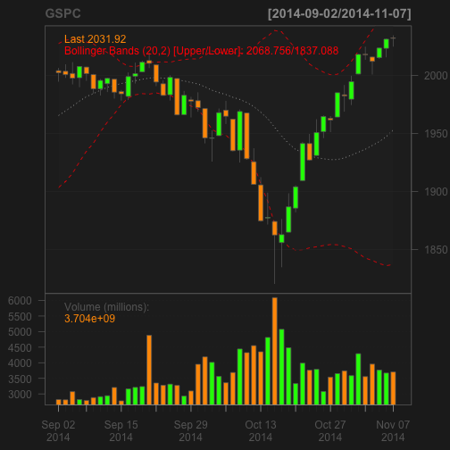

**Resources**
<ul>
<li type="square"><a href="http://youtu.be/lDgvaJFpybU" target='_blank'>YouTube Companion Video</a></li>
<li type="square"><a href="#sourcecode">Full Source Code</a></li>
</ul>
<BR>
**Packages Used in this Walkthrough**
<ul>
        <li type="square"><b>{quantmod}</b> - financial data and modeling tools</li>
        <li type="square"><b>{xts}</b> - handling of time-based data classes</li>
        <li type="square"><b>{xgboost}</b> - fast modeling algorithm</li>
        <li type="square"><b>{pROC}</b> - Area Under the Curve (AUC) functions</li>
</ul>

<BR><BR>

This walkthrough has two parts:

<ol type="1">
 <li>The first part is a very basic introduction to <b>quantmod</b> and, if you haven't used it before and need basic access to daily stock market data and charting, then you're in for a <b>huge</b> treat.</li> 
<li>The second part goes deeper into quantitative finance by leveraging <b>quantmod</b> to access all the stocks composing the <a href='http://www.nasdaq.com/markets/indices/nasdaq-100.aspx' target='_blank>'>NASDAQ 100 Index</a> to build a vocabulary of market moves and attempt to predict whether the following trading day's <b>volumne</b> will be <b>higher</b> or <b>lower</b>.</li>
</ol>

<BR><BR>
<b>quantmod</b> stands for <i>"Quantitative Financial Modeling and Trading Framework for R"</i>
<BR><BR>
It has many features so check out the help file for a full coverage or the <a href='http://www.quantmod.com/' target='_blank'>Quantmod's official website</a>. 
<BR><BR>
Let's see how Amazon has been doing lately:

```r
library(quantmod)
getSymbols(c("AMZN"))
```
```r
barChart(AMZN,theme='white.mono',bar.type='hlc') 
```
<BR><BR>
 
<BR><BR>
The ``getSymbols`` function downloaded daily data going all the way back to January 2007. The ``barChart`` function displays the data in a nice clean fashion following a theme-based parameter (<a href='http://www.quantmod.com/' target='_blank'>see the help file for more</a>). Not bad for 2 lines of code!!
<BR><BR>
It gets better - let's see how easy it is to display a full stock chart with indicators in just 3 lines of code:

```r
getSymbols(c("^GSPC"))
chartSeries(GSPC, subset='last 3 months')
addBBands(n = 20, sd = 2, ma = "SMA", draw = 'bands', on = -1)
```
<BR><BR>
 
<BR><BR>
<b>quantmod</b> uses <b>Yahoo</b> to get its financial data. In the above example ``^GSPC`` represents the <b>S&P 500 Index</b>. Most financial product symbols are straightforward ala <b>MSFT</b> for <b>Microsoft</b>. For indexes and other esoteric symbols, refer to <a href='http://finance.yahoo.com/lookup' target='_blank'>finance.yahoo.com/lookup</a> to see how they abbreviated it.
<BR><BR>
``chartSeries`` is straightforward and will plot whatever symbol has been downloaded to memory using ``getSymbols``. ``addBBands`` function will plot <b>Bollinger Bands</b> around your price series. There are many ways to customize the display, for some examples check out the <a href='http://www.quantmod.com/gallery/' target='_blank'>Quantmod Gallery</a>.
<BR><BR>
**Quant Time**
<BR><BR>
Moving deeper into quantitative finance, let's design a pattern-based system to predict whether the a particular financial product will see a raise or drop in volume the following trading day.
<BR><BR>
We'll use <b>quantmod</b> to download all the stocks that compose the <b>NASDAQ 100 Index</b>. The we'll ``merge`` together to synchronize all our time series together. This will collate the data by time and fill in any missing data with ``NA``s:

```r
Nasdaq100_Symbols <- c("AAPL", "ADBE", "ADI", "ADP", "ADSK", "AKAM", "ALTR", "ALXN", 
"AMAT", "AMGN", "AMZN", "ATVI", "AVGO", "BBBY", "BIDU", "BIIB", 
"BRCM", "CA", "CELG", "CERN", "CHKP", "CHRW", "CHTR", "CMCSA", 
"COST", "CSCO", "CTRX", "CTSH", "CTXS", "DISCA", "DISCK", "DISH", 
"DLTR", "DTV", "EBAY", "EQIX", "ESRX", "EXPD", "EXPE", "FAST", 
"FB", "FFIV", "FISV", "FOXA", "GILD", "GMCR", "GOOG", "GOOGL", 
"GRMN", "HSIC", "ILMN", "INTC", "INTU", "ISRG", "KLAC", "KRFT", 
"LBTYA", "LLTC", "LMCA", "LMCK", "LVNTA", "MAR", "MAT", "MDLZ", 
"MNST", "MSFT", "MU", "MXIM", "MYL", "NFLX", "NTAP", "NVDA", 
"NXPI", "ORLY", "PAYX", "PCAR", "PCLN", "QCOM", "QVCA", "REGN", 
"ROST", "SBAC", "SBUX", "SIAL", "SIRI", "SNDK", "SPLS", "SRCL", 
"STX", "SYMC", "TRIP", "TSCO", "TSLA", "TXN", "VIAB", "VIP", 
"VOD", "VRSK", "VRTX", "WDC", "WFM", "WYNN", "XLNX", "YHOO")
getSymbols(Nasdaq100_Symbols)
```

```
## pausing 1 second between requests for more than 5 symbols
...

```

```
##   [1] "AAPL"  "ADBE"  "ADI"   "ADP"   "ADSK"  "AKAM"  "ALTR"  "ALXN" 
##   [9] "AMAT"  "AMGN"  "AMZN"  "ATVI"  "AVGO"  "BBBY"  "BIDU"  "BIIB" 
##  [17] "BRCM"  "CA"    "CELG"  "CERN"  "CHKP"  "CHRW"  "CHTR"  "CMCSA"
##  [25] "COST"  "CSCO"  "CTRX"  "CTSH"  "CTXS"  "DISCA" "DISCK" "DISH" 
##  [33] "DLTR"  "DTV"   "EBAY"  "EQIX"  "ESRX"  "EXPD"  "EXPE"  "FAST" 
##  [41] "FB"    "FFIV"  "FISV"  "FOXA"  "GILD"  "GMCR"  "GOOG"  "GOOGL"
##  [49] "GRMN"  "HSIC"  "ILMN"  "INTC"  "INTU"  "ISRG"  "KLAC"  "KRFT" 
##  [57] "LBTYA" "LLTC"  "LMCA"  "LMCK"  "LVNTA" "MAR"   "MAT"   "MDLZ" 
##  [65] "MNST"  "MSFT"  "MU"    "MXIM"  "MYL"   "NFLX"  "NTAP"  "NVDA" 
##  [73] "NXPI"  "ORLY"  "PAYX"  "PCAR"  "PCLN"  "QCOM"  "QVCA"  "REGN" 
##  [81] "ROST"  "SBAC"  "SBUX"  "SIAL"  "SIRI"  "SNDK"  "SPLS"  "SRCL" 
##  [89] "STX"   "SYMC"  "TRIP"  "TSCO"  "TSLA"  "TXN"   "VIAB"  "VIP"  
##  [97] "VOD"   "VRSK"  "VRTX"  "WDC"   "WFM"   "WYNN"  "XLNX"  "YHOO"
```
<BR><BR>
Be warned, that this does take a little time as <b>quantmod</b> will throttle the download. Each symbol is loaded in memory under the symbol name, therefore we have over 100 new objects loaded in memory each with years of daily market data. As these are independent time series, we have to merge everything together and fill in missing data so everything fits nicely in a data frame. We'll use the ``merge.xts`` function to merge by time all these objects into one data frame: 


```r
nasdaq100 <- data.frame(as.xts(merge(AAPL, ADBE, ADI, ADP, ADSK, AKAM, 
                ALTR, ALXN,AMAT, AMGN, AMZN, ATVI, AVGO, BBBY, BIDU, BIIB, 
                 BRCM, CA, CELG, CERN, CHKP, CHRW, CHTR, CMCSA, 
                 COST, CSCO, CTRX, CTSH, CTXS, DISCA, DISCK, DISH, 
                 DLTR, DTV, EBAY, EQIX, ESRX, EXPD, EXPE, FAST, 
                 FB, FFIV, FISV, FOXA, GILD, GMCR, GOOG, GOOGL, 
                 GRMN, HSIC, ILMN, INTC, INTU, ISRG, KLAC, KRFT, 
                 LBTYA, LLTC, LMCA, LMCK, LVNTA, MAR, MAT, MDLZ, 
                 MNST, MSFT, MU, MXIM, MYL, NFLX, NTAP, NVDA, 
                 NXPI, ORLY, PAYX, PCAR, PCLN, QCOM, QVCA, REGN, 
                 ROST, SBAC, SBUX, SIAL, SIRI, SNDK, SPLS, SRCL, 
                 STX, SYMC, TRIP, TSCO, TSLA, TXN, VIAB, VIP, 
                 VOD, VRSK, VRTX, WDC, WFM, WYNN, XLNX, YHOO)))
head(nasdaq100[,1:12],2)
```

```
##            AAPL.Open AAPL.High AAPL.Low AAPL.Close AAPL.Volume
## 2007-01-03     86.29     86.58    81.90      83.80   309579900
## 2007-01-04     84.05     85.95    83.82      85.66   211815100
##            AAPL.Adjusted ADBE.Open ADBE.High ADBE.Low ADBE.Close
## 2007-01-03         11.34     40.72     41.32    38.89      39.92
## 2007-01-04         11.59     39.88     41.00    39.43      40.82
##            ADBE.Volume ADBE.Adjusted
## 2007-01-03     7126000         39.92
## 2007-01-04     4503700         40.82
```
<BR><BR>
Now that we have a handful of years of market data for every stock currently in the the <b>NASDAQ 100 Index</b>, we need to do something with it. We're going to create a variety of measures between price and volume points. The idea is to quantify stock moves as patterns by subtracting one day versus a previous one. We'll create a series of differences: 
<ul>
<li type="square">1 day versus 2 days ago</li>
<li type="square">1 day versus 3 days ago</li>
<li type="square">1 day versus 5 days ago</li>
<li type="square">1 day versus 20 days ago (akin a 20 day moving average)</li>
</ul>
<BR><BR>
**Creating The Outcome Variable**
<BR><BR>
This is the heart of the system and its a bit tedious so hold on. What are we trying to predict?
Whether the next trading day's volume for a chosen symbol will be higher or lower than the current trading day (this doesn't have to be the ``volume`` field of <b>FISV</b>, it could be the ``high`` or ``close`` of any other symbol for which we have data):


```r
outcomeSymbol <- 'FISV.Volume'
```
<BR><BR>
Shift the result we're trying to predict down one trading day using the ``lag`` function. This will add the ``volume`` field of our outcome symbol with a lag of 1 trading day so its on the same line as the predictors. We will rely on this value for training and testing purposes. A value of ``1`` means the volume went up, and a ``0``, that it went down:

```r
library(xts)
nasdaq100 <- xts(nasdaq100,order.by=as.Date(rownames(nasdaq100)))
nasdaq100 <- as.data.frame(merge(nasdaq100, lm1=lag(nasdaq100[,outcomeSymbol],-1)))
nasdaq100$outcome <- ifelse(nasdaq100[,paste0(outcomeSymbol,'.1')] > nasdaq100[,outcomeSymbol], 1, 0)
# remove shifted down volume field as we don't care by the value
nasdaq100 <- nasdaq100[,!names(nasdaq100) %in% c(paste0(outcomeSymbol,'.1'))]
```
<BR><BR>
Cast the date field to type ``date`` as it currently is of type ``character`` and sort by decreasing order: 


```r
nasdaq100$date <- as.Date(row.names(nasdaq100))
nasdaq100 <- nasdaq100[order(as.Date(nasdaq100$date, "%m/%d/%Y"), decreasing = TRUE),]
```
<BR><BR>
Here is the pattern maker function. This will take our raw market data and ``scale`` it so that we can compare any symbol with any other symbol. It then subtracts the different day ranges requested by the ``days`` parameter using the ``diff`` and ``lag`` calls and puts them all on the same row along with the outcome. To make things even more compatible, the ``roundByScaler`` parameter can round results.


```r
GetDiffDays <- function(objDF,days=c(10), offLimitsSymbols=c('outcome'), roundByScaler=3) {
        # needs to be sorted by date in decreasing order
        ind <- sapply(objDF, is.numeric)
        for (sym in names(objDF)[ind]) {
                if (!sym %in% offLimitsSymbols) {
                        print(paste('*********', sym))
                        objDF[,sym] <- round(scale(objDF[,sym]),roundByScaler)
                        
                        print(paste('theColName', sym))
                        for (day in days) {
                                objDF[paste0(sym,'_',day)] <- c(diff(objDF[,sym],lag = day),rep(x=0,day)) * -1
                        }
                }
        }
        return (objDF)
}
```
<BR><BR>
Call the function with the following differences and scale it down to 2 decimal points (this takes a little while to run):

```r
nasdaq100 <- GetDiffDays(nasdaq100, days=c(1,2,3,4,5,10,20), offLimitsSymbols=c('outcome'), roundByScaler=2)
```

```
## [1] "********* AAPL.Open"
## [1] "theColName AAPL.Open"
## [1] "********* AAPL.High"
## [1] "theColName AAPL.High"
## [1] "********* AAPL.Low"
## [1] "theColName AAPL.Low"
## [1] "********* AAPL.Close"
## [1] "theColName AAPL.Close"
## [1] "********* AAPL.Volume"
## [1] "theColName AAPL.Volume"
## [1] "********* AAPL.Adjusted"
## [1] "theColName AAPL.Adjusted"
...
## [1] "********* YHOO.Open"
## [1] "theColName YHOO.Open"
## [1] "********* YHOO.High"
## [1] "theColName YHOO.High"
## [1] "********* YHOO.Low"
## [1] "theColName YHOO.Low"
## [1] "********* YHOO.Close"
## [1] "theColName YHOO.Close"
## [1] "********* YHOO.Volume"
## [1] "theColName YHOO.Volume"
## [1] "********* YHOO.Adjusted"
## [1] "theColName YHOO.Adjusted"
```
<BR><BR>
We delete the last row from our data frame as it doesn't have an ``outcome`` variable (that is in the <b>future</b>):

```r
nasdaq100 <- nasdaq100[2:nrow(nasdaq100),]
```
<BR><BR>
Let's take a peek at our resulting features for Yahoo:

```r
dput(names(nasdaq100)[grepl('YHOO.',names(nasdaq100))])
```

```
## c("YHOO.Open", "YHOO.High", "YHOO.Low", "YHOO.Close", "YHOO.Volume", 
## "YHOO.Adjusted", "YHOO.Open_1", "YHOO.Open_2", "YHOO.Open_3", 
## "YHOO.Open_4", "YHOO.Open_5", "YHOO.Open_10", "YHOO.Open_20", 
## "YHOO.High_1", "YHOO.High_2", "YHOO.High_3", "YHOO.High_4", "YHOO.High_5", 
## "YHOO.High_10", "YHOO.High_20", "YHOO.Low_1", "YHOO.Low_2", "YHOO.Low_3", 
## "YHOO.Low_4", "YHOO.Low_5", "YHOO.Low_10", "YHOO.Low_20", "YHOO.Close_1", 
## "YHOO.Close_2", "YHOO.Close_3", "YHOO.Close_4", "YHOO.Close_5", 
## "YHOO.Close_10", "YHOO.Close_20", "YHOO.Volume_1", "YHOO.Volume_2", 
## "YHOO.Volume_3", "YHOO.Volume_4", "YHOO.Volume_5", "YHOO.Volume_10", 
## "YHOO.Volume_20", "YHOO.Adjusted_1", "YHOO.Adjusted_2", "YHOO.Adjusted_3", 
## "YHOO.Adjusted_4", "YHOO.Adjusted_5", "YHOO.Adjusted_10", "YHOO.Adjusted_20"
## )
```
<BR><BR>
We extract the day of the week, day of the month, day of the year as predictors using ``POSIXlt``:

```r
nasdaq100$wday <- as.POSIXlt(nasdaq100$date)$wday
nasdaq100$yday <- as.POSIXlt(nasdaq100$date)$mday
nasdaq100$mon <- as.POSIXlt(nasdaq100$date)$mon
```
<BR><BR>
Next we remove the date field as it won't help us as a predictor as they are all unique and we shuffle the data set using the ``sample`` function:

```r
nasdaq100 <- subset(nasdaq100, select=-c(date))
nasdaq100 <- nasdaq100[sample(nrow(nasdaq100)),]
```
<BR><BR>
**Let's Model It!**
<BR><BR>
We'll use a simple <b>xgboost</b> model to get an ``AUC`` score. You can get more details regarding parameter settings for this model at the <a href='https://github.com/tqchen/xgboost/wiki/Parameters' target='_blank'>xgboost wiki</a>:


```r
library(xgboost)
predictorNames <- names(nasdaq100)[names(nasdaq100) != 'outcome']

set.seed(1234)
split <- sample(nrow(nasdaq100), floor(0.7*nrow(nasdaq100)))
train <-nasdaq100[split,]
test <- nasdaq100[-split,]
 
bst <- xgboost(data = as.matrix(train[,predictorNames]),
               label = train$outcome,
               verbose=0,
               eta = 0.1,
               gamma = 50, 
               nround = 50,
               colsample_bytree = 0.1,
               subsample = 8.6,
               objective="binary:logistic")
 
predictions <- predict(bst, as.matrix(test[,predictorNames]), outputmargin=TRUE)
 
library(pROC)
auc <- roc(test$outcome, predictions)
print(paste('AUC score:', auc$auc))
```     
```
## [1] "AUC score: 0.719931972789116"
```
<BR>  
**Conclusion**
<BR><BR>  
Not bad, right? An <b>AUC</b> of <b>0.719</b> for very little work (remember that an <b>AUC</b> ranges between <b>0.5</b> and <b>1</b>, where <b>0.5</b> is random and <b>1</b> is perfect). Hopefully this will pique your imagination with the many possibilities of <b>quantmod</b> and <b>R</b>.
<BR><BR>        
<a id="sourcecode">Full source code (<a href='https://github.com/amunategui/quantmod-wallstreet' target='_blank'>also on GitHub</a>)</a>:

```r

library(quantmod)

# display a simple bar chart
getSymbols(c("AMZN"))
barChart(AMZN,theme='white.mono',bar.type='hlc') 
 
# display a complex chart
getSymbols(c("^GSPC"))
chartSeries(GSPC, subset='last 3 months')
addBBands(n = 20, sd = 2, ma = "SMA", draw = 'bands', on = -1)

# get market data for all symbols making up the NASDAQ 100 Index
Nasdaq100_Symbols <- c("AAPL", "ADBE", "ADI", "ADP", "ADSK", "AKAM", "ALTR", "ALXN", 
"AMAT", "AMGN", "AMZN", "ATVI", "AVGO", "BBBY", "BIDU", "BIIB", 
"BRCM", "CA", "CELG", "CERN", "CHKP", "CHRW", "CHTR", "CMCSA", 
"COST", "CSCO", "CTRX", "CTSH", "CTXS", "DISCA", "DISCK", "DISH", 
"DLTR", "DTV", "EBAY", "EQIX", "ESRX", "EXPD", "EXPE", "FAST", 
"FB", "FFIV", "FISV", "FOXA", "GILD", "GMCR", "GOOG", "GOOGL", 
"GRMN", "HSIC", "ILMN", "INTC", "INTU", "ISRG", "KLAC", "KRFT", 
"LBTYA", "LLTC", "LMCA", "LMCK", "LVNTA", "MAR", "MAT", "MDLZ", 
"MNST", "MSFT", "MU", "MXIM", "MYL", "NFLX", "NTAP", "NVDA", 
"NXPI", "ORLY", "PAYX", "PCAR", "PCLN", "QCOM", "QVCA", "REGN", 
"ROST", "SBAC", "SBUX", "SIAL", "SIRI", "SNDK", "SPLS", "SRCL", 
"STX", "SYMC", "TRIP", "TSCO", "TSLA", "TXN", "VIAB", "VIP", 
"VOD", "VRSK", "VRTX", "WDC", "WFM", "WYNN", "XLNX", "YHOO")
getSymbols(Nasdaq100_Symbols)

# merge them all together
nasdaq100 <- data.frame(as.xts(merge(AAPL, ADBE, ADI, ADP, ADSK, AKAM, 
                ALTR, ALXN,AMAT, AMGN, AMZN, ATVI, AVGO, BBBY, BIDU, BIIB, 
                 BRCM, CA, CELG, CERN, CHKP, CHRW, CHTR, CMCSA, 
                 COST, CSCO, CTRX, CTSH, CTXS, DISCA, DISCK, DISH, 
                 DLTR, DTV, EBAY, EQIX, ESRX, EXPD, EXPE, FAST, 
                 FB, FFIV, FISV, FOXA, GILD, GMCR, GOOG, GOOGL, 
                 GRMN, HSIC, ILMN, INTC, INTU, ISRG, KLAC, KRFT, 
                 LBTYA, LLTC, LMCA, LMCK, LVNTA, MAR, MAT, MDLZ, 
                 MNST, MSFT, MU, MXIM, MYL, NFLX, NTAP, NVDA, 
                 NXPI, ORLY, PAYX, PCAR, PCLN, QCOM, QVCA, REGN, 
                 ROST, SBAC, SBUX, SIAL, SIRI, SNDK, SPLS, SRCL, 
                 STX, SYMC, TRIP, TSCO, TSLA, TXN, VIAB, VIP, 
                 VOD, VRSK, VRTX, WDC, WFM, WYNN, XLNX, YHOO)))
head(nasdaq100[,1:12],2)

# set outcome variable
outcomeSymbol <- 'FISV.Volume'

# shift outcome value to be on same line as predictors
library(xts)
nasdaq100 <- xts(nasdaq100,order.by=as.Date(rownames(nasdaq100)))
nasdaq100 <- as.data.frame(merge(nasdaq100, lm1=lag(nasdaq100[,outcomeSymbol],-1)))
nasdaq100$outcome <- ifelse(nasdaq100[,paste0(outcomeSymbol,'.1')] > nasdaq100[,outcomeSymbol], 1, 0)

# remove shifted down volume field as we don't care by the value
nasdaq100 <- nasdaq100[,!names(nasdaq100) %in% c(paste0(outcomeSymbol,'.1'))]

# cast date to true date and order in decreasing order
nasdaq100$date <- as.Date(row.names(nasdaq100))
nasdaq100 <- nasdaq100[order(as.Date(nasdaq100$date, "%m/%d/%Y"), decreasing = TRUE),]

# calculate all day differences and populate them on same row
GetDiffDays <- function(objDF,days=c(10), offLimitsSymbols=c('outcome'), roundByScaler=3) {
        # needs to be sorted by date in decreasing order
        ind <- sapply(objDF, is.numeric)
        for (sym in names(objDF)[ind]) {
                if (!sym %in% offLimitsSymbols) {
                        print(paste('*********', sym))
                        objDF[,sym] <- round(scale(objDF[,sym]),roundByScaler)
                        
                        print(paste('theColName', sym))
                        for (day in days) {
                                objDF[paste0(sym,'_',day)] <- c(diff(objDF[,sym],lag = day),rep(x=0,day)) * -1
                        }
                }
        }
        return (objDF)
}

# call the function with the following differences
nasdaq100 <- GetDiffDays(nasdaq100, days=c(1,2,3,4,5,10,20), offLimitsSymbols=c('outcome'), roundByScaler=2)

# drop most recent entry as we don't have an outcome
nasdaq100 <- nasdaq100[2:nrow(nasdaq100),]

# take a peek at YHOO features:
dput(names(nasdaq100)[grepl('YHOO.',names(nasdaq100))])

# well use POSIXlt to add day of the week, day of the month, day of the year
nasdaq100$wday <- as.POSIXlt(nasdaq100$date)$wday
nasdaq100$yday <- as.POSIXlt(nasdaq100$date)$mday
nasdaq100$mon<- as.POSIXlt(nasdaq100$date)$mon
 
# remove date field and shuffle data frame
nasdaq100 <- subset(nasdaq100, select=-c(date))
nasdaq100 <- nasdaq100[sample(nrow(nasdaq100)),]
 
# let's model
library(xgboost)
predictorNames <- names(nasdaq100)[names(nasdaq100) != 'outcome']
 
set.seed(1234)
split <- sample(nrow(nasdaq100), floor(0.7*nrow(nasdaq100)))
train <-nasdaq100[split,]
test <- nasdaq100[-split,]
 
bst <- xgboost(data = as.matrix(train[,predictorNames]),
               label = train$outcome,
               verbose=0,
               eta = 0.1,
               gamma = 50, 
               nround = 50,
               colsample_bytree = 0.1,
               subsample = 8.6,
               objective="binary:logistic")
 
predictions <- predict(bst, as.matrix(test[,predictorNames]), outputmargin=TRUE)
 
library(pROC)
auc <- roc(test$outcome, predictions)
print(paste('AUC score:', auc$auc))
```


<div class="row">   
    <div class="span9 column">
            <p class="pull-right"> <a href="{{page.previous.url}}" title="Previous Post: {{page.previous.title}}"><i class="icon-chevron-left"></i></a>          <a href="{{page.next.url}}" title="Next Post: {{page.next.title}}"><i class="icon-chevron-right"></i></a>    </p>  
    </div>
</div>