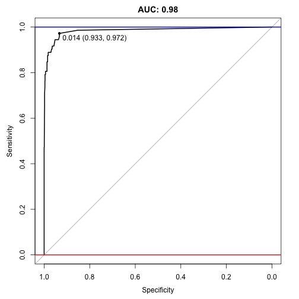
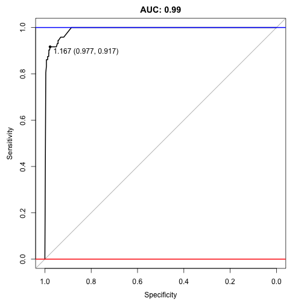

 
**Resources**
<ul>
<li type="square"><a href="https://www.youtube.com/watch?v=1Mt7EuVJf1A&list=UUq4pm1i_VZqxKVVOz5qRBIA&index=10" target='_blank'>YouTube Companion Video</a></li>
<li type="square"><a href="#sourcecode">Full Source Code</a></li>
</ul>
<BR>
**Packages Used in this Walkthrough**
<ul>
        <li type="square"><b>{DMwR}</b> - Functions and data for the book "Data Mining with R" and SMOTE algorithm</li>
        <li type="square"><b>{caret}</b> - modeling wrapper, functions, commands</li>
        <li type="square"><b>{pROC}</b> - Area Under the Curve (AUC) functions</li>
</ul>

<BR><BR>
The ``SMOTE`` function oversamples your rare event by using <a href='http://en.wikipedia.org/wiki/Bootstrapping' target='_blank'>bootstrapping</a> and <a href='http://en.wikipedia.org/wiki/K-nearest_neighbors_algorithm' target="_blank"><i>k</i>-nearest neighbor</a> to synthetically create additional observations of that event. The definition of <b>rare event</b> is usually attributed to any outcome/depent/target/response variable that happens less than 15% of the time. For more details about this algorithm, read the original white paper, <a href='https://www.jair.org/media/953/live-953-2037-jair.pdf' target='_blank'>SMOTE: Synthetic Minority Over-sampling Technique</a>, from its creators. 

The best way to illustrate this tool is to apply it to an actual data set suffering from this so-called <b>rare event</b>. We'll use the <b>Thyroid Disease</b> data set from the <a href='http://archive.ics.uci.edu/ml/' target='_blank'>UCI Machine Learning Repository</a> (<b>University of California, Irvine</b>) containing positive and negative cases of hyperthyroidism. This is a condition in which the thyroid gland produces too much thyroid hormone (also known as "overactive thyroid").
<BR><BR>
**Let's Clean Some Data**

Let's load the <b>hypothyroid</b> data, clean it up by removing the colons and periods, and appending readable column names:

```r
hyper <-read.csv('http://archive.ics.uci.edu/ml/machine-learning-databases/thyroid-disease/hypothyroid.data', header=F)
names <- read.csv('http://archive.ics.uci.edu/ml/machine-learning-databases/thyroid-disease/hypothyroid.names', header=F, sep='\t')[[1]]
names <- gsub(pattern =":|[.]",x = names, replacement="")
colnames(hyper) <- names
```
<BR><BR>
We change the target column name from ``hypothyroid, negative.`` to ``target`` and set any values of ``negative`` to <b>0</b> and everything else to <b>1</b>:

```r
colnames(hyper) <-c("target", "age", "sex", "on_thyroxine", "query_on_thyroxine",
  "on_antithyroid_medication", "thyroid_surgery", "query_hypothyroid",
  "query_hyperthyroid", "pregnant", "sick", "tumor", "lithium",
  "goitre", "TSH_measured", "TSH", "T3_measured", "T3", "TT4_measured",
  "TT4", "T4U_measured", "T4U", "FTI_measured", "FTI", "TBG_measured",
  "TBG")
hyper$target <- ifelse(hyper$target=='negative',0,1)
```
<br><br>
Whether dealing with a <b>rare event</b> or not, it is a good idea to check the balance of positive versus negative outcomes: 

```r
print(table(hyper$target))
```
```
##    0    1 
## 3012  151
```

```r
print(prop.table(table(hyper$target)))
```
```
##       0       1 
## 0.95226 0.04774
```
At <b>5%</b>, this is clearly a skewed data set, aka <b>rare event</b>.
<br><br>
A quick peek to see where we are:

```{r}
head(hyper,2)
```

```
##   target age sex on_thyroxine query_on_thyroxine on_antithyroid_medication
## 1      1  72   M            f                  f                         f
## 2      1  15   F            t                  f                         f
##   thyroid_surgery query_hypothyroid query_hyperthyroid pregnant sick tumor
## 1               f                 f                  f        f    f     f
## 2               f                 f                  f        f    f     f
##   lithium goitre TSH_measured TSH T3_measured   T3 TT4_measured TT4
## 1       f      f            y  30           y 0.60            y  15
## 2       f      f            y 145           y 1.70            y  19
##   T4U_measured  T4U FTI_measured FTI TBG_measured TBG
## 1            y 1.48            y  10            n   ?
## 2            y 1.13            y  17            n   ?
```
<BR><BR>
The data is riddled with characters. These need to binarize into numbers to facilitate modeling:

```r
ind <- sapply(hyper, is.factor)
hyper[ind] <- lapply(hyper[ind], as.character)
 
hyper[ hyper == "?" ] = NA
hyper[ hyper == "f" ] = 0
hyper[ hyper == "t" ] = 1
hyper[ hyper == "n" ] = 0
hyper[ hyper == "y" ] = 1
hyper[ hyper == "M" ] = 0
hyper[ hyper == "F" ] = 1
 
hyper[ind] <- lapply(hyper[ind], as.numeric)
 
repalceNAsWithMean <- function(x) {replace(x, is.na(x), mean(x[!is.na(x)]))}
hyper <- repalceNAsWithMean(hyper)
```
<BR><BR>

**Reference Model**

We randomly split the data set into 2 equal portions using the ``createDataPartition`` function from the <b>caret</b> package :

```r
library(caret)
set.seed(1234)
splitIndex <- createDataPartition(hyper$target, p = .50,
                                  list = FALSE,
                                  times = 1)
trainSplit <- hyper[ splitIndex,]
testSplit <- hyper[-splitIndex,]
 
prop.table(table(trainSplit$target))
```

```
##       0       1 
## 0.95006 0.04994
```

```r
prop.table(table(testSplit$target))
```

```
##       0       1 
## 0.95446 0.04554
```
The outcome balance between both splits is still around <b>5%</b> therefore representative of the bigger set - we're in good shape.
<BR><BR>
We train a <a href='http://topepo.github.io/caret/Bagging.html' target='_blank'>treebag</a> model using <b>caret</b> syntax on ``trainSplit`` and predict hyperthyroidism on the ``testSplit`` portion:

```r
ctrl <- trainControl(method = "cv", number = 5)
tbmodel <- train(target ~ ., data = trainSplit, method = "treebag",
                 trControl = ctrl)

predictors <- names(trainSplit)[names(trainSplit) != 'target']
pred <- predict(tbmodel$finalModel, testSplit[,predictors])
```
<BR><BR>
To evaluate the model, we call on package <b>pROC</b> for an ``auc`` score and plot:

```r
library(pROC)
auc <- roc(testSplit$target, pred)
print(auc)
```

```
## Data: pred in 1509 controls (testSplit$target 0) < 72 cases (testSplit$target 1).
## Area under the curve: 0.985
```

```r
plot(auc, ylim=c(0,1), print.thres=TRUE, main=paste('AUC:',round(auc$auc[[1]],2)))
abline(h=1,col='blue',lwd=2)
abline(h=0,col='red',lwd=2)
```

 
<Br>
An ``auc`` score of <b>0.98</b> is great (remember it ranges on a scale between <b>0.5</b> and <b>1</b>, where <b>0.5</b> is random and <b>1</b> is perfect). It is hard to imagine that ``SMOTE`` can improve on this, but...
<BR><BR>

**Let's SMOTE**

Let's create extra positive observations using ``SMOTE``. We set ``perc.over = 100`` to double the quantity of positive cases, and set ``perc.under=200`` to keep half of what was created as negative cases.

```r
library(DMwR)
trainSplit$target <- as.factor(trainSplit$target)
trainSplit <- SMOTE(target ~ ., trainSplit, perc.over = 100, perc.under=200)
trainSplit$target <- as.numeric(trainSplit$target)
```
<br><br>
We can check the ``outcome`` balance with ``prop.table`` and confirm that we equalized the data set between positive and negative cases of hyperthyroidism. 

```{r}
prop.table(table(trainSplit$target))
```

```
##   1   2 
## 0.5 0.5
```
<br><br>
We then train using the ``SMOTE``'d training set and predict using the <b>same</b> testing set as used before on the non-``SMOTE``'d training set to ensure we're comparing apples-to-apples:

```r
tbmodel <- train(target ~ ., data = trainSplit, method = "treebag",
                 trControl = ctrl)
 
predictors <- names(trainSplit)[names(trainSplit) != 'target']
pred <- predict(tbmodel$finalModel, testSplit[,predictors])

auc <- roc(testSplit$target, pred)
print(auc)
```

```
## Data: pred in 1509 controls (testSplit$target 0) < 72 cases (testSplit$target 1).
## Area under the curve: 0.991
```
<BR><BR>
Wow <b>0.991</b>, it managed to better the old ``auc`` score of <b>0.985</b>! 

```r
plot(auc, ylim=c(0,1), print.thres=TRUE, main=paste('AUC:',round(auc$auc[[1]],2)))
abline(h=1,col='blue',lwd=2)
abline(h=0,col='red',lwd=2)
```

 
 
<BR><BR>
**Conclusion**

Not bad - we ended up reducing the overall size and getting a better score. ``SMOTE`` works great in some situation and not-so-great in others. This definitely requires some trial-and-error but the concept is very promising when stuck with extremely skewed and, therefore, overly sensitive data.

<BR><BR>        
<a id="sourcecode">Full source code (<a href='https://github.com/amunategui/SMOTE-Oversample-Rare-Events' target='_blank'>also on GitHub</a>)</a>:

```r
# load data sets
hyper <-read.csv('http://archive.ics.uci.edu/ml/machine-learning-databases/thyroid-disease/hypothyroid.data', header=F)
names <- read.csv('http://archive.ics.uci.edu/ml/machine-learning-databases/thyroid-disease/hypothyroid.names', header=F, sep='\t')[[1]]
names <- gsub(pattern =":|[.]",x = names, replacement="")
colnames(hyper) <- names

# fix variables and column headers
colnames(hyper) <-c("target", "age", "sex", "on_thyroxine", "query_on_thyroxine",
  "on_antithyroid_medication", "thyroid_surgery", "query_hypothyroid",
  "query_hyperthyroid", "pregnant", "sick", "tumor", "lithium",
  "goitre", "TSH_measured", "TSH", "T3_measured", "T3", "TT4_measured",
  "TT4", "T4U_measured", "T4U", "FTI_measured", "FTI", "TBG_measured",
  "TBG")
hyper$target <- ifelse(hyper$target=='negative',0,1)
head(hyper,2)

# check balance of outcome variable
print(table(hyper$target))
print(prop.table(table(hyper$target)))

# binarize all character fields
ind <- sapply(hyper, is.factor)
hyper[ind] <- lapply(hyper[ind], as.character)
 
hyper[ hyper == "?" ] = NA
hyper[ hyper == "f" ] = 0
hyper[ hyper == "t" ] = 1
hyper[ hyper == "n" ] = 0
hyper[ hyper == "y" ] = 1
hyper[ hyper == "M" ] = 0
hyper[ hyper == "F" ] = 1
 
hyper[ind] <- lapply(hyper[ind], as.numeric)
 
repalceNAsWithMean <- function(x) {replace(x, is.na(x), mean(x[!is.na(x)]))}
hyper <- repalceNAsWithMean(hyper)

# split data into train and test portions
library(caret)
set.seed(1234)
splitIndex <- createDataPartition(hyper$target, p = .50,
                                  list = FALSE,
                                  times = 1)
trainSplit <- hyper[ splitIndex,]
testSplit <- hyper[-splitIndex,]

prop.table(table(trainSplit$target))
prop.table(table(testSplit$target))

# model using treebag
ctrl <- trainControl(method = "cv", number = 5)
tbmodel <- train(target ~ ., data = trainSplit, method = "treebag",
                 trControl = ctrl)

predictors <- names(trainSplit)[names(trainSplit) != 'target']
pred <- predict(tbmodel$finalModel, testSplit[,predictors])

# evaluate the model's performance
library(pROC)
auc <- roc(testSplit$target, pred)
print(auc)
plot(auc, ylim=c(0,1), print.thres=TRUE, main=paste('AUC:',round(auc$auc[[1]],2)))
abline(h=1,col='blue',lwd=2)
abline(h=0,col='red',lwd=2)

# SMOTE more positive cases
library(DMwR)
trainSplit$target <- as.factor(trainSplit$target)
trainSplit <- SMOTE(target ~ ., trainSplit, perc.over = 100, perc.under=200)
trainSplit$target <- as.numeric(trainSplit$target)

prop.table(table(trainSplit$target))

# evaluate the SMOTE performance
tbmodel <- train(target ~ ., data = trainSplit, method = "treebag",
                 trControl = ctrl)

predictors <- names(trainSplit)[names(trainSplit) != 'target']
pred <- predict(tbmodel$finalModel, testSplit[,predictors])

auc <- roc(testSplit$target, pred)
print(auc)

plot(auc, ylim=c(0,1), print.thres=TRUE, main=paste('AUC:',round(auc$auc[[1]],2)))
abline(h=1,col='blue',lwd=2)
abline(h=0,col='red',lwd=2)

```


<div class="row">   
    <div class="span9 column">
            <p class="pull-right"> <a href="{{page.previous.url}}" title="Previous Post: {{page.previous.title}}"><i class="icon-chevron-left"></i></a>          <a href="{{page.next.url}}" title="Next Post: {{page.next.title}}"><i class="icon-chevron-right"></i></a>    </p>  
    </div>
</div>

 