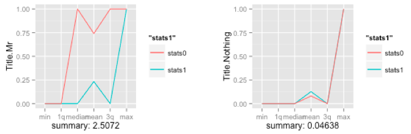

**Resources**
<ul>
<li type="square"><a href="https://www.youtube.com/user/mamunate/videos" target='_blank'>YouTube Companion Video</a></li>
<li type="square"><a href="#sourcecode">Full Source Code</a></li>
</ul>
<BR>
**Packages Used in this Walkthrough**

<ul>
        <li type="square"><b>{caret}</b> - dummyVars function</li>
        <li type="square"><b>{ggplot2}</b> - Graphics/Grammar of Graphics</li>
        <li type="square"><b>{grid}</b> - Grid Graphics Package</li>
</ul>

<BR><BR>
You're probably familiar within the <a href='https://stat.ethz.ch/R-manual/R-devel/library/base/html/summary.html' target='_blank'>summary()</a> function in R. It's an essential function, used all the time, that can reveal so much about your data. Yet, by extending it just a tad, we can quickly figure out top predictors, even on extremely large data sets.

 
<BR><BR>

The idea is not to summarize the variable in of itself, but to split the data into two sets, one for each outcome and summarize them then. Comparing the results from both sets will tell you how well you predictor behaves towards your outcome variable. The above plots shows the summary of two predictors the spreads between outcomes - clearly, this first plot is a powerful predictor, while the second one isn't.

Let's first measure a single predictor to see how this works, then we'll quantify this technique to apply it to entire data sets.

We’ll pull in the classic <b>Titanic</b> data set that I’ve already used in many of my walkthroughs. The code below will download the data from the <b>University of Colorado</b>, clean it up and yield a numeric-only, modeling-ready data frame:


```r
# using dataset from the UCI Machine Learning Repository (http://archive.ics.uci.edu/ml/)
titanicDF <- read.csv('http://math.ucdenver.edu/RTutorial/titanic.txt',sep='\t')

# creating new title feature
titanicDF$Title <- ifelse(grepl('Mr ',titanicDF$Name),'Mr',ifelse(grepl('Mrs ',titanicDF$Name),'Mrs',ifelse(grepl('Miss',titanicDF$Name),'Miss','Nothing')))
titanicDF$Title <- as.factor(titanicDF$Title)

# impute age to remove NAs
titanicDF$Age[is.na(titanicDF$Age)] <- median(titanicDF$Age, na.rm=T)

# reorder data set so target is last column
titanicDF <- titanicDF[c('PClass', 'Age',    'Sex',   'Title', 'Survived')]

# binarize all factors
require(caret)
```

```
## Loading required package: caret
## Loading required package: lattice
## Loading required package: ggplot2
```

```r
titanicDummy <- dummyVars("~.",data=titanicDF, fullRank=F)
titanicDF <- as.data.frame(predict(titanicDummy,titanicDF))
```
<BR><BR>
Let's call ``head`` on our variables to see what we are dealing with. ``Survived`` is our outcome variable:


```r
head(titanicDF, 3)
```

```
##   PClass.1st PClass.2nd PClass.3rd Age Sex.female Sex.male Title.Miss
## 1          1          0          0  29          1        0          1
## 2          1          0          0   2          1        0          1
## 3          1          0          0  30          0        1          0
##   Title.Mr Title.Mrs Title.Nothing Survived
## 1        0         0             0        1
## 2        0         0             0        0
## 3        1         0             0        0
```
<BR><BR>
Calling the ``summary`` function or the <a href='https://stat.ethz.ch/R-manual/R-devel/library/utils/html/str.html' target='_blank'>str</a> function on an entire data frame is a great way of getting aquainted with it:


```r
summary(titanicDF)
```

```
##    PClass.1st      PClass.2nd      PClass.3rd         Age       
##  Min.   :0.000   Min.   :0.000   Min.   :0.000   Min.   : 0.17  
##  1st Qu.:0.000   1st Qu.:0.000   1st Qu.:0.000   1st Qu.:26.00  
##  Median :0.000   Median :0.000   Median :1.000   Median :28.00  
##  Mean   :0.245   Mean   :0.213   Mean   :0.541   Mean   :29.38  
##  3rd Qu.:0.000   3rd Qu.:0.000   3rd Qu.:1.000   3rd Qu.:30.00  
##  Max.   :1.000   Max.   :1.000   Max.   :1.000   Max.   :71.00  
##    Sex.female       Sex.male       Title.Miss      Title.Mr    
##  Min.   :0.000   Min.   :0.000   Min.   :0.00   Min.   :0.000  
##  1st Qu.:0.000   1st Qu.:0.000   1st Qu.:0.00   1st Qu.:0.000  
##  Median :0.000   Median :1.000   Median :0.00   Median :1.000  
##  Mean   :0.352   Mean   :0.648   Mean   :0.18   Mean   :0.572  
##  3rd Qu.:1.000   3rd Qu.:1.000   3rd Qu.:0.00   3rd Qu.:1.000  
##  Max.   :1.000   Max.   :1.000   Max.   :1.00   Max.   :1.000  
##    Title.Mrs     Title.Nothing      Survived    
##  Min.   :0.000   Min.   :0.000   Min.   :0.000  
##  1st Qu.:0.000   1st Qu.:0.000   1st Qu.:0.000  
##  Median :0.000   Median :0.000   Median :0.000  
##  Mean   :0.152   Mean   :0.096   Mean   :0.343  
##  3rd Qu.:0.000   3rd Qu.:0.000   3rd Qu.:1.000  
##  Max.   :1.000   Max.   :1.000   Max.   :1.000
```
<BR><BR>
As you can see, this yields a version of the <a href='http://en.wikipedia.org/wiki/Five-number_summary' target='_blank'>five-number summary</a> displaying the <b>min, max, 1st & 3rd quantile, mean, medium</b> of each variable.
<BR><BR>
Though extremely useful, this doesn't help us understand how our outcome variable interacts with its predictors. To remedy this, we split the data into two separate data sets, an outcome-positive data set, and an outcome-negative data set. Let's look at ``Sex.female``:


```r
df_survived_1 <- subset(titanicDF, Survived==1)
df_survived_0 <- subset(titanicDF, Survived==0)
summary(df_survived_1$Sex.female)
```

```
##    Min. 1st Qu.  Median    Mean 3rd Qu.    Max. 
##   0.000   0.000   1.000   0.684   1.000   1.000
```

```r
summary(df_survived_0$Sex.female)
```

```
##    Min. 1st Qu.  Median    Mean 3rd Qu.    Max. 
##   0.000   0.000   0.000   0.178   0.000   1.000
```
<BR><BR>
Now, a much clearer picture emerges regarding that variable when using an outcome-specific perspective. We learn that almost 70% of those that survived where females! I think you can see where I am going with this.
<BR><BR>
Let's see how we can graph this information in an intuitive way. The idea is to create a vector of summary information for both outcomes, overlaying them together and measuring the spread. We'll continue with the ``Sex.female`` variable as it should already be apparent how strong of a predictor it is.


```r
Sex.Female_0 <- (summary(df_survived_0$Sex.female))
Sex.Female_0 <- c(Sex.Female_0[1:6])
Sex.Female_1 <- (summary(df_survived_1$Sex.female))
Sex.Female_1 <- c(Sex.Female_1[1:6])
stats <- data.frame('ind'=c(1:6), 
                    'Sex.Female_1'=Sex.Female_1,
                    'Sex.Female_0'=Sex.Female_0)
```
<BR><BR>
``stats`` is the data frame holding the summary data for ``Sex.female`` for both outcomes. This data frame holds three varialbes, an index column, a predictor column where the outcome is positive and another where the outcome is negative, and 6 rows, one for each summary output:


```r
head(stats,6)
```

```
##         ind Sex.Female_1 Sex.Female_0
## Min.      1        0.000        0.000
## 1st Qu.   2        0.000        0.000
## Median    3        1.000        0.000
## Mean      4        0.684        0.178
## 3rd Qu.   5        1.000        0.000
## Max.      6        1.000        1.000
```
<BR><BR>
The logical next step is to plot it:


```r
require(ggplot2)
p <- ggplot(data=stats, aes(ind)) +
               geom_line(aes(y = Sex.Female_1, colour = "Sex.Female_1")) +
               geom_line(aes(y = Sex.Female_0, colour = "Sex.Female_0")) +
               scale_x_discrete(breaks = 1:6,
                                labels=c("min","1q","median","mean","3q","max"))
p
```

 
<BR><BR>
Obviously, we're going to generalize this into a neat function, but, by doing it by hand for a single variable you should start seeing the power of looking at summary data is such manner. By using <a href='http://ggplot2.org/' target='_blank'>ggplot2</a>, it is easy to display the summary measures on the ``x`` axis. 
<BR><BR>
The green line represents the females that survied and the red one, those that didn't survived. As you can see both lines are far apart, the green line is well above the red one, and this means that the variable is a powerful predictor for survivability. 
<BR><BR>
If we generalize this spread into a single number, we'll be able to bypass the graphing phase and apply this to huge data sets.


```r
spread <- ((Sex.Female_1[[1]] - Sex.Female_0[[1]]) +
             (Sex.Female_1[[2]] - Sex.Female_0[[2]]) +
             (Sex.Female_1[[3]] - Sex.Female_0[[3]]) +
             (Sex.Female_1[[4]] - Sex.Female_0[[4]]) +
             (Sex.Female_1[[5]] - Sex.Female_0[[5]]) +
             (Sex.Female_1[[6]] - Sex.Female_0[[6]]))
print(spread)
```

```
## [1] 2.506
```
<BR><BR>
<b>2.56</b> is a large spread, let's compare it with the weaker variable ``Title.Nothing``:


```r
Title.Nothing_0 <- (summary(df_survived_0$Title.Nothing))
Title.Nothing_0 <- c(Title.Nothing_0[1:6])
Title.Nothing_1 <- (summary(df_survived_1$Title.Nothing))
Title.Nothing_1 <- c(Title.Nothing_1[1:6])
stats <- data.frame('ind'=c(1:6), 'stats1'=Title.Nothing_1,'stats0'=Title.Nothing_0)
spread <- ((Title.Nothing_1[[1]] - Title.Nothing_0[[1]]) +
             (Title.Nothing_1[[2]] - Title.Nothing_0[[2]]) +
             (Title.Nothing_1[[3]] - Title.Nothing_0[[3]]) +
             (Title.Nothing_1[[4]] - Title.Nothing_0[[4]]) +
             (Title.Nothing_1[[5]] - Title.Nothing_0[[5]]) +
             (Title.Nothing_1[[6]] - Title.Nothing_0[[6]]))
print(spread)
```

```
## [1] 0.0366
```
<BR><BR>
There you go, <b>0.0366</b> is a much smaller spread than <b>2.56</b>! This quantative value will allow us to cycle through any number of variables without having to plot them individually:


```r
p <- ggplot(data=stats, aes(ind)) +
               geom_line(aes(y = stats1, colour = "stats1")) +
               geom_line(aes(y = stats0, colour = "stats0")) +
               scale_x_discrete(breaks = 1:6,
                                labels=c("min","1q","median","mean","3q","max")) +
                ylab('Title.Nothing') + xlab(paste('Spread:',spread))
p
```

 
<BR><BR>
It is time to generalize all this so we don't have to tediously type each variable name every time we want to measure these relationships.
<BR><BR>
We'll call it ``GetSummaryAndPlots()``. It requires a scaled data set, the ``outcome`` variable (what we're trying to predict), the ``predictor`` variable, and whether we want it to be plotted. If we don't want it plotted, it will return the spread:


```r
GetSummaryPlot <- function(objdfscaled0, objdfscaled1, outcomename, varname, plotit=TRUE) {
     require(ggplot2)
    
     stats0 <- (summary(objdfscaled0[,varname]))
     stats0 <- c(stats0[1:6])
     stats1 <- (summary(objdfscaled1[,varname]))
     stats1 <- c(stats1[1:6])
     stats <- data.frame('ind'=c(1:6), 'stats1'=stats1,'stats0'=stats0)
    
     spread <- ((stats1[[1]] - stats0[[1]]) +
                     (stats1[[2]] - stats0[[2]]) +
                     (stats1[[3]] - stats0[[3]]) +
                     (stats1[[4]] - stats0[[4]]) +
                     (stats1[[5]] - stats0[[5]]) +
                     (stats1[[6]] - stats0[[6]]))
    
     if (plotit) {
          print(paste('Scaled spread:',spread))
          p <- ggplot(data=stats, aes(ind)) +
               geom_line(aes(y = stats1, colour = "stats1")) +
               geom_line(aes(y = stats0, colour = "stats0")) +
               scale_x_discrete(breaks = 1:6,
                                labels=c("min","1q","median","mean","3q","max")) +
               ylab(varname) + xlab(paste('Spread:',spread))
          return (p)
     } else {
          return (spread)
     }
}
```
<BR><BR>
Let's look at another piece of code that will allow us to generalize this further. By using the ``scale`` function and scaling the entire data set into a standard unit of measurement, we can easily compare the spread between each predictor. Let's give it a whirl on the entire data set...


```r
outcomeName <- 'Survived'
predictorNames <- names(titanicDF)[!names(titanicDF) %in% outcomeName]
# Temporarily remove the outcome variable before scaling the data set
outcomeValue <- titanicDF$Survived
# scale returns a matrix so we need to tranform it back to a data frame
scaled_titanicDF <- as.data.frame(scale(titanicDF))
scaled_titanicDF$Survived <- outcomeValue
# split your data sets
scaled_titanicDF_0 <- scaled_titanicDF[scaled_titanicDF[,outcomeName]==0,]
scaled_titanicDF_1 <- scaled_titanicDF[scaled_titanicDF[,outcomeName]==1,]
    
for (predictorName in predictorNames)
        print(paste(predictorName,':',GetSummaryPlot(scaled_titanicDF_0,
                scaled_titanicDF_1, outcomeName, predictorName, plotit=FALSE)))
```

```
## [1] "PClass.1st : 2.969"
## [1] "PClass.2nd : 2.6301"
## [1] "PClass.3rd : -2.727"
## [1] "Age : -0.2498"
## [1] "Sex.female : 5.253"
## [1] "Sex.male : -5.253"
## [1] "Title.Miss : 3.119"
## [1] "Title.Mr : -5.071"
## [1] "Title.Mrs : 3.54"
## [1] "Title.Nothing : 0.1241"
```
<BR><BR>
Pretty cool, right? With a quick glance we see that ``Sex.male`` and ``Title.Mr`` have a substantial negative effect on survivabilty while ``Sex.female`` has a sustantial poistive effect.
<BR><BR>
How about plotting this efficiently? We'll use the ``multiplot`` function from the great resource: <a href='http://www.cookbook-r.com/Graphs/Multiple_graphs_on_one_page_(ggplot2)/' target='_blank'>Cookbook for R</a>. This enables the stacking of multiple ``ggplots`` on the same page, just like ``par`` and ``mfrow`` does for regular R plots. For more information, please visit the above link.


```r
multiplot <- function(..., plotlist=NULL, file, cols=1, layout=NULL) {
     #http://www.cookbook-r.com/Graphs/Multiple_graphs_on_one_page_(ggplot2)/
     # Multiple plot function
     #
     # ggplot objects can be passed in ..., or to plotlist (as a list of ggplot objects)
     # - cols:   Number of columns in layout
     # - layout: A matrix specifying the layout. If present, 'cols' is ignored.
     #
     # If the layout is something like matrix(c(1,2,3,3), nrow=2, byrow=TRUE),
     # then plot 1 will go in the upper left, 2 will go in the upper right, and
     # 3 will go all the way across the bottom.
     #
     require(grid)
    
     # Make a list from the ... arguments and plotlist
     plots <- c(list(...), plotlist)
    
     numPlots = length(plots)
    
     # If layout is NULL, then use 'cols' to determine layout
     if (is.null(layout)) {
          # Make the panel
          # ncol: Number of columns of plots
          # nrow: Number of rows needed, calculated from # of cols
          layout <- matrix(seq(1, cols * ceiling(numPlots/cols)),
                           ncol = cols, nrow = ceiling(numPlots/cols))
     }
    
     if (numPlots==1) {
          print(plots[[1]])
         
     } else {
          # Set up the page
          grid.newpage()
          pushViewport(viewport(layout = grid.layout(nrow(layout), ncol(layout))))
         
          # Make each plot, in the correct location
          for (i in 1:numPlots) {
               # Get the i,j matrix positions of the regions that contain this subplot
               matchidx <- as.data.frame(which(layout == i, arr.ind = TRUE))
              
               print(plots[[i]], vp = viewport(layout.pos.row = matchidx$row,
                                               layout.pos.col = matchidx$col))
          }
     }
}
```
<BR><BR>
Now, let's plot the 4 strongest positive predictors for survivability and the 4 strongest negative ones:


```r
p1 <- GetSummaryPlot(scaled_titanicDF_0, scaled_titanicDF_1, outcomeName, 'Sex.female', plotit=TRUE)
```

```
## [1] "Scaled spread: 5.253"
```

```r
p2 <- GetSummaryPlot(scaled_titanicDF_0, scaled_titanicDF_1, outcomeName, 'Title.Mrs', plotit=TRUE)
```

```
## [1] "Scaled spread: 3.54"
```

```r
p3 <- GetSummaryPlot(scaled_titanicDF_0, scaled_titanicDF_1, outcomeName, 'Sex.male', plotit=TRUE)
```

```
## [1] "Scaled spread: -5.253"
```

```r
p4 <- GetSummaryPlot(scaled_titanicDF_0, scaled_titanicDF_1, outcomeName, 'Title.Mr', plotit=TRUE)
```

```
## [1] "Scaled spread: -5.071"
```

```r
multiplot(p1,p2,p3,p4,cols=2)
```

```
## Loading required package: grid
```

 
<BR><BR>
And now for the capper, let's plot everything on a bar graph so we can easily compare the strongest predictors and the direction they affect the model:


```r
summaryImportance <- c()
variableName <- c()
for (predictorName in predictorNames) {
        summaryImportance <-  c(summaryImportance, GetSummaryPlot(scaled_titanicDF_0, scaled_titanicDF_1, outcomeName, predictorName, plotit=FALSE))
        variableName <- c(variableName, predictorName)
}
results <- data.frame('VariableName'=variableName, 'Weight'=summaryImportance)

# display variable importance on a +/- scale 
results <- results[order(results$Weight),]
results <- results[(results$Weight != 0),]

par(mar=c(5,15,4,2)) # increase y-axis margin. 
xx <- barplot(results$Weight, width = 0.85, 
              main = paste("Variable Importance - Titanic"), horiz = T, 
              xlab = "< (-) importance >  < neutral >  < importance (+) >", axes = FALSE, 
              col = ifelse((results$Weight > 0), 'blue', 'red')) 
axis(2, at=xx, labels=results$VariableName, tick=FALSE, las=2, line=-0.3, cex.axis=0.6)  
```

 
<BR><BR>

**Conclusion**

This approach only works when attempting to predict a binary outcome and won't work if predicting a continous variable. Also, it is a naive-based variable importance calcluator as it dosen't account for interactions between predictors. Yet, it is a fast way to size up a data set for supervised modeling and should handle very large dimensions. Happy explorations!

<BR><BR>        
<a id="sourcecode">Full source code (<a href='https://github.com/amunategui/' target='_blank'>also on GitHub</a>)</a>:

```r
```
