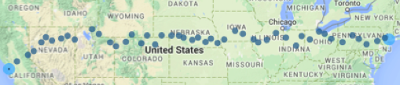

 
<BR><BR>

**Resources**
<ul>
<li type="square"><a href="https://www.youtube.com/user/mamunate/videos" target='_blank'>YouTube Companion Video</a></li>
<li type="square"><a href="#sourcecode">Full Source Code</a></li>
</ul>
<BR>
**Packages Used in this Walkthrough**

<ul>
        <li type="square"><b>{caret}</b> - dummyVars function</li>
        <li type="square"><b>{ggplot2}</b> - Graphics/Grammar of Graphics</li>
        <li type="square"><b>{grid}</b> - Grid Graphics Package</li>
</ul>

<BR><BR>

Just in time for Valentine's day, if you are planning a trip accross the United States and want to offer your companion a rose every 1 degree latitude, then this code is for you! The title says it all, we’re going to use <a href='http://www.yelp.com/' target='_blank'>Yelp</a> to cross the United States from San Francisco, CA to New York City, NY, and be 60 miles from a florist at all times. 
<BR><BR>
This walkthrough has two parts, the basics of Yelp and <a href='http://cran.r-project.org/web/packages/httr/vignettes/quickstart.html' target='_blank'>httr</a>, and a traveling code to hop from florist to florist and cross the country. The iternary will be plotted on <a href='http://cran.r-project.org/web/packages/ggmap/index.html' target='_blank'>ggmap</a>. If all you need is to pull locations via Yelp, then the first part is all you need.

**Part 1: Yelp and httr**

We'll look at two different ways of using the <a href='http://www.yelp.com/developers/documentation/v2/search_api' target='_blank'>Yelp Search API</a>. For either of them, you will need to sign up for a free <a href='http://www.yelp.com/developers/' target='_blank'>Yelp account</a> and request <a href='http://www.yelp.com/developers/manage_api_keys' target='_blank'>API keys</a>.

The simplest and probably most common way of using the API, is to request a term for a specific city or address. This is what the URL would look like for the term ``food`` around ``San Franciso``:

<quote>http://api.yelp.com/v2/search?term=food&location=San+Francisco</quote>
 
Unfortunatly, its a bit more complicated than simply dropping that in a browser. To authenticate (i.e. be recognized as a registered user), Yelp uses <a href='http://tools.ietf.org/html/rfc5849' target='_blank'>OAuth v1.0a protocol</a>. 

This is a cleaver of way autehnicating you without exposing your account or password. On a very high level, it is done with a two-step process, first we ask Yelp for a signature key through a GET command, then we use that returned temporary key to retrieve our locations. Check out <a href='http://www.yelp.com/developers/documentation/v2/authentication' target='_blank'>Yelp's authentication docs</a> for more details.

This is a lot of work to do manually, but the handy <a href='http://cran.r-project.org/web/packages/httr/index.html' target='_blank'>httr package</a> from Hadley Wickham handles a lot of the authentication minutia details automatically. It’s a really cool package as it can 'shake hands' with many <b>HTTP</b> API's (Twitter, Facebook, Linkedin, Google, etc).

After you get your keys from <b>Yelp</b>, swap them for the x’s in the code below:

```r
consumerKey = "xxxx"
consumerSecret = "xxxx"
token = "xxxx"
tokenSecret = "xxxx"
```
<BR><BR>
Load up the <b>httr</b> library and call the ``oauth_app`` function passing it a name tag (can be anything you want), and your ``consumer`` credentials. Next call up the ``sign_oauth1.0``, pass it the ``myapp`` object along with your ``token`` credentials.


```r
require(httr)
```

```
## Loading required package: httr
```

```r
myApp <- oauth_app("YELP", key=consumerKey, secret=consumerSecret)
mySignature <- sign_oauth1.0(myApp, token=token, token_secret=tokenSecret)
```

** Searching by Locations**
Your signature is ready to be used on a <b>Yelp</b> search query:


```r
yelpURL <- paste0("http://api.yelp.com/v2/search/?limit=3&term=food&location=San%20Francisco")
locationData <- GET(yelpURL, mySignature)
```
<BR><BR>
That's it, we entered the term <b>food</b> in <b>San Francisco</b> and asked to limit it to ``3`` result. Let's use the JSON parser, <a href='http://cran.r-project.org/web/packages/jsonlite/index.html' target='_blank'>jsonlite</a>, to access them:


```r
require(jsonlite)
```

```
## Loading required package: jsonlite
```

```
## Warning: package 'jsonlite' was built under R version 3.1.2
```

```
## 
## Attaching package: 'jsonlite'
## 
## The following object is masked from 'package:utils':
## 
##     View
```

```r
locationDataContent = content(locationData)
locationList=jsonlite::fromJSON(toJSON(locationDataContent))
results <- data.frame(locationList)
results$businesses.name
```

```
## [[1]]
## [1] "Ike's Place"
## 
## [[2]]
## [1] "The Italian Homemade Company"
## 
## [[3]]
## [1] "The Codmother Fish and Chips"
```
<BR><BR>
``results$businesses.name`` returned three business names as asked, but it offers up a lot more variables:


```r
names(results)
```

```
##  [1] "region.span.latitude_delta"      "region.span.longitude_delta"    
##  [3] "region.center.latitude"          "region.center.longitude"        
##  [5] "total"                           "businesses.is_claimed"          
##  [7] "businesses.rating"               "businesses.mobile_url"          
##  [9] "businesses.rating_img_url"       "businesses.review_count"        
## [11] "businesses.name"                 "businesses.snippet_image_url"   
## [13] "businesses.rating_img_url_small" "businesses.url"                 
## [15] "businesses.menu_date_updated"    "businesses.phone"               
## [17] "businesses.snippet_text"         "businesses.image_url"           
## [19] "businesses.categories"           "businesses.display_phone"       
## [21] "businesses.rating_img_url_large" "businesses.menu_provider"       
## [23] "businesses.id"                   "businesses.is_closed"           
## [25] "businesses.location"
```

Obviously, the terms <b>food</b> and <b>San Francisco</b> are way too vague, but you get the idea. Next we'll search by geo-spatial coordinates.

** Searching by Geo-Spatial Coordinates**

This is very close to what we did above except we specify the location down to the latitude and longitude of the desired area. How about three bars by Montgomery and Market Streets in San Francisco:

```r
yelpURL <- paste0("http://api.yelp.com/v2/search/?limit=3&ll=37.788022,-122.399797&term=bar")
locationData <- GET(yelpURL, mySignature)
require(jsonlite)
locationDataContent = content(locationData)
locationList=jsonlite::fromJSON(toJSON(locationDataContent))
results <- data.frame(locationList)
names(results)
```

```
##  [1] "region.span.latitude_delta"      "region.span.longitude_delta"    
##  [3] "region.center.latitude"          "region.center.longitude"        
##  [5] "total"                           "businesses.is_claimed"          
##  [7] "businesses.distance"             "businesses.mobile_url"          
##  [9] "businesses.rating_img_url"       "businesses.review_count"        
## [11] "businesses.name"                 "businesses.snippet_image_url"   
## [13] "businesses.rating"               "businesses.url"                 
## [15] "businesses.location"             "businesses.phone"               
## [17] "businesses.snippet_text"         "businesses.image_url"           
## [19] "businesses.categories"           "businesses.display_phone"       
## [21] "businesses.rating_img_url_large" "businesses.id"                  
## [23] "businesses.is_closed"            "businesses.rating_img_url_small"
```

```r
results$businesses.name
```

```
## [[1]]
## [1] "83 Proof"
## 
## [[2]]
## [1] "Topsy's Fun House"
## 
## [[3]]
## [1] "Rickhouse"
```
<BR><BR>
The difference is syntatical, instead of building the URL with ``location``, we do it with ``ll``. We'll use a thrid way of pulling locations in part 2 - geo-spatial bounded boxes. That's it for part 1.

**Part 2: Hoping from Florist to Florist Accross the United States**

Let me tell you, this was a blast to design and build! I'll go over the perinent parts but if you want to see this in action yourself, copy the code at the end of the walkthrough and replace the Yelp credentials with yours and you're good to go!

This isn't a full-proof application (matter of fact it can only travel west to east), but it will take a departure and destination set of latitudes and logitudes, a search term and attempt to link both points with a path using your search term every 60 miles approximately. Here, we will go from San Francisco, CA to New York City, NY, florist by florist.

``ggmap`` has a handy function called `geocode``. You can give it addresses, zip codes, famous monuments, and it will return that places latitude and longitude coordinates. 


```r
require(ggplot2)
```

```
## Loading required package: ggplot2
```

```r
require(ggmap)
```

```
## Loading required package: ggmap
```

```r
startingpoint <- geocode(c("Fishersman's Wharf, San Francisco, CA"))
```

```
## Information from URL : http://maps.googleapis.com/maps/api/geocode/json?address=Fishersman's+Wharf,+San+Francisco,+CA&sensor=false
## Google Maps API Terms of Service : http://developers.google.com/maps/terms
```

```r
print(startingpoint)
```

```
##      lon   lat
## 1 -122.4 37.81
```

```r
endingpoint <- geocode(c("Chelsea Piers, NY"))
```

```
## Information from URL : http://maps.googleapis.com/maps/api/geocode/json?address=Chelsea+Piers,+NY&sensor=false
## Google Maps API Terms of Service : http://developers.google.com/maps/terms
```

```r
print(endingpoint)
```

```
##      lon   lat
## 1 -74.01 40.75
```
<BR><BR>
Now we know our staring and ending points, let's start our first point manually then generalize tasks through functions. 

We'll use ``ggmap`` to import a map of the United States from Google. ``ggplot2`` accepts a data frame, let's make one with our start and end points and see the journey that lies ahead. We'll assign an importance to each point - start and end are 10, 


```r
latitudes <- c(startingpoint$lat, endingpoint$lat)
longitudes <- c(startingpoint$lon, endingpoint$lon)

objdf <- data.frame('latitude'=latitudes,
                    'longitude'=longitudes,
                    'size'=c(10,10),
                    'color'=c('red','red'))

# get a Google map
map<-get_map(location='united states', zoom=4, maptype = "terrain",
             source='google',color='color')
```

```
## Map from URL : http://maps.googleapis.com/maps/api/staticmap?center=united+states&zoom=4&size=%20640x640&scale=%202&maptype=terrain&sensor=false
## Google Maps API Terms of Service : http://developers.google.com/maps/terms
## Information from URL : http://maps.googleapis.com/maps/api/geocode/json?address=united+states&sensor=false
## Google Maps API Terms of Service : http://developers.google.com/maps/terms
```

```r
objMap <- NULL
objMap <- ggmap(map) + geom_point(
        aes(x=longitude, y=latitude, size=size, 
            show_guide = TRUE, colour = color), 
        data=objdf, alpha=.8, na.rm = T) 

objMap
```

 
<BR><BR>
I will keep the details short on the next few functions. ``MapIt`` takes geo-spatial coordinates, a size, and the ``ggmap`` object. The function will return the ``ggmap`` object and we need to always pass the same ``ggmap`` back if we want to update and track the journey's history. 


```r
MapIt <- function(latitude, longitude, size, objggmap) {
        objdf <- data.frame('latitude'=latitude,
               'longitude'=longitude,
               'size'=size)
        
        # add new point to ggmap
        require("ggplot2")
        require("ggmap")
        objggmap <- objggmap + geom_point(
                aes(x=longitude, y=latitude, size=size, 
                    show_guide = TRUE, colour=size), 
                data=objdf, alpha=.8, na.rm = T)  
        return (objggmap)
}
```
<BR><BR>
``GetBestYelpLocation``, as its name implies, takes a vector of two sets of geo-spatial coordinates, the upper left point and the lower right one, along with the search term and sends it to Yelp. It returns a data frame with the ``name``, ``city``, ``rating``, ``state``, and geo-spatial coordinates of the top location using the search term.


```r
GetBestYelpLocation <- function(boundedcoordinates, term) {
        limit <- 1
        
        YelpUrl <- paste0("http://api.yelp.com/v2/search/?limit=20&bounds=",
                          boundedcoordinates[1],",",boundedcoordinates[2],
                          "|",boundedcoordinates[3],",",boundedcoordinates[4],"&term=",term)
         
        locationdata=GET(YelpUrl, sig)
        listMembersContent = content(locationdata)
        listMembers=jsonlite::fromJSON(toJSON(listMembersContent))
        
        yelpResults = tryCatch({
                data.frame(listMembers)
        }, error = function(e) { 
                NULL
        })
        if (!is.null(yelpResults)) {
                set1 <- data.frame("name"=yelpResults$businesses.name,
                   'city'=yelpResults$businesses.location$city,
                   'rating'=yelpResults$businesses.rating, 
                   'latitude'=yelpResults$businesses.location$coordinate$latitude,
                   'longitude'=yelpResults$businesses.location$coordinate$longitude,
                   'state'=yelpResults$businesses.location$state_code)
                 
                for (ind in seq(1:nrow(set1))) {
                        if ((set1$latitude[ind] <= boundedcoordinates[1]) &
                                (set1$latitude[ind] >= boundedcoordinates[3]) &
                                (set1$longitude[ind] >= boundedcoordinates[2]) &
                                (set1$longitude[ind] <= boundedcoordinates[4]))
                                return(set1[ind,])
                }
        }
        return(NULL)
}
```
<BR><BR>
``GetPossibleCoordinates`` takes the current position of our traveler, calculates its bounded box and returns the next two possible moves. One higher foward move and one lower forward move (see image below).

The default bounded box unit is 1 degree (very loosly around 60 miles), so we add 30 miles in all four directions. 


```r
GetPossibleCoordinates<-function(lat, lon, area=1) {
        # this is hard to keep track but each location's next move
        # equates attempting to move forward one square, the same area
        # as the previous one but half-way above and half-way below the
        # previous one.
        halfarea <- area/2
    
        # new forward top square area
        topArea_upperleft_latitude <- lat+area
        topArea_upperleft_longitude <- lon+halfarea
        
        topArea_lowerright_latitude <- lat
        topArea_lowerright_longitude <- lon+(halfarea+area)
        
        # new forward bottom square area
        bottomArea_upperleft_latitude <- lat
        bottomArea_upperleft_longitude <- lon+halfarea
        
        bottomArea_lowerright_latitude <- lat-area
        bottomArea_lowerright_longitude <- lon+(halfarea+area)
          
        
        rownames <- c('new_top_area','new_bottom_area')
        latitude_point1 <- c(topArea_upperleft_latitude, bottomArea_upperleft_latitude)
        longitude_point1 <- c(topArea_upperleft_longitude, bottomArea_upperleft_longitude)
        latitude_point2 <- c(topArea_lowerright_latitude, bottomArea_lowerright_latitude)
        longitude_point2 <- c(topArea_lowerright_longitude, bottomArea_lowerright_longitude)
        
        return (data.frame('direction'=rownames,
                'latitude_point1'=latitude_point1,
                           'longitude_point1'=longitude_point1,
                           'latitude_point2'=latitude_point2,
                           'longitude_point2'=longitude_point2))
         
}
```
<BR><BR>
Finally, ``MakeAMove`` is the central relay that communicates with the other functions. It will get the next coordinates via ``GetPossibleCoordinates``, figure out if it should try up or down first depending on where it is in relation to the end point's latitude, and call on the Yelp API. If it finds a florist, it will report back the pertinant information such as the florist's name, state, and coordinates.


```r
MakeAMove <- function(lat,lon,sizebox, searchTerm, lat_endPoint) {
        possibleCoordinates <- GetPossibleCoordinates(lat,lon,sizebox)
        
        # go up or down first depending on latitude of end point
        searchOrder <- c('new_top_area','new_bottom_area')
        if (lat > lat_endPoint)
                searchOrder <- c('new_bottom_area','new_top_area')
        
        for (directiontogo in searchOrder) {
                coords <- possibleCoordinates[possibleCoordinates$direction==directiontogo,]
                print(paste('Scanning',directiontogo, 'for', searchTerm,'...'))
                foundLocation <- GetBestYelpLocation(as.numeric(as.vector(coords[2:5])), searchTerm)
                if (!is.null(foundLocation))
                        return (foundLocation)
        }
        return (NULL)
}
```

Let's finally look at the main logic. Here we set a search term 'florist', and a bounded square size unit, ``1`` degree in this case. ``madeIt`` is the boolean flag that keeps the while loop going until we make it close to our final destination (or if 100 tires went by). ``Sys.sleep(0.5)`` will pause the code between each loop, this is critical so you don't flood the Yelp server and get yourself banned.
The rest should be self-explanatory.

```
## [1] "Scanning new_top_area for florist ..."
## [1]   40.46699 -118.28123   39.46699 -117.28123
## [1] "Scanning new_bottom_area for florist ..."
## [1]   39.46699 -118.28123   38.46699 -117.28123
## [1] "Can't find any florist , enlarging square search area to 2"
## [1] "Scanning new_top_area for florist ..."
## [1]   41.46699 -117.78123   39.46699 -115.78123
## [1] "Our new florist is Second Street Seasonals in Winnemucca NV with a 4 start rating"

...

## [1] "Our new florist is Achin' Back Garden Center in Pottstown PA with a 4.5 start rating"
## [1] "Scanning new_top_area for florist ..."
## [1]  41.24341 -75.06065  40.24341 -74.06065
## [1] "Our new florist is Monday Morning Flower and Balloon Co. in Princeton NJ with a 4.5 start rating"
## [1] "We made it!! It took 41 hops..."


**Conclusion**
So, I didn't quite deliver on my promise of being within 60 miles of a florist at all times, it may or may not be possible (and certainly won't find out with the current state of my code). Yet, we managed to be within those parameters during most of the journey. You can try with with different terms, different locations, even upgrade the algorithim to do cooler things - just don't abuse the API or the party may end for all of us.


<BR><BR>              
<a id="sourcecode">Full source code (<a href='https://github.com/amunategui/Walkthrough-of-the-dummyVars-Function' target='_blank'>also on GitHub</a>)</a>:

```r

######################## functions ################################
MapIt <- function(latitude, longitude, size, objggmap) {
        objdf <- data.frame('latitude'=latitude,
               'longitude'=longitude,
               'size'=size)
        
        # add new point to ggmap
        require("ggplot2")
        require("ggmap")
        objggmap <- objggmap + geom_point(
                aes(x=longitude, y=latitude, size=size, 
                    show_guide = TRUE, colour=size), 
                data=objdf, alpha=.8, na.rm = T)  
        return (objggmap)
}

# yelp rest API call
GetBestYelpLocation <- function(boundedcoordinates, term) {
        limit <- 1
        print(boundedcoordinates)
        # Pick first florist in San Francisco, CA
        #YelpUrl <- paste0("http://api.yelp.com/v2/search/?limit=",limit,
        #                  "&location=San%20Francisco%20CA&term=florist")
        # or 10 bars by geo-coordinates
        #YelpUrl <- paste0("http://api.yelp.com/v2/search/?limit=",
        #       limit,"&ll=",latitude,",",longitude,"&term=florist")
        # or by bounded geo-spatial coordinates
        YelpUrl <- paste0("http://api.yelp.com/v2/search/?limit=20&bounds=",
                          boundedcoordinates[1],",",boundedcoordinates[2],
                          "|",boundedcoordinates[3],",",boundedcoordinates[4],"&term=",term)
         
        locationdata=GET(YelpUrl, sig)
        listMembersContent = content(locationdata)
        listMembers=jsonlite::fromJSON(toJSON(listMembersContent))
        
        yelpResults = tryCatch({
                data.frame(listMembers)
        }, error = function(e) { 
                NULL
        })
        if (!is.null(yelpResults)) {
                set1 <- data.frame("name"=yelpResults$businesses.name,'city'=yelpResults$businesses.location$city,
                                   'rating'=yelpResults$businesses.rating, 
                                   'latitude'=yelpResults$businesses.location$coordinate$latitude,
                                   'longitude'=yelpResults$businesses.location$coordinate$longitude,
                                   'state'=yelpResults$businesses.location$state_code)
                 
                for (ind in seq(1:nrow(set1))) {
                        if ((set1$latitude[ind] <= boundedcoordinates[1]) &
                                (set1$latitude[ind] >= boundedcoordinates[3]) &
                                (set1$longitude[ind] >= boundedcoordinates[2]) &
                                (set1$longitude[ind] <= boundedcoordinates[4]))
                                return(set1[ind,])
                }
        }
        return(NULL)
}
 
# Movement controls
GetPossibleCoordinates<-function(lat, lon, area=1) {
        # this is hard to keep track but each location's next move
        # equates attempting to move forward one square, the same area
        # as the previous one but half-way above and half-way below the
        # previous one.
        halfarea <- area/2
    
        # new forward top square area
        topArea_upperleft_latitude <- lat+area
        topArea_upperleft_longitude <- lon+halfarea
        
        topArea_lowerright_latitude <- lat
        topArea_lowerright_longitude <- lon+(halfarea+area)
        
        # new forward bottom square area
        bottomArea_upperleft_latitude <- lat
        bottomArea_upperleft_longitude <- lon+halfarea
        
        bottomArea_lowerright_latitude <- lat-area
        bottomArea_lowerright_longitude <- lon+(halfarea+area)
          
        
        rownames <- c('new_top_area','new_bottom_area')
        latitude_point1 <- c(topArea_upperleft_latitude, bottomArea_upperleft_latitude)
        longitude_point1 <- c(topArea_upperleft_longitude, bottomArea_upperleft_longitude)
        latitude_point2 <- c(topArea_lowerright_latitude, bottomArea_lowerright_latitude)
        longitude_point2 <- c(topArea_lowerright_longitude, bottomArea_lowerright_longitude)
        
        return (data.frame('direction'=rownames,
                'latitude_point1'=latitude_point1,
                           'longitude_point1'=longitude_point1,
                           'latitude_point2'=latitude_point2,
                           'longitude_point2'=longitude_point2))
         
}
 
MakeAMove <- function(lat,lon,sizebox, searchTerm, lat_endPoint) {
        possibleCoordinates <- GetPossibleCoordinates(lat,lon,sizebox)
        
        # go up or down first depending on latitude of end point
        searchOrder <- c('new_top_area','new_bottom_area')
        if (lat > lat_endPoint)
                searchOrder <- c('new_bottom_area','new_top_area')
        
        for (directiontogo in searchOrder) {
                coords <- possibleCoordinates[possibleCoordinates$direction==directiontogo,]
                print(paste('Scanning',directiontogo, 'for', searchTerm,'...'))
                foundLocation <- GetBestYelpLocation(as.numeric(as.vector(coords[2:5])), searchTerm)
                if (!is.null(foundLocation))
                        return (foundLocation)
        }
        return (NULL)
}

############################## YELP SETUP ###############################
# yelp credentials
consumerKey = "xxxxx"
consumerSecret = "xxxxx"
token = "xxxxx"
token_secret = "xxxxx"

require(httr)
require(jsonlite)
library(rjson)

# authorization
myapp = oauth_app("Yelp", key=consumerKey, secret=consumerSecret)
sig=sign_oauth1.0(myapp, token=token,token_secret=token_secret)

############################### Manual Code ###############################
library(ggplot2)
library(ggmap)

# Get our starting and ending points
# Fisherman's Wharf, San Francisco, CA 94109
startingpoint <- geocode(c("Fishersman's Wharf, San Francisco, CA"))
# Chelsea Piers 10011
endingpoint <- geocode(c("Chelsea Piers, NY"))

# ggplots accepts a data frame, let's make with with start and end points
latitudes <- c(startingpoint$lat, endingpoint$lat)
longitudes <- c(startingpoint$lon, endingpoint$lon)
# importance holds the size and color (we'll leave it up to ggplot to choose)
objdf <- data.frame('latitude'=latitudes,
                    'longitude'=longitudes,
                    'importance'=c(10,10))

# sample ggplot/ggmap with start and end locations
# get a Google map
require(ggmap)
map<-get_map(location='united states', zoom=4, maptype = "terrain",
             source='google',color='color')

# plot it with ggplot2
require("ggplot2")
objMap <- NULL
objMap <- ggmap(map) + geom_point(
        aes(x=longitude, y=latitude, size=importance, 
            show_guide = TRUE, colour = importance), 
        data=objdf, alpha=.8, na.rm = T)  
 

################################### Logic #####################################

searchTerm <- 'florist'
squareSize <- 1 # setting the bounded area to a square 

# start trip info vectors - we need to remember where we've been!
currentLatitude <- startingpoint$lat
currentLongitude <- startingpoint$lon

# let ggmap keep track of where we've been
objMap <- MapIt(currentLatitude, currentLongitude, 1, objMap)

madeIt=FALSE
safetyCount <- 0
foundCount <- 0
while(madeIt == FALSE) {
        safetyCount <- safetyCount + 1
        foundLocation <- MakeAMove(lat=currentLatitude,
                                   lon=currentLongitude,
                                   sizebox=squareSize,
                                   searchTerm=searchTerm,
                                   endingpoint$lat)
        
        if (!is.null(foundLocation)) {
                print (paste('Our new',searchTerm, 'is', foundLocation$name, 'in', 
                             foundLocation$city, foundLocation$state,
                             'with a', foundLocation$rating, 'start rating'))
                currentLatitude <- foundLocation$latitude
                currentLongitude <- foundLocation$longitude
                
                # reset temporary setting
                squareSize <- 1
                
                # let ggmap keep track of where we've been
                objMap <- MapIt(currentLatitude, currentLongitude, squareSize, objMap)
                
                # let's keep track how our successes!
                foundCount <- foundCount + 1
        } else {
                # increase squareSize
                print(paste("Can't find any", searchTerm,", enlarging square search area to",squareSize + 1))
                
                # temporary settings to get us out of desert
                squareSize <- squareSize + 1
        }  
        
        # have we arrived at our end point
        if ((currentLongitude < (endingpoint$lon + squareSize)) 
                & (currentLongitude > (endingpoint$lon - squareSize)))
        {
                print(paste('We made it!! It took',foundCount,'hops...'))
                break
        }
        if (safetyCount > 100) 
        {
                print(paste('Giving up!! Failed after',foundCount,'hops'))
                break
        }
                  
        # be considerate with your Yelp requests
        Sys.sleep(0.5)
}
 
objMap

    


```
