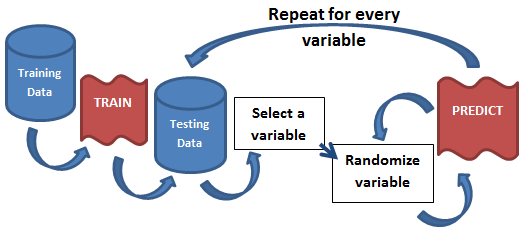

**Resources**
<ul>
<li type="square"><a href="https://www.youtube.com/watch?v=dTRDZBltCTg&list=UUq4pm1i_VZqxKVVOz5qRBIA" target='_blank'>YouTube Companion Video</a></li>
<li type="square"><a href="#sourcecode">Full Source Code</a></li>
</ul>
<BR>
**Packages Used in this Walkthrough**

<ul>
        <li type="square"><a href='http://cran.r-project.org/web/packages/caret/index.html' target='_blank'>{caret}</a> - Classification and Regression Training</li>
        <li type="square"><a href='http://cran.r-project.org/web/packages/mRMRe/index.html' target='_blank'>{mRMRe}</a> - R package for parallelized mRMR ensemble feature selection</li>
</ul>

<BR><BR>
My colleague shared with me a nifty concept to easily calculate variable importance for any model. He did not invent it, actually many forms of it abound in the literature and on the Internet. <a href='http://www.plottingsuccess.com/3-predictive-model-accuracy-tests-0114/' target='_blank'>John Elder is one of the authors</a>. 

 

The idea is so simple, its brilliant; you model once, predict once to get your benchmark score, and finally predict hundreds of times for each variable in the model while randomizing that variable. If the variable being randomized hurts the model's benchmark score, then its an important variable. If, on the other hand, nothing changes, or it beats the benchmark, then its a useless variable. By running this hundreds of times for each variable, you can paint a clear picture of what variable is affecting the model and to what degree. The beauty of this approach is that it is model agnostic as everything happens after the modeling phase.

**Let’s code!**

We’ll use the good old Titanic dataset from the University of Colorado Denver that I’ve used in many of my walkthroughs. This is a classic data set often seen in online courses and walkthroughs. The outcome is passenger survivorship (i.e. can you predict who will survive based on various features). We drop the passenger names as they are all unique but keep the passenger titles. We also impute the missing 'Age' variables with the mean and <a href='http://amunategui.github.io/dummyVar-Walkthrough/' target='_blank'>binarize all non-numerical data</a>:


```r
# using dataset from the UCI Machine Learning Repository (http://archive.ics.uci.edu/ml/)
titanicDF <- read.csv('http://math.ucdenver.edu/RTutorial/titanic.txt',sep='\t')

# creating new title feature
titanicDF$Title <- ifelse(grepl('Mr ',titanicDF$Name),'Mr',ifelse(grepl('Mrs ',titanicDF$Name),'Mrs',ifelse(grepl('Miss',titanicDF$Name),'Miss','Nothing')))
titanicDF$Title <- as.factor(titanicDF$Title)
 
# impute age to remove NAs
titanicDF$Age[is.na(titanicDF$Age)] <- median(titanicDF$Age, na.rm=T)
 
# reorder data set so target is last column
titanicDF <- titanicDF[c('PClass', 'Age',    'Sex',   'Title', 'Survived')]
 
# binarize all factors
library(caret)
titanicDummy <- dummyVars("~.",data=titanicDF, fullRank=F)
titanicDF <- as.data.frame(predict(titanicDummy,titanicDF))
```

Let's take a peek at our data:


```r
str(titanicDF)
```

```
## 'data.frame':	1313 obs. of  11 variables:
##  $ PClass.1st   : num  1 1 1 1 1 1 1 1 1 1 ...
##  $ PClass.2nd   : num  0 0 0 0 0 0 0 0 0 0 ...
##  $ PClass.3rd   : num  0 0 0 0 0 0 0 0 0 0 ...
##  $ Age          : num  29 2 30 25 0.92 47 63 39 58 71 ...
##  $ Sex.female   : num  1 1 0 1 0 0 1 0 1 0 ...
##  $ Sex.male     : num  0 0 1 0 1 1 0 1 0 1 ...
##  $ Title.Miss   : num  1 1 0 0 0 0 1 0 0 0 ...
##  $ Title.Mr     : num  0 0 1 0 0 1 0 1 0 1 ...
##  $ Title.Mrs    : num  0 0 0 1 0 0 0 0 1 0 ...
##  $ Title.Nothing: num  0 0 0 0 1 0 0 0 0 0 ...
##  $ Survived     : num  1 0 0 0 1 1 1 0 1 0 ...
```
<BR><BR>
We'll start by running a simple Gradient Boosted Machine (GBM) model on the data in order to get our benchmark area-under-the-curve (AUC) score. First we need to split the data into a training and testing portion, generalize our outcome and predictor names, and <a href='http://amunategui.github.io/binary-outcome-modeling/' target='_blank'>fix the outcome variable for classification</a>:


```r
# split data set into train and test portion
set.seed(1234)
splitIndex <- sample(nrow(titanicDF), floor(0.5*nrow(titanicDF)))
trainDF <- titanicDF[ splitIndex,]
testDF  <- titanicDF[-splitIndex,]
 
outcomeName <- 'Survived'
predictorNames <- setdiff(names(trainDF),outcomeName)
 
# transform outcome variable to text as this is required in caret for classification 
trainDF[,outcomeName] <- ifelse(trainDF[,outcomeName]==1,'yes','nope')
```
<BR><BR>
Now we're ready to run a simple GBM model:

```r
# create caret trainControl object to control the number of cross-validations performed
objControl <- trainControl(method='cv', number=2, returnResamp='none', summaryFunction = twoClassSummary, classProbs = TRUE)
 
objGBM <- train(trainDF[,predictorNames],  as.factor(trainDF[,outcomeName]),
                method='gbm',
                trControl=objControl,
                metric = "ROC",
                tuneGrid = expand.grid(n.trees = 5, interaction.depth = 3, shrinkage = 0.1)
)

predictions <- predict(object=objGBM, testDF[,predictorNames], type='prob')
```
<BR><BR>
Here I introduce a very fast AUC approximation function found on <a href='http://stackoverflow.com/questions/4903092/calculate-auc-in-r' target='_blank'>stackoverflow</a> that will allow us to calculate the AUC thousands of times with minimal processing:


```r
GetROC_AUC = function(probs, true_Y){
        # AUC approximation
        # http://stackoverflow.com/questions/4903092/calculate-auc-in-r
        # ty AGS
        probsSort = sort(probs, decreasing = TRUE, index.return = TRUE)
        val = unlist(probsSort$x)
        idx = unlist(probsSort$ix) 
        
        roc_y = true_Y[idx];
        stack_x = cumsum(roc_y == 0)/sum(roc_y == 0)
        stack_y = cumsum(roc_y == 1)/sum(roc_y == 1)   
        
        auc = sum((stack_x[2:length(roc_y)]-stack_x[1:length(roc_y)-1])*stack_y[2:length(roc_y)])
        return(auc)
}
 
refAUC <- GetROC_AUC(predictions[[2]],testDF[,outcomeName])
print(paste('AUC score:', refAUC))
```

```
## [1] "AUC score: 0.855016305004227"
```
<BR><BR>
**Shuffling with GBM**

Now we have a benchmark AUC score of ``0.85``. We will use this score during every iteration of the shuffler to determine the effect of the scrambled variable:


```r
# Shuffle predictions for variable importance
AUCShuffle <- NULL
shuffletimes <- 200
 
featuresMeanAUCs <- c()
for (feature in predictorNames) {
        featureAUCs <- c()
        shuffledData <- testDF[,predictorNames]
        for (iter in 1:shuffletimes) {
                shuffledData[,feature] <- sample(shuffledData[,feature], length(shuffledData[,feature]))
                predictions <- predict(object=objGBM, shuffledData[,predictorNames], type='prob')
               featureAUCs <- c(featureAUCs,GetROC_AUC(predictions[[2]], testDF[,outcomeName]))
        }
        featuresMeanAUCs <- c(featuresMeanAUCs, mean(featureAUCs < refAUC))
}
AUCShuffle <- data.frame('feature'=predictorNames, 'importance'=featuresMeanAUCs)
AUCShuffle <- AUCShuffle[order(AUCShuffle$importance, decreasing=TRUE),]
print(AUCShuffle)
```

```
##          feature importance
## 3     PClass.3rd      1.000
## 5     Sex.female      1.000
## 6       Sex.male      1.000
## 8       Title.Mr      1.000
## 1     PClass.1st      0.970
## 4            Age      0.945
## 2     PClass.2nd      0.000
## 7     Title.Miss      0.000
## 9      Title.Mrs      0.000
## 10 Title.Nothing      0.000
```

There you have it, by iterating through each variable and scrambling them 200 times, the following four variables proved most important:<b>PClass.3rd, Sex.female, Sex.male, Title.Mr</b>.

Let's put this in words one more time; we started by modeling our Titanic data set once with a GBM model and used the saved model to predict a reference (or benchmark) AUC score. With the saved benchmark and model, we created a loop to cycle through every variable in the set and predict the test set 200 times while scrambling the values of that variable each time.  
 
**Shuffling with GLM**
Now let's try this with a GLM model. You'll see that the code is the same.


```r
# run model
objGLM <- train(trainDF[,predictorNames],  as.factor(trainDF[,outcomeName]),
                method='glm',
                trControl=objControl, 
                metric = "ROC",
                preProc = c("center", "scale"))

predictions <- predict(object=objGLM, testDF[,predictorNames], type='prob')
refAUC <- GetROC_AUC(predictions[[2]],testDF[,outcomeName])
print(paste('AUC score:', refAUC))
```

```
## [1] "Reference AUC: 0.855187406900439"
```

```r
# Shuffle predictions for variable importance
VariableImportanceShuffle <- NULL
refRMSE=sqrt((sum((testDF[,outcomeName]-predictions[[2]])^2))/nrow(testDF))
print(paste('Reference RMSE:',refRMSE))
```

```
## [1] "Reference RMSE: 0.368559855818399"
```

```r
shuffletimes <- 200
featuresMeanAUCs <- c()
featuresMeanRMSEs <- c()
for (feature in predictorNames) {
        featureAUCs <- c()
        featureRMSEs <- c()
        shuffledData <- testDF[,predictorNames]
        for (iter in 1:shuffletimes) {
                shuffledData[,feature] <- sample(shuffledData[,feature], length(shuffledData[,feature]))
                predictions <- predict(object=objGLM, shuffledData[,predictorNames], type='prob')
                featureAUCs <- c(featureAUCs,GetROC_AUC(predictions[[2]], testDF[,outcomeName]))
                featureRMSEs <- c(featureRMSEs, sqrt((sum((testDF[,outcomeName]-predictions[[2]])^2))/nrow(testDF)))
        }
        featuresMeanAUCs <- c(featuresMeanAUCs, mean(featureAUCs < refAUC))
        featuresMeanRMSEs <- c(featuresMeanRMSEs,  mean((featureRMSEs - refRMSE)/refRMSE))
        
}
```

```r
VariableImportanceShuffle <- data.frame('feature'=predictorNames, 'AUC_Importance'=featuresMeanAUCs, 'RMSE_Importance'=featuresMeanRMSEs)
VariableImportanceShuffle <- VariableImportanceShuffle[order(VariableImportanceShuffle$AUC_Importance, decreasing=TRUE),]
print(VariableImportanceShuffle)
```

```
##          feature AUC_Importance RMSE_Importance
## 1     PClass.1st          1.000        0.228725
## 2     PClass.2nd          1.000        0.076828
## 4            Age          1.000        0.028916
## 5     Sex.female          1.000        0.049387
## 8       Title.Mr          1.000        0.141144
## 9      Title.Mrs          0.970        0.014406
## 7     Title.Miss          0.925        0.002671
## 3     PClass.3rd          0.000        0.000000
## 6       Sex.male          0.000        0.000000
## 10 Title.Nothing          0.000        0.000000
```
<BR><BR>
The code is the same but the results are different which is to be expected when using two different models (tree based versus linear).

As a bonus, here is a great package for quick variable importance. I won't go into any details but I recommend it for its speed!


```r
# bonus - great package for fast variable importance
library(mRMRe)
ind <- sapply(titanicDF, is.integer)
titanicDF[ind] <- lapply(titanicDF[ind], as.numeric)
dd <- mRMR.data(data = titanicDF)
feats <- mRMR.classic(data = dd, target_indices = c(ncol(titanicDF)), feature_count = 10)
bestVars <-data.frame('features'=names(titanicDF)[solutions(feats)[[1]]], 'scores'= scores(feats)[[1]])
print(bestVars)
```

```
##         features     scores
## 1       Sex.male  0.1457778
## 2     PClass.3rd  0.0540301
## 3  Title.Nothing -0.0009211
## 4      Title.Mrs -0.0068498
## 5     PClass.1st -0.0152483
## 6            Age -0.0268120
## 7       Title.Mr -0.0121603
## 8     PClass.2nd -0.0309136
## 9     Title.Miss -0.0315590
## 10    Sex.female       -Inf
```
<BR><BR>
Enjoy!!
<BR><BR>        
<a id="sourcecode">Full source code (<a href='https://github.com/amunategui/feature-hashing-walkthrough/blob/master/feature-hasher-walkthrough.r' target='_blank'>also on GitHub</a>)</a>:

```r

# using dataset from the UCI Machine Learning Repository (http://archive.ics.uci.edu/ml/)
titanicDF <- read.csv('http://math.ucdenver.edu/RTutorial/titanic.txt',sep='\t')

# creating new title feature
titanicDF$Title <- ifelse(grepl('Mr ',titanicDF$Name),'Mr',ifelse(grepl('Mrs ',titanicDF$Name),'Mrs',ifelse(grepl('Miss',titanicDF$Name),'Miss','Nothing')))
titanicDF$Title <- as.factor(titanicDF$Title)
 
# impute age to remove NAs
titanicDF$Age[is.na(titanicDF$Age)] <- median(titanicDF$Age, na.rm=T)
 
# reorder data set so target is last column
titanicDF <- titanicDF[c('PClass', 'Age',    'Sex',   'Title', 'Survived')]
 
# binarize all factors
library(caret)
titanicDummy <- dummyVars("~.",data=titanicDF, fullRank=F)
titanicDF <- as.data.frame(predict(titanicDummy,titanicDF))

# Let's take a peek at our data:
str(titanicDF)
 
# split data set into train and test portion
set.seed(1234)
splitIndex <- sample(nrow(titanicDF), floor(0.5*nrow(titanicDF)))
trainDF <- titanicDF[ splitIndex,]
testDF  <- titanicDF[-splitIndex,]
 
outcomeName <- 'Survived'
predictorNames <- setdiff(names(trainDF),outcomeName)
 
# transform outcome variable to text as this is required in caret for classification 
trainDF[,outcomeName] <- ifelse(trainDF[,outcomeName]==1,'yes','nope')
 
# create caret trainControl object to control the number of cross-validations performed
objControl <- trainControl(method='cv', number=2, returnResamp='none', summaryFunction = twoClassSummary, classProbs = TRUE)
 
# shuffling with GBM
objGBM <- train(trainDF[,predictorNames],  as.factor(trainDF[,outcomeName]),
                method='gbm',
                trControl=objControl,
                metric = "ROC",
                tuneGrid = expand.grid(n.trees = 5, interaction.depth = 3, shrinkage = 0.1)
)

predictions <- predict(object=objGBM, testDF[,predictorNames], type='prob')

GetROC_AUC = function(probs, true_Y){
        # AUC approximation
        # http://stackoverflow.com/questions/4903092/calculate-auc-in-r
        # ty AGS
        probsSort = sort(probs, decreasing = TRUE, index.return = TRUE)
        val = unlist(probsSort$x)
        idx = unlist(probsSort$ix) 
        
        roc_y = true_Y[idx];
        stack_x = cumsum(roc_y == 0)/sum(roc_y == 0)
        stack_y = cumsum(roc_y == 1)/sum(roc_y == 1)   
        
        auc = sum((stack_x[2:length(roc_y)]-stack_x[1:length(roc_y)-1])*stack_y[2:length(roc_y)])
        return(auc)
}
 
refAUC <- GetROC_AUC(predictions[[2]],testDF[,outcomeName])
print(paste('AUC score:', refAUC))
  
# Shuffle predictions for variable importance
AUCShuffle <- NULL
shuffletimes <- 200
 
featuresMeanAUCs <- c()
for (feature in predictorNames) {
        featureAUCs <- c()
        shuffledData <- testDF[,predictorNames]
        for (iter in 1:shuffletimes) {
                shuffledData[,feature] <- sample(shuffledData[,feature], length(shuffledData[,feature]))
                predictions <- predict(object=objGBM, shuffledData[,predictorNames], type='prob')
               featureAUCs <- c(featureAUCs,GetROC_AUC(predictions[[2]], testDF[,outcomeName]))
        }
        featuresMeanAUCs <- c(featuresMeanAUCs, mean(featureAUCs < refAUC))
}
AUCShuffle <- data.frame('feature'=predictorNames, 'importance'=featuresMeanAUCs)
AUCShuffle <- AUCShuffle[order(AUCShuffle$importance, decreasing=TRUE),]
print(AUCShuffle)
 
# shuffling with GLM
objGLM <- train(trainDF[,predictorNames],  as.factor(trainDF[,outcomeName]),
                method='glm',
                trControl=objControl, 
                metric = "ROC",
                preProc = c("center", "scale"))

predictions <- predict(object=objGLM, testDF[,predictorNames], type='prob')
refAUC <- GetROC_AUC(predictions[[2]],testDF[,outcomeName])
print(paste('AUC score:', refAUC))

# Shuffle predictions for variable importance
VariableImportanceShuffle <- NULL
refRMSE=sqrt((sum((testDF[,outcomeName]-predictions[[2]])^2))/nrow(testDF))
print(paste('Reference RMSE:',refRMSE))

shuffletimes <- 200
featuresMeanAUCs <- c()
featuresMeanRMSEs <- c()
for (feature in predictorNames) {
        featureAUCs <- c()
        featureRMSEs <- c()
        shuffledData <- testDF[,predictorNames]
        for (iter in 1:shuffletimes) {
                shuffledData[,feature] <- sample(shuffledData[,feature], length(shuffledData[,feature]))
                predictions <- predict(object=objGLM, shuffledData[,predictorNames], type='prob')
                featureAUCs <- c(featureAUCs,GetROC_AUC(predictions[[2]], testDF[,outcomeName]))
                featureRMSEs <- c(featureRMSEs, sqrt((sum((testDF[,outcomeName]-predictions[[2]])^2))/nrow(testDF)))
        }
        featuresMeanAUCs <- c(featuresMeanAUCs, mean(featureAUCs < refAUC))
        featuresMeanRMSEs <- c(featuresMeanRMSEs,  mean((featureRMSEs - refRMSE)/refRMSE))
        
}

VariableImportanceShuffle <- data.frame('feature'=predictorNames, 'AUC_Importance'=featuresMeanAUCs, 'RMSE_Importance'=featuresMeanRMSEs)
VariableImportanceShuffle <- VariableImportanceShuffle[order(VariableImportanceShuffle$AUC_Importance, decreasing=TRUE),]
print(VariableImportanceShuffle)
 
# bonus - great package for fast variable importance
library(mRMRe)
ind <- sapply(titanicDF, is.integer)
titanicDF[ind] <- lapply(titanicDF[ind], as.numeric)
dd <- mRMR.data(data = titanicDF)
feats <- mRMR.classic(data = dd, target_indices = c(ncol(titanicDF)), feature_count = 10)
bestVars <-data.frame('features'=names(titanicDF)[solutions(feats)[[1]]], 'scores'= scores(feats)[[1]])
print(bestVars)

```

