In this project, I take an idea coded in <b>Python</b>, create an <b>AWS EC2</b> instance, and use <b><a href='http://flask.pocoo.org' target='_blank'>Flask</a></b> to share it with the world. Even though everything here is relatively simple, there are a lot of steps and you don’t want to miss any - take you time, have fun, when in doubt start again, and, most importantly, think about the possibilities for your own work!

<BR>
<ul>
    <li type="square"><a href="#python-application">Plagiarism Defender - A Python Application</a></li>
    <li type="square"><a href="#amazon-web-services">Amazon Web Services (AWS)</a></li>
    <ul>
        <li type="square"><a href="#vpc">VPC</a></li>
        <li type="square"><a href="#ec2">EC2</a></li>
        <li type="square"><a href="#connecting-ec2">Connecting to EC2</a></li>
    </ul>
    <li type="square"><a href="#installing-flask">Installing Flask</a></li>
    <li type="square"><a href="#configuring-flask">Building the Flask Site</a></li>
    <li type="square"><a href="#running-plagiarism-defender">Running Plagiarism Defender on the Web</a></li>
    <ul>
        <li type="square"><a href="#web-serving-file">Main Web-Serving File</a></li>
        <li type="square"><a href="#template-files">Template HTML Files</a></li>
    </ul>
     <li type="square"><a href="#twitter-bootsrap">Beautifying with Twitter’s Bootstrap</a></li>
</ul>

<BR><BR>
<h2><a id="python-application">Plagiarism Defender - A Python Application</a></h2>
<BR>
OK, so I have a Python project that I want to push out to the web. This app takes text as input, splits it into sentences using <a = href='http://www.nltk.org/' target='_blank'>Natural Language Toolkit (NLTK)</a>, and sends it to the Bing search engine for matches. 

It surrounds each sentence with quotes to <b>only</b> find exact matches. If a match is found, then that sentence is deemed plagiarized and the counter is incremented. It does so for all sentences and returns the mean counter value as a plagiarism score.

```r
# sudo apt-get install python-lxml
from lxml import html
import requests, time
# sudo pip install -U nltk
from nltk.tokenize.punkt import PunktSentenceTokenizer, PunktParameters 

# Try it out on the first lines of Moby Dick:
text_to_check = "Call me Ishmael. Some years ago - never mind how long precisely - having little or no money in my purse, and nothing particular to interest me on shore, I thought I would sail about a little and see the watery part of the world."

punkt_param = PunktParameters()
sentence_splitter = PunktSentenceTokenizer(punkt_param)
sentences = sentence_splitter.tokenize(text_to_check)
probability_of_plagiarism = 0

for a_sentence in sentences:
    print(a_sentence)
    time.sleep(0.3)
    the_term = urllib2.quote('+' + '"' + a_sentence + '"')
    page = requests.get('https://www.bing.com/search?q='+the_term)
    if (not "No results found for" in page.text):
        probability_of_plagiarism += 1;

print('Probability of plagiarism: ' + str((probability_of_plagiarism / len(sentences)) * 100) + '%')
```

It correctly flags the Moby Dick text as plagiarized!

```r
In [151]: print('Probability of plagiarism: ' + str((probability_of_plagiarism / len(sentences)) * 100) + '%')
Probability of plagiarism: 100%
```

This may not scale well as Bing would probably get upset from excessive automated calls, but will do fine for this demonstration. Let's push this out onto the web and get some exposure.

<BR>
<h2><a id="amazon-web-services">Amazon Web Services - Home Away from Home</a></h2>
<BR>
Now that we have our application ready to go, we need the tools to serve it out to the world. We’ll start with our <a href='http://aws.amazon.com/' target='_blank'>Amazon Web Service EC2 instance</a>. You will need an AWS account to access the site. 
<BR><BR>
**AWS Console**
<br>
First, log into the AWS console:
<BR><BR>
<p style="text-align:center">
</p>
<BR><BR>
<h2><a id="vpc">VPC</a></h2>
Select VPC:
<BR><BR>
<p style="text-align:center">
</p>
<BR><BR>
A virtual private connection (VPC) will determine who and what gets to access the site. We will use the wizard and content ourselves with only on VPC. In an enterprise-level application, you will want at least 4, 2 to be private and run your database, and two to be public and hold your web-serving application. By duplicating the private and public VPCs you can benefit from fail-over and load balancing tools. By keeping things simple, we’ll get our instance working in just a few clicks, seriously!

Start the wizard:
<BR><BR>
<p style="text-align:center">
</p>
<BR><BR><BR>
Start the wizard and select ‘VPC with a Single Public Subnet':
<BR><BR>
<p style="text-align:center">
</p>
<BR><BR><BR>
Most of the defaults are fine except you should add a name under ``VPC name`` and under ``Add endpoints for S3 to you subnets`` select ``Public subnet``:
<BR><BR>
<p style="text-align:center"></p>
<BR><BR><BR>


<h2><a id="ec2">EC2</a></h2>
<BR>
VPC is done, let’s now create our EC2 instance - this is going to be our new machine. Click on the orange cube in the upper left corner of the page. From the ensuing menu, choose the first option, ``EC2``

<BR><BR>
<p style="text-align:center"></p>
<BR><BR><BR>
In ``Create Instance``, select ``Launch Instance``:
<BR><BR>
<p style="text-align:center"></p>
<BR><BR><BR>
``Select`` the free eligible tier <a href='http://www.ubuntu.com/' target='_blank'>Ubuntu</a> box (may not always be free, check if it applies to you):
<BR><BR>
<p style="text-align:center">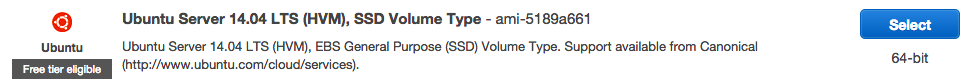</p>
<BR><BR><BR>
Go with defaults and click ``Next: Configure Instance Details``
<BR><BR>
<p style="text-align:center"></p>
<BR><BR><BR>
Under ``Step 3``, make sure to enable ‘Auto-assign IP’ and leave the rest as is.
<BR><BR>
<p style="text-align:center">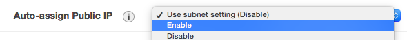</p>
<BR><BR><BR>
And in ``Step 7`` add a new rule to the security group. Click ``Add Rule`` and choose ``HTTP`` on port 80, this will allow for Internet traffic:
<BR><BR>
<p style="text-align:center">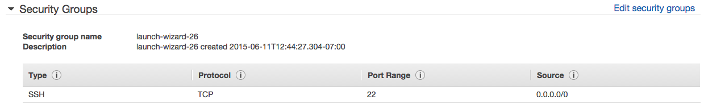</p>
<BR><BR><BR>
It should look like the following:
<BR><BR>
<p style="text-align:center"></p>
<BR><BR><BR>
Once added, select ``Review and Launch``. We have one more step before reaching the instance - we need create a new ``key pair``. This is a security file that will live on your machine and is required to ‘SSH’ into the instance. I tend to create them and leave them in my downloads. What ever you decided to do, make sure you know where it is as you’ll need to pass a path to it every time you want to connect to it. 
<BR><BR>
<p style="text-align:center"></p>
<BR><BR><BR>
Name it whatever you like and hit the ``Download Key Pair``. Finally select ``Launch Instance`` and we’re ready to go! Keep in mind that whenever you instance is running, you may be charged by Amazon - read the documentation to make sure you’re OK with it. Also, stop the instance when you don’t need to slow down the charges, and terminate it when you don’t need it anymore (i.e. delete it) to stop all charges.

Once the instance is initialized and running, you should see a green light by it:
<BR><BR>
<p style="text-align:center">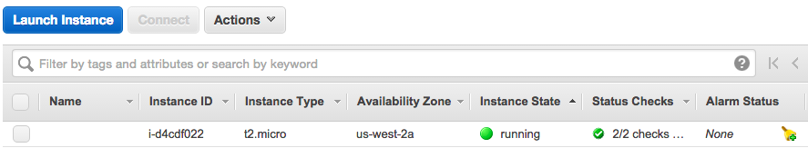</p>
<BR><BR><BR>
Select the left check-box to access the settings of that specific instance.
<BR><BR>
<p style="text-align:center">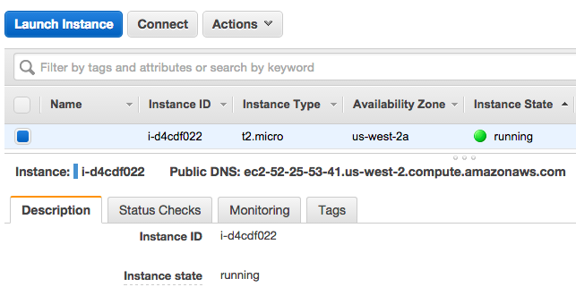</p>
<BR><BR><BR>

<h2><a id="connecting-ec2">Connecting to the EC2 Instance</a></h2>

Select the top ``Connect`` button to get the SSH connection string that enables connections. Follow the instructions if you want to use the Java terminal to connect to the instance. Here, I will be using the terminal on my Mac.
<BR><BR>
<p style="text-align:center">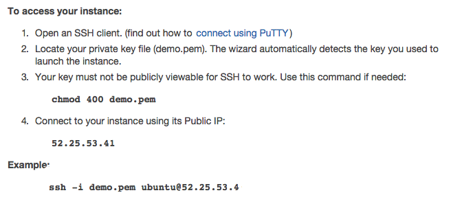</p>
<BR><BR><BR>
The last line states your connection string: ``ssh -i demo.pem ubuntu@52.25.53.41``. To use it on the Mac, open your terminal and navigate to your ``Downloads`` folder (or wherever you moved your <b>pem</b> key-pair file).
<BR><BR>
<p style="text-align:center"></p>
<BR><BR><BR>
That is all you need to access the instance. If you are having issues with it, follow Amazon’s advice and set the correct permissions for you <b>pem</b> file by calling ``chmod 400 demo.pem``. Also, keep in mind, anytime you reboot your instance, your connection IP will be different.

Once you get in, you should see something along these lines:
<BR><BR>
<p style="text-align:center">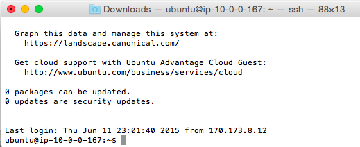</p>
<BR><BR><BR>
<BR><BR>
<h2><a id="installing-flask">Installing Flask on EC2</a></h2>
<BR>
To keep things simple, we won’t use GIT or a virtual environment - fast and cheap, remember? But in the long run, you will benefit from using those tools.

Now, to get to Flask, we first need to install Apache:

```r
sudo apt-get install apache2
sudo apt-2 update
sudo apt-get install libapache2-mod-wsgi
```

and Flask:

```r
sudo apt-get install python-flask
sudo apt-get upgrade
```

We now have our web serving software installed. To verify that things are progressing properly, enter your I.P. address in the browser. This is what you should be seeing, the static Apache homepage:

<BR><BR>
<p style="text-align:center">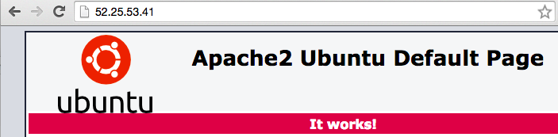</p>
<BR><BR><BR>
<BR><BR>
<h2><a id="configuring-flask">Configuring the Flask Site</a></h2>
<BR>

Now, lets create our file structure. We start with a ``FlaskApps`` master directory off of the ``www`` folder:

```r
cd /var/www
sudo mkdir FlaskApps
cd FlaskApps
```

We create our ``PlagiarismDefenderApp`` directory and a ``template`` subdirectory:

```r
sudo mkdir PlagiarismDefenderApp
cd PlagiarismDefenderApp
sudo mkdir templates
```

Let’s start with a simple page to confirm that Flask can serve dynamic pages. We’ll call up ‘nano’, a very simple text editor. 

```r
sudo nano /var/www/FlaskApps/PlagiarismDefenderApp/home.py
```

and enter the following code:

```r
from flask import Flask
app=Flask(__name__)

@app.route('/')
def home():
    return  "This is from Flask!!!"

if __name__ == "__main__":
    app.run()
```

Save and exit (ctrl-X). Now edit the ``config`` file to point to our new Flask site:

```r
sudo nano /etc/apache2/sites-available/PlagiarismDefenderApp.conf
```

and paste the following except for the ``ServerName`` IP address that you replace with yours:

```r
<VirtualHost *:80>
    ServerName 52.11.197.21 # update this every time your IP changes
    ServerAdmin admin@mywebsite.com # don't worry about this
    WSGIScriptAlias / /var/www/FlaskApps/FlaskApps.wsgi
    <Directory /var/www/FlaskApps/PlagiarismDefenderApp/>
        Order allow,deny
        Allow from all
    </Directory>
    Alias /static /var/www/FlaskApps/PlagiarismDefenderApp/static
    <Directory /var/www/FlaskApps/PlagiarismDefenderApp/static/>
        Order allow,deny
        Allow from all
    </Directory>
    ErrorLog ${APACHE_LOG_DIR}/error.log
    LogLevel warn
    CustomLog ${APACHE_LOG_DIR}/access.log combined
</VirtualHost>
```
Save and exit (ctrl-X). Add our new site and restart apache:

```r

sudo apachectl restart
sudo a2ensite PlagiarismDefenderApp

# that's a lot of reloading but it does the trick
service apache2 reload
/etc/init.d/apache2 reload
sudo /etc/init.d/apache2 reload

```

Create a WSGI file to tell Apache how to run Flask - it’s the link and entry point for our web application:

```r
sudo nano /var/www/FlaskApps/FlaskApps.wsgi
```

and enter the following code:

```r
#! /usr/bin/python
import sys
import logging
logging.basicConfig(stream=sys.stderr)
sys.path.insert(0,"/var/www/FlaskApps/PlagiarismDefenderApp/")

from home import app as application
application.secret_key = “somesecretsessionkey"
```

Save and exit (ctrl-X). Restart Apache:

```r
sudo service apache2 restart
/etc/init.d/apache2 reload 
```

Try running this again in the browser - hopefully you should see something like:

<BR><BR>
<p style="text-align:center">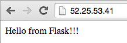</p>
<BR><BR><BR>

NOTE: If you have any errors, check the error log (scroll to the bottom of the list to see latest messages):

```r
sudo nano /var/log/apache2/error.log
```
<BR><BR>
<h2><a id="running-plagiarism-defender">Plagiarism Defender on the Web!</a></h2>

Things are looking good, lets get the <b>real</b> application running on Flask and EC2 instance. 

Lets start installing some libraries on your instance:

```r
# install lxml
sudo apt-get install python-lxml
sudo apt-get install python3-lxml
sudo apt-get install libxml2-dev libxslt-dev python-dev

# install nltk
sudo pip install -U nltk
```
<BR><BR>
<h2><a id="web-serving-file">Main Web-Serving File</a></h2>

Let's build our main web-serving file:

```r
sudo nano /var/www/FlaskApps/PlagiarismDefenderApp/home.py
```

```r
from flask import Flask, render_template, request, url_for
import urllib2
# sudo apt-get install python3-lxml
# sudo apt-get install python-lxml
# apt-get install python-dev libxml2 libxml2-dev libxslt-dev
from lxml import html
import requests
import string
import time
#sudo pip install -U nltk
from nltk.tokenize.punkt import PunktSentenceTokenizer, PunktParameters


# Initialize the Flask application
app = Flask(__name__)

# Define a route for the default URL, which loads the form
@app.route('/')
def form():
    return render_template('plagiarizer-submit.html')


@app.route('/IsItPlagiarized/', methods=['POST'])
def IsItPlagiarized():
        text_to_filter=request.form['text_to_check']
        if (text_to_filter.lstrip().rstrip() == ''):
                return render_template('plagiarizer-submit.html')
        punkt_param = PunktParameters()
        sentence_splitter = PunktSentenceTokenizer(punkt_param)
        sentences = sentence_splitter.tokenize(text_to_filter)
        probability_of_plagiarism = 0
        for a_sentence in sentences:
                time.sleep(0.3)
                content = filter(lambda x: x in string.printable, a_sentence)
                the_term = urllib2.quote('+' + '"' + content + '"')
                page = requests.get('https://www.bing.com/search?q='+the_term)
                if (not "No results found for" in page.text):
                        probability_of_plagiarism += 1;
        is_it_plagiarized = str((probability_of_plagiarism / len(sentences)) * 100) + '%'
        return render_template('plagiarizer-results.html', text_to_filter=text_to_filter, is_it_plagiarized=is_it_plagiarized)


if __name__ == "__main__":
    app.run()
```

<BR><BR>
<h2><a id="template-files">Template HTML Files</a></h2>
Let's build our two template html files:

```r
cd /var/www/FlaskApps/PlagiarismDefenderApp/templates/
sudo nano plagiarizer-submit.html
```

and enter the following for ``plagiarizer-submit.html``:

```r
<html>
    <head>
        <title>Plagiarism Defender</title>
         <link rel=stylesheet type=text/css href="{{ url_for('static', filename='style.css') }}">
    </head>
    <body>
        <div id="container">
            <div class="title">
                <h1>Check Your Text for Plagiarism</h1>
            </div>
            <div id="content">
                <form method="post" action="{{ url_for('IsItPlagiarized') }}">
                  <label for="text_to_check">Enter text to check for plagiarism:</label>
                  <BR><textarea cols="100" rows="20" name="text_to_check"></textarea>
                  <BR><input type="submit" />
                </form>
            </div>
        </div>
    </body>
</html>
```

```r
cd  /var/www/FlaskApps/PlagiarismDefenderApp/templates
sudo nano plagiarizer-results.html
```

and enter the following for ``plagiarizer-results.html``:

```r
 <html>
    <head>
        <title>Plagiarism Defender</title>
        <link rel=stylesheet type=text/css href="{{ url_for('static', filename='style.css') }}">
    </head>
    <body>
        <div id="container">
            <div class="title">
                <h1>Plagiarism Defender Results</h1>
            </div>
            <div id="content">
                In our best opinion, the text you entered is <strong>{{is_it_plagiarized}}</strong> plagiarized!
            </div>
            <div id="content">
                Text Entered: <strong>{{text_to_filter}}</strong>
            </div>
        </div>
    </body>
</html>
```

Try it out - enter some text and hit the ``submit`` button:
<BR>
<p style="text-align:center">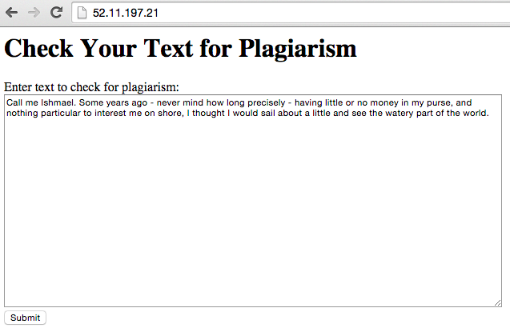</p>
<BR><BR>

And the final prognostic is:
<BR><BR>
<p style="text-align:center"></p>
<BR><BR><BR>


<h2><a id="twitter-bootsrap">Beautifying with Twitter’s Bootstrap</a></h2>

This is undoubtedly the most amazing part of this whole walkthrough, by just adding a few lines of code, you can magically give you site a professional look! 

<a href='http://getbootstrap.com/' target='_blank'>GetBootstrap.com</a> is a big menu where you can pick and choose how you want your site to look. We're going to go with the <a href='http://getbootstrap.com/getting-started/#starter-template' target=''>Starter template</a>, it is simple but leaps ahead of what we had before. You can click on any samples shown, do a ``view source`` and pick whatever part of the code you like.

Lets update our ``plagiarizer-submit.html`` page with a few bootstrap goodies:

```r
sudo nano /var/www/FlaskApps/PlagiarismDefenderApp/templates/plagiarizer-submit.html
```
And replace it with the following code:

```r

<html>
    <head>
        <title>Plagiarism Defender</title>
        <link href="https://maxcdn.bootstrapcdn.com/bootstrap/3.3.4/css/bootstrap.min.css" rel="stylesheet" media="screen">

    </head>
    <body style = "background-color: lightgrey; padding-top: 70px; ">
    <nav class="navbar navbar-inverse navbar-fixed-top">
      <div class="container">
        <div class="navbar-header">
          <a class="navbar-brand" href="#">Plagiarism Defender</a>
        </div>
      </div>
    </nav>

     <div class="container">
      <div class="starter-template">
          <form method="post" action="{{ url_for('IsItPlagiarized') }}">
            <label for="text_to_check">Enter text to check for plagiarism:</label>
            <BR><textarea cols="100" rows="20" name="text_to_check"></textarea>
            <BR><input type="submit" />
          </form>
        </div>
      </div>

    <!-- Bootstrap core JavaScript
    ================================================== -->
    <!-- Placed at the end of the document so the pages load faster -->
    <script src="https://ajax.googleapis.com/ajax/libs/jquery/1.11.2/jquery.min.js"></script>
    <script src="../../dist/js/bootstrap.min.js"></script>
    <!-- IE10 viewport hack for Surface/desktop Windows 8 bug -->
    <script src="../../assets/js/ie10-viewport-bug-workaround.js"></script>
  </body>
</html>
```
The most important change is on the fourth line where we added a live link to the bootstrap CSS file. We also added the ``navbar`` class which adds a fancy title on a header. Explore the <a href='http://getbootstrap.com/getting-started/' target='_blank'>GetBoostrap.com</a> to see what else it offers and how you may apply it to your projects.

You can get the latest bootstrap link at the <a href='http://getbootstrap.com/getting-started/' target='_blank'>GetBoostrap.com</a>

Here is a peek at our beautifully metamorphosed page:
<BR><BR>
<p style="text-align:center">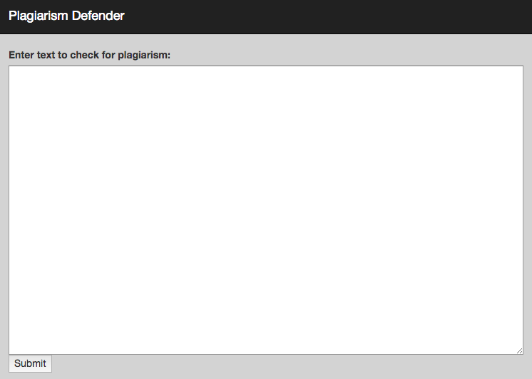</p>
<BR><BR><BR>


