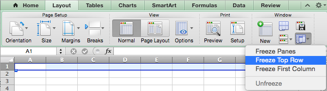
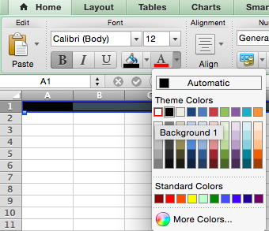
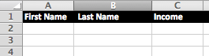
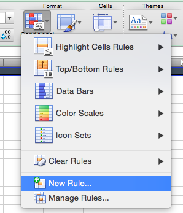
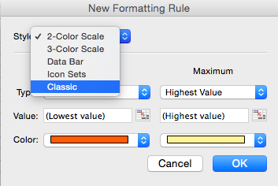
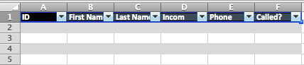
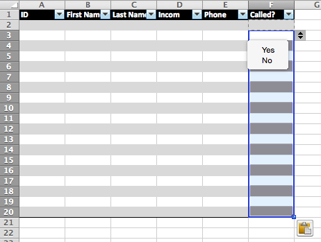

 
**Resources**
<ul>
<li type="square"><a href="https://www.youtube.com/user/mamunate/videos" target='_blank'>YouTube Companion Video</a></li>
<li type="square"><a href="#sourcecode">Source Code</a></li>
</ul>
<BR>
**Packages Used in this Walkthrough**
<ul>
        <li type="square"><a href='http://cran.r-project.org/web/packages/XLConnect/index.html' targer='_blank'>{XLConnect}</a> Excel Connector for R</li>
</ul>
<BR>
<BR>
When it comes to sharing data, results, probabilities, one has many choices in terms of deliverable media. On one end of the spectrum you have raw text files, and on the other, numerous reporting engines,  content management systems and web solutions. 

As a data scientist, I get away with working and sharing comma delimited files (.csv) all day long, but there are times when customers want more. Excel is a great tool as everybody in analytics is familiar with it and it can do some pretty cool things inexpensively. 

Instead of saving your data as a ``.csv`` or ``.tab`` file, you can leverage the ``.xlsx`` (native <b>Excel</b> format) just as easily and make a huge leap towards better looking reports. 
<BR>
<BR>
***Case 1: Conditional Formatting***

The key is to prepare an Excel file in advance and use it as a base form to be called, duplicated, and populated from within <b>R</b>. So fire up your <b>Excel</b> application and open a new document. 
<BR><BR>
Make the top row frozen. Go to: ``Layout —> Window —> Freeze Top Row`` on the <b>Mac</b> and ``View -> Freeze Panes -> Freeze Top Row`` on <b>Windows</b> (and this may still be different depending on your application version and operating system):
<BR><BR>
<p style="text-align:center"></p>
<BR>
<BR>
To emphasize the difference between a straight ``.csv`` file, let's bold the entire top row, and change the font and background colors:
``Home —> Font`` box. Select a dark background color and light font color. 
<BR><BR>
<p style="text-align:center"></p>
<BR><BR>
Finally, add the following headers, ``First Name``, ``Last Name``, ``Income``:
<p style="text-align:center"></p>
<BR><BR>
Now, let’s add some conditional formatting. Go to ``Home —> Format —> Conditional Formatting`` and select ``New Rule``:
<p style="text-align:center"></p>
<BR><BR>
On the <b>Mac</b>, in the 'New Formatting Rule' box, select ``Classic``:
<p style="text-align:center"></p>
<BR><BR>
Make it look like below with the following formula ``$C2>50000``, this will trigger anytime ``C`` column has a higher value than 50000:
<p style="text-align:center"></p>
After you ``OK``, fill in the ``Applies to`` section with ``Sheet1!$2:$200``, this will apply the background color on rows 2-200 when the condition is met:
<p style="text-align:center"></p>
<BR><BR>

On <b>Windows</b>, in the ``Home -> Conditional Formatting -> New Rule``, select ``Use a formula to determine which cells to format on Windows`` and enter ``$C2>50000``:
<p style="text-align:center"></p>

<BR><BR>
Finally, make the rule applies to the entire row by adding in the ``Applies to`` section ``=$2:$200``, along with a color selection in the ``Format`` section:
 <p style="text-align:center"></p>
<BR><BR>
Don’t sweat the details as this isn’t a walkthrough about Excel, we’re just setting up our base file.
<BR><BR>
Hit ``Apply`` and ``OK``. Save the file as ``sample.xlsx`` and close it.
<BR><BR>
**Jumpint into R**

Let’s create some data:

```r
income_data <- data.frame('FirstName'=c('Joe','Mike','Liv'), 'LastName'=c('Smith','Steel','Storm'), 'Income'=c(100000,20000,80000))
income_data$FirstName <- as.character(income_data$FirstName)
income_data$LastName <- as.character(income_data$LastName)
head(income_data)
```
<BR><BR>
This create a basic income table:

```r
##	  FirstName LastName Income
##	1       Joe    Smith 100000
##	2      Mike    Steel  20000
##	3       Liv    Storm  80000
```
<BR><BR>
And let's grab our <b>Excel</b> spreadsheet we just created:

```r
library(XLConnect)
wb <- loadWorkbook('sample.xlsx')
xldf = readWorksheet(wb, sheet = getSheets(wb)[1])
```

<BR><BR>
All we did above is load ``XLConnect``, call our saved ``sample.xlsx`` and loaded the first sheet of the spreadsheet (this implies you can load and write to many sheets on a spreadsheet - cool!). ``xldf`` is an actual data frame object that only contains our headers:

```r
class(xldf)
##	[1] "data.frame"
head(xldf)
##	[1] First.Name  X.Last.Name Income     
##	<0 rows> (or 0-length row.names)
```

<BR><BR>
Don't worry about the weird header format, it won't show on our final output. Here comes the interesting part, we're going to cycle through each cell of interest and update it with our ``income_data``:

```r
for (id in 1:nrow(income_data)) {
	colcount <- 1
	for (nm in names(xldf)){
		xldf[id,nm] <- income_data[id,colcount]
		colcount <- colcount + 1
	}
}
```

<BR><BR>
We can customize the sheet name with ``Salaries``, write the sheet, and finally save it as ``income_data.xlsx`` (note ``startRow=2``):


```r
sheet_name <- "Salaries"
renameSheet(wb, sheet = getSheets(wb)[1], newName = sheet_name)
writeWorksheet(wb,xldf,sheet=getSheets(wb)[1],startRow=2,header=F)
saveWorkbook(wb,'income_data.xlsx')
```

<BR><BR>
And this what the final spreadsheet looks like:
<p style="text-align:center"></p>
 

<BR><BR>
***Case 2: Hidden fields and drop down cells***

This isn't really <b>R</b> related but it has come in handy for a recent project. We created call sheets for operators to use containing an ID, name and number on each row along with a drop-down list indicating how the call went. We also wanted to have the user ID on the sheet but not visible to the operator. And this is what we came up with...
<BR><BR>
Let's start a new spreadsheet. Here will add a drop down column for each row, every-other-row background formatting, and a hidden column for our IDs.
<BR><BR>
First, let's format the sheet in a visually appealing way. Highlight an area of 6 columns by 10 or 20 rows. Select ``Tables -> Table Styles`` and choose a color scheme you like.
<p style="text-align:center"></p>
<BR><BR>
Swap the generic header text with the following headers: ``ID``, ``First Name``, ``Last Name``, ``Income``,  ``Phone``, ``Called``. Also highlight the first row and format it like we did in ``Case 1``.
<p style="text-align:center"></p>
<BR><BR>
To hide a row, simply resize it to nothing on the tool bar... that simple. To add a drop down, select the cell you want it in (F2) and navigate to ``Data -> Data Validation -> Data Validation``. In ``Allow:`` select ``List`` and in ``Source`` enter ``Yes, No`` (separate both words with a comma):
<p style="text-align:center"></p>
<BR><BR>
Copy the F2 cell with our drop down to all other cells in that column. You table should like something like this:
<p style="text-align:center"></p>
<BR><BR>
Save your spreadsheet as ``sample2.xlsx`` and close it.
<BR><BR>

**Jumpint into R**

<BR><BR>
Let's add IDs and phone numbers to our income data set:

```r
income_data <- data.frame('ID'=c(1,2,3), 'FirstName'=c('Joe','Mike','Liv'), 'LastName'=c('Smith','Steel','Storm'), 'Income'=c(100000,20000,80000), 'PhoneNumber'=c('888-888-1111','888-888-2222','888-888-3333'))
income_data$FirstName <- as.character(income_data$FirstName)
income_data$LastName <- as.character(income_data$LastName)
income_data$PhoneNumber <- as.character(income_data$PhoneNumber)
head(income_data)
```

```r
##	  ID FirstName LastName Income  PhoneNumber
##	1  1       Joe    Smith 100000 888-888-1111
##	2  2      Mike    Steel  20000 888-888-2222
##	3  3       Liv    Storm  80000 888-888-3333
```

```r
library(XLConnect)
wb <- loadWorkbook('sample2.xlsx')
xldf = readWorksheet(wb, sheet = getSheets(wb)[1])[1:5]
for (id in 1:nrow(income_data)) {
	colcount <- 1
	for (nm in names(xldf)[1:5]) # only headers 1 through 5, 6 is the Called? field
	{
		xldf[id,nm] <- income_data[id,colcount]
		colcount <- colcount + 1
	}
}
``` 

<BR><BR>
We'll save it as ``income_data2.xlsx``:

```r
sheet_name <- "Salaries"
renameSheet(wb, sheet = getSheets(wb)[1], newName = sheet_name)
writeWorksheet(wb,xldf,sheet=getSheets(wb)[1],startRow=2,header=F)
saveWorkbook(wb,'income_data2.xlsx')
```
<BR><BR>
Here is a look at our final spreadsheet. It is ready do be distributed with the drop downs all functional and the ID column hidden:
<BR><BR>
<p style="text-align:center"></p>

<BR><BR>        
<a id="sourcecode">Full source code</a>:
 
```r
# Case 1
income_data <- data.frame('FirstName'=c('Joe','Mike','Liv'), 'LastName'=c('Smith','Steel','Storm'), 'Income'=c(100000,20000,80000))
income_data$FirstName <- as.character(income_data$FirstName)
income_data$LastName <- as.character(income_data$LastName)
head(income_data)

# load XLConnect and grab a copy of sample.xlsx
library(XLConnect)
wb <- loadWorkbook('sample.xlsx')
xldf = readWorksheet(wb, sheet = getSheets(wb)[1])
class(xldf)
head(xldf)

# replace XL cells with new content
for (id in 1:nrow(income_data)) {
	colcount <- 1
	for (nm in names(xldf)[1:3]){
		xldf[id,nm] <- income_data[id,colcount]
		colcount <- colcount + 1
	}
}

# save XL sheet and file
sheet_name <- "Salaries"
renameSheet(wb, sheet = getSheets(wb)[1], newName = sheet_name)
writeWorksheet(wb,xldf,sheet=getSheets(wb)[1],startRow=2,header=F)
saveWorkbook(wb,'income_data.xlsx')

# Case 2
income_data <- data.frame('ID'=c(1,2,3), 'FirstName'=c('Joe','Mike','Liv'), 'LastName'=c('Smith','Steel','Storm'), 'Income'=c(100000,20000,80000), 'PhoneNumber'=c('888-888-1111','888-888-2222','888-888-3333'))
income_data$FirstName <- as.character(income_data$FirstName)
income_data$LastName <- as.character(income_data$LastName)
income_data$PhoneNumber <- as.character(income_data$PhoneNumber)
head(income_data)

library(XLConnect)
wb <- loadWorkbook('sample2.xlsx')
xldf = readWorksheet(wb, sheet = getSheets(wb)[1]) 
for (id in 1:nrow(income_data)) {
	colcount <- 1
	for (nm in names(xldf)[1:5]){
		xldf[id,nm] <- income_data[id,colcount]
		colcount <- colcount + 1
	}
}

# save XL sheet and file
sheet_name <- "Salaries"
renameSheet(wb, sheet = getSheets(wb)[1], newName = sheet_name)
writeWorksheet(wb,xldf,sheet=getSheets(wb)[1],startRow=2,header=F)
saveWorkbook(wb,'income_data.xlsx')


```

 