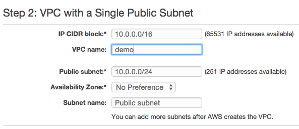
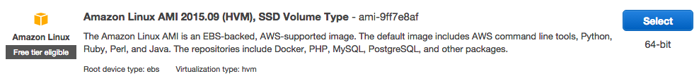
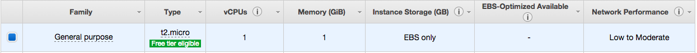
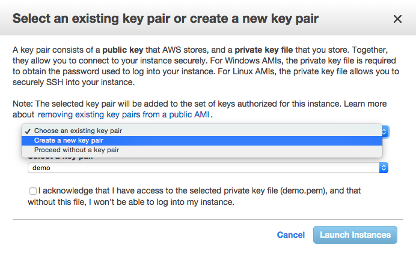
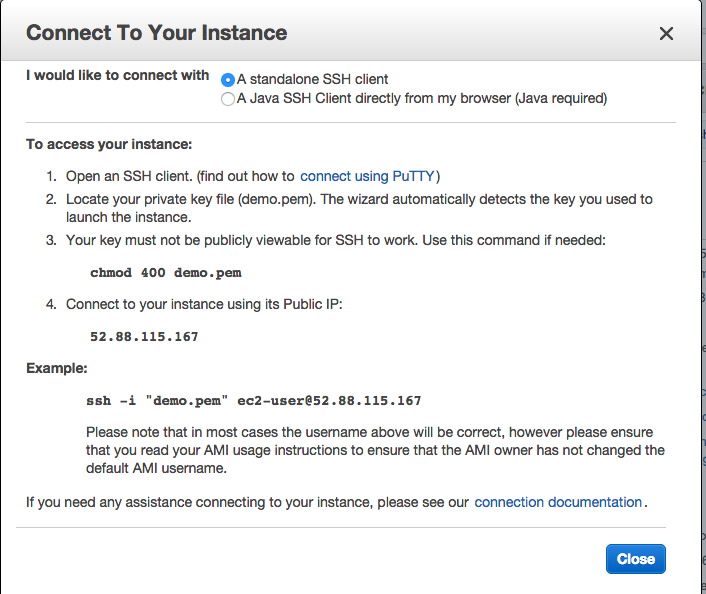

<p style="text-align:center">
</p>
**Resources**
<ul>
<li type="square"><a href="https://www.youtube.com/watch?v=3HuYr6G2Z28&list=UUq4pm1i_VZqxKVVOz5qRBIA&index=1" target='_blank'>YouTube Companion Video</a></li>

</ul>
<BR>
<a href='http://spark.apache.org/' target='_blank'>Spark</a> doesn’t need an introduction, but just in case, it extends Hadoop’s distributed / parallel computing paradigm by distributing tasks using both live memory and disk storage. As of version 1.4, <b>SparkR</b> is included in Apache's Spark build. We'll be using version 1.5 here.

This will be a two-part series, here we'll install <b>SparkR</b> on <b>EC2</b> and fire up a few clusters. In the second part, will do some distributed modeling.
<br><br>
***Let's get right to it***

In order to approach this from the same vantage point, we’ll use a small EC2 instance to launch our Spark clusters. You will need an amazon <b>AWS</b> account and the ability to <b>Secure Shell Tunneling (SSH)</b> into AWS (more on this later). 

First, sign into the <a href='http://aws.amazon.com/' target="_blank">AWS Console</a>:

<p style="text-align:center">

</p>

**Under header Networking, select VPC**

<p style="text-align:center">
</p>

A <b>virtual private cloud (VPC)</b> will determine who and what gets to access the site. We will use the wizard and content ourselves with only on VPC. In an enterprise-level application, you will want at least 4, 2 to be private and run your database, and two to be public and hold your web-serving application. By duplicating the private and public VPCs you can benefit from fail-over and load balancing tools. By keeping things simple, we’ll get our instance working in just a few clicks, seriously!

Start the ``wizard``:

<p style="text-align:center">
</p>
<br><br>
Start the wizard and select ``VPC with a Single Public Subnet``: 

<p style="text-align:center">
</p>
<br><br>
Most of the defaults are fine except you should add a name under ``VPC name``: 

<p style="text-align:center">
</p>
<br><br>
***EC2***

VPC is done, let’s now create our EC2 instance - this is going to be our cluster-launching machine. Click on the orange cube in the upper left corner of the page. From the ensuing menu, choose the first option, ``EC2``:

<p style="text-align:center">
</p>
</p>

In ``Create Instance``, select ``Launch Instance``: 

<p style="text-align:center">
</p>
<br><br>
Select the first option ``Amazon Linux AMI``:

<p style="text-align:center">
</p>
<br><br>
In **Step 2**, continue with the preselected machine and click ``Next: Configure Instance Details``:

<p style="text-align:center">
</p>
<br><br>
In **Step 3**, keep all defaults but change the ``Auto-assign Public IP`` to ``Enable``:

<p style="text-align:center">
</p>
<br><br>
Select ``Review and Launch``:

<p style="text-align:center">
</p>
<br><br>
In **Step 7**, ``SSH port 22`` is opened by default so there is nothing for us to do but to click ``Launch``. It will open a pop-up box where you will need to create a new key pair:

<p style="text-align:center">
</p>

<br><br>
Key-pair is a security file that will live on your machine and is required to ``SSH`` into the instance. I tend to create them and leave them in my downloads. What ever you decided to do, make sure you know where it is as you’ll need to pass a path to it every time you want to connect to it. Create a new one, check the acknowledgment check-box. 

Finally, click Launch Instances. That’s it for our instance. Hit the View Instances on the next page as the machine is being initialized:

<p style="text-align:center">
</p>
<br><br>
We need to wait till the Initializing is done. Meanwhile we can get the security credentials that will be needed to launch the clusters. Go to your account name drop down in the top right corner and click ``Security Credentials``:

<p style="text-align:center">
</p>
<br><br>
Choose ``Access Keys``


<p style="text-align:center">
</p>
<br><br>
And ``Create Access Key``


<p style="text-align:center">
</p>
<br><br>
This will download two strings:

```r
AWS_ACCESS_KEY_ID=...
AWS_SECRET_ACCESS_KEY= ...
```
<br><br>
Keep that download handy as we’ll need the values shortly.

Back at the instance window, check that our new instance is running, you can click on the check box to access the assigned dynamic IP address:

<p style="text-align:center">
</p>
<br><br>
Use the Actions button to get the exact SSH string to reach the instance:

<p style="text-align:center">
</p>
<br><br>
And select ``Connect``:

<p style="text-align:center">
</p>
<br><br>
Read the instruction on the pop-up box. The last line states your connection string: ``ssh -i "demo.pem" ec2-user@52.88.115.167``. To use it on the Mac, open your terminal and navigate to your Downloads folder (or wherever you moved your pem key-pair file). As per instructions, apply ``chmod 400 demo.pem`` and copy the example string.

Paste it into the terminal and follow the instructions to log into your EC2 instance:

```r
ssh -i "demo.pem" ec2-user@52.88.115.167
```
<br><br>
Your terminal should confirm the EC2:

<p style="text-align:center">
</p>
<br><br>
***Installing Spark***

This instance will be used to launch our Master and Dependent clusters. Let’s download and install <b>Spark</b> (<a href='http://spark.apache.org/downloads.html' target='_blank'>check downloads page for the latest version</a>):


<p style="text-align:center">
</p>
<br><br>
To download Spark directly into our instance, paste the following commands into the terminal:

```r
# download spark
sudo wget http://d3kbcqa49mib13.cloudfront.net/spark-1.5.0-bin-hadoop2.6.tgz

# unpack spark tgz file
sudo tar zxvf  spark-1.5.0-bin-hadoop2.6.tgz

```
<br><br>
Now we need to download our ``PEM`` key-pair file over to the instance as well. Exit out of the EC2 session:

```r
# get out of current session and back to local machine
exit

# upload pem file in same directory on the EC2 instance (swap the dashed IP with your instance's) 
scp -i  demo.pem demo.pem ec2-user@ec2-52-88-115-167.us-west-2.compute.amazonaws.com:/home/ec2-user/spark-1.5.0-bin-hadoop2.6/ec2
```
<br><BR>
Now we go back to the EC2 box:

```r
ssh -i "demo.pem" ec2-user@52.88.115.167

# navigate to the ec2 folder:
cd spark-1.5.0-bin-hadoop2.6/ec2

# change file permissions
sudo chmod 400 demo.pem

```
<br><br>
We also need to export our access keys over

```r
Set access keys:
export AWS_ACCESS_KEY_ID=...yours here... 
export AWS_SECRET_ACCESS_KEY=...yours here... 
```
<br><br>
***Creating Clusters***

Now, let's get our clusters up and running. This will call the script to launch 3 clusters, 1 master and 2 dependents in the ``us-west`` zone. ``-k`` is your PEM name, ``-i`` is the path to the PEM file, ``-s`` is the number of instances needed and ``-t`` is the server type:

```r
# launch clusters
./spark-ec2 -k demo -i demo.pem -r us-west-2 -s 2 -t m1.small launch --copy-aws-credentials my-spark-cluster

```
<br><br>
Building the clusters takes about 10 minutes. The terminal window may spit out some ``waiting``, ``disconnected``, or ``refused`` messages but as long as it doesn't return the prompt, let it do its thing as it needs to set up each instance and install a lot of software on all of them.

<p style="text-align:center">
</p>

***Connecting to our Master Cluster***

The master cluster is where we need to run RStudio. It is automatically installed for us (nice!). To check that it works, go to the cluster service window (swap the IP address with yours):

```r
http://52.13.38.224:8080/
```

In order to log into RStudio, we need to first SSH into the instance and create a new user.

```r
# log into master instance
ssh -i "demo.pem" ec2-user@52-13-38-224
 
# add new user (and you don't have to use my name) and set a passwd
useradd manuel
passwd manuel

```
The credentials we just created are what we'll use to log into ``RStudio Server``:

```r
# log into r studio
http://52.13.38.224:8787/
```


