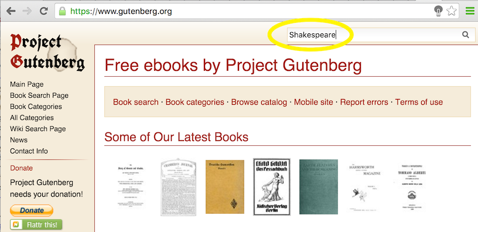
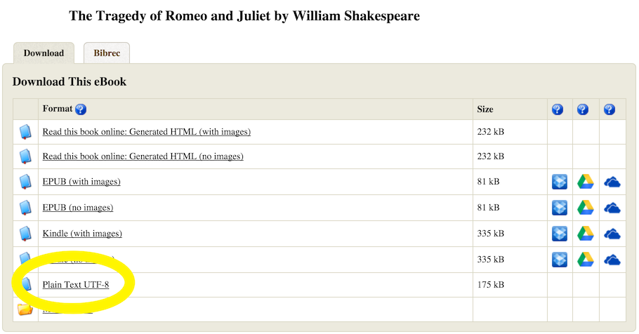

<p style="text-align:center">
</p>
**Resources**
<BR>
<ul>
<li type="square"><a href="https://www.youtube.com/user/mamunate/videos" target='_blank'>YouTube Companion Video</a></li>
<li type="square"><a href="#sourcecode">Full Source Code</a></li>
</ul>
<BR>
 
<a href='http://www.gutenberg.org/' target='_blank'>Project Gutenberg</a> is an incredible resource for anybody interested in accessing classic works of literature from around the world in digital format. It is free and powered by thousands of volunteers (if you find it useful, there is a donation button on their landing page). From the site:

<blockquote>Project Gutenberg offers over 50,000 free ebooks: choose among free epub books, free kindle books, download them or read them online.</blockquote>

Beyond enjoying all the great classics, it's an enormous boon to those working in <a href='https://en.wikipedia.org/wiki/Natural_language_processing' target='_blank'>Natural Language Processing (NLP)</a>. It can be used to compare writing styles through the ages, vocabulary choices, gender balance, punctuation usage, etc... 
<BR><BR>

**The Tragedy of Romeo and Juliet**

Let's see how it works by downloading 'The Tragedy of Romeo and Juliet'

First go to the main page and enter 'Shakespeare' in the top right search box. It will return many books by and on Shakespeare. Click on ```The Tragedy of Romeo and Juliet```

<p style="text-align:center">
</p>

There are many file types available and if you have a preference for a particular tab, go ahead. I keep things simple and rely on the plain text format. 

Click on 'Plain Text UTF-8' and the entire book should be readable in plain text format in your browser. 

<p style="text-align:center">
</p>

Now, let's see how we can do this programmatically, copy the link in the URL address bar (http://www.gutenberg.org/cache/epub/1112/pg1112.txt). There are different ways of downloading this data, a simple way is to you the ``readLines`` that can handle URL paths and split each line on the newline character. 
 
```r
romeo_juliet <- readLines("http://www.gutenberg.org/cache/epub/1112/pg1112.txt") 
class(romeo_juliet)
## [1] "character"

length(romeo_juliet)
## [1] 4853

```

<BR>

We've successfully imported ``4853`` lines of text. But we need to cut off some editorial data surrounding the actual play. The easiest way to tackle this is to ``print`` the first 100 lines of text:

```r
# not showing all lines to save space
# head(romeo_juliet,100)

print(romeo_juliet[63:69])

```

```r
## [63] ""                                                                       
## [64] "1595"                                                                   
## [65] ""                                                                       
## [66] "THE TRAGEDY OF ROMEO AND JULIET"                                        
## [67] ""                                                                       
## [68] "by William Shakespeare"                                                 
## [69] ""    

```
<BR>
So, the play really starts at line ``64`` therefore we need to remove everything before that. At the tail end, the story ends with ``THE END`` (this may be different for different books and requires manual inspection)
 
```r
grep( "THE END", romeo_juliet)
## [1] 4484

```

Let's prune out download to only contains data from line ``64`` to line ``4484``:

```r
romeo_juliet <- romeo_juliet[64:4484]

```

<BR><BR>
And that's how you find and download books - first search for the book on the <a href='https://www.gutenberg.org/' target='_blank'>Project Gutenberg</a> page, get to the text link, copy it into a ``readLines`` function in R, download it, and finally trim the editorial elements. After that... the sky is the limit.

For example:
<ul>
     <li>Which name is mentioned most, Romeo or Juliet?</li>
     <li>how many sentences are there?</li>
</ul>

Note: The site will track usage and may limit access if it goes beyond their accepted usage settings.
<BR><BR>
Let's bring all our data into one big blob of text:

```r
romeo_juliet_blob <- paste(romeo_juliet, sep="",collapse=" ")

```

Let's remove all punctuation and create a vector of words:

```r
romeo_juliet_words <- gsub(x=romeo_juliet_blob,pattern= "[[:punct:]]", replacement = ' ')   
romeo_juliet_words <- strsplit(romeo_juliet_words, ' ')

```
<BR><BR>
**Flyby Analysis**

How many times was the word Romeo and Juliet used?

```r
print('Romeo')
## [1] "Romeo"

sum(grepl(romeo_juliet_words[[1]], pattern='romeo', ignore.case = TRUE))
## [1] 156

print('Juliet')
## [1] "Juliet"

sum(grepl(romeo_juliet_words[[1]], pattern='juliet', ignore.case = TRUE))
## [1] 66

```
Interesting, right? ``Romeo`` was mentioned over 2 times more than ``Juliet``...

How many times was the word ``man`` used?

```r
sum(grepl(romeo_juliet_words[[1]], pattern='man', ignore.case = TRUE))
## [1] 176

```
<BR>
And ``woman``?

```r
sum(grepl(romeo_juliet_words[[1]], pattern='woman', ignore.case = TRUE))
## [1] 9

```
Really? ``Man`` was mentioned 20 times more than ``woman``?

<BR>
But that isn't fair, the ```grepl``` function looks for **man** on its own but also within words, including **wo**<i>man</i>. Thankfully we can force the ``grepl`` function to only look for the word **man**:

```r
sum(grepl(romeo_juliet_words[[1]], pattern='\\<man\\>', ignore.case = TRUE))
## [1] 77

```
<BR>
Just like we can find words synonymous to **woman** by adding multiple patterns in the ``grepl`` and using the ``|`` symbol to separate them:
<BR>

```r
sum(grepl(romeo_juliet_words[[1]], pattern='woman|women|lady', ignore.case = TRUE))
## [1] 94

```
The point here is that it's trivially easy to run some analysis of literature using Project Gutenberg.

<BR>

**How many sentences are in The Tragedy of Romeo and Juliet?** 

The **R** language has some great NLP packages that can help us build a <a href='https://en.wikipedia.org/wiki/Text_segmentation#Word_segmentation' target='_blank'>sentence tokenizer</a> and split our text into actual sentences.

<ul>
  <li><a href='https://cran.r-project.org/web/packages/openNLP/index.html' target='_blank'>openNLP: Apache OpenNLP Tools Interface</a></li>
  <li><a href='https://cran.r-project.org/web/packages/NLP/index.html' target='_blank'>NLP: Natural Language Processing Infrastructure</a></li>
  <li><a href='https://cran.r-project.org/web/packages/tm/index.html' target='_blank'>tm: Text Mining Package</a></li>
</ul>
<BR>

Instead, we're going to cheat and use a simple trick to break our data into sentences that I used in a previous blog entry. This won't be as precise as a real sentence tokenizer but is package-free and fast. We replace the following characters ``!``, ``?``, ``.``, ``;`` with an alphabet-based code: ``ootoo``. Then we remove all punctuation and finally split our data using the ``ootoo`` code:

```r
# create a blob of text like we did earlier
romeo_juliet_sentences <- paste(romeo_juliet, sep="",collapse=" ")

# swap all sentence ends with code 'ootoo'
romeo_juliet_sentences <- gsub(pattern=';|\\.|!|\\?', x=romeo_juliet_sentences, replacement='ootoo')

# remove all punctuation
romeo_juliet_sentences <- gsub(x=romeo_juliet_sentences,pattern= "[[:punct:]]", replacement = ' ')  

# remove contiguous spaces
romeo_juliet_sentences <- gsub(pattern="\\s+", x=romeo_juliet_sentences, replacement=' ')

# split sentences by split code
romeo_juliet_sentences <- unlist(strsplit(x=romeo_juliet_sentences, split='ootoo',fixed = TRUE))

# remove empty elements (when there are multiple points or question marks)
romeo_juliet_sentences <- romeo_juliet_sentences[romeo_juliet_sentences != ""]

```
<BR>
How many sentences are in ``The Tragedy of Romeo and Juliet``?

```r
length(romeo_juliet_sentences)
## [1] 3751

```

<BR><BR>       
<i>A special thanks to Lucas A. for the Shakespeare portrait!</i>
<BR>        
<a id="sourcecode">Full source code</a>:

```r
romeo_juliet <- readLines("http://www.gutenberg.org/cache/epub/1112/pg1112.txt") 
class(romeo_juliet)
length(romeo_juliet)

# not showing all lines to save space
# head(romeo_juliet,100)
print(romeo_juliet[63:69])
grep( "THE END", romeo_juliet)

# remove unecessary text
romeo_juliet <- romeo_juliet[64:4484]

# create a text blob
romeo_juliet_blob <- paste(romeo_juliet, sep="",collapse=" ")

#remove all punctuation and create a vector of words:
romeo_juliet_words <- gsub(x=romeo_juliet_blob,pattern= "[[:punct:]]", replacement = ' ')   
romeo_juliet_words <- strsplit(romeo_juliet_words, ' ')

# How many times was the word Romeo and Juliet used:
print('Romeo')
sum(grepl(romeo_juliet_words[[1]], pattern='romeo', ignore.case = TRUE))
print('Juliet')
sum(grepl(romeo_juliet_words[[1]], pattern='juliet', ignore.case = TRUE))

# How many times was the word ``man`` used?
sum(grepl(romeo_juliet_words[[1]], pattern='man', ignore.case = TRUE))

# And ``woman``?
sum(grepl(romeo_juliet_words[[1]], pattern='woman', ignore.case = TRUE))

sum(grepl(romeo_juliet_words[[1]], pattern='\\<man\\>', ignore.case = TRUE))
sum(grepl(romeo_juliet_words[[1]], pattern='woman|women|lady', ignore.case = TRUE))

# create a blob of text like we did earlier
romeo_juliet_sentences <- paste(romeo_juliet, sep="",collapse=" ")

# swap all sentence ends with code 'ootoo'
romeo_juliet_sentences <- gsub(pattern=';|\\.|!|\\?', x=romeo_juliet_sentences, replacement='ootoo')
 
# remove all punctuation
romeo_juliet_sentences <- gsub(x=romeo_juliet_sentences,pattern= "[[:punct:]]", replacement = ' ')  

# remove contiguous spaces
romeo_juliet_sentences <- gsub(pattern="\\s+", x=romeo_juliet_sentences, replacement=' ')

# split sentences by split code
romeo_juliet_sentences <- unlist(strsplit(x=romeo_juliet_sentences, split='ootoo',fixed = TRUE))

# remove empty elements (when there are multple points or question marks)
romeo_juliet_sentences <- romeo_juliet_sentences[romeo_juliet_sentences != ""]

# How many sentences are in ``The Tragedy of Romeo and Juliet``?

length(romeo_juliet_sentences)

```
