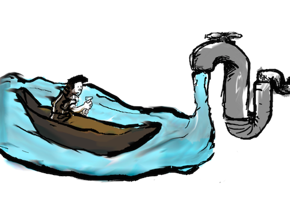
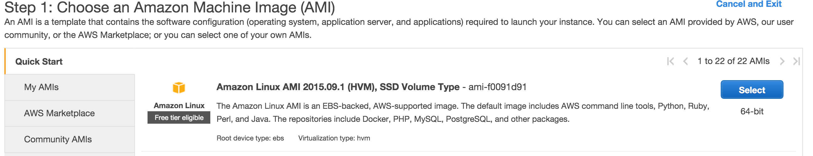
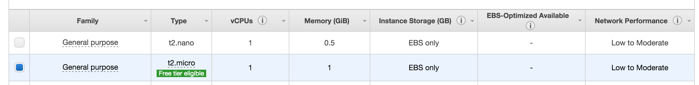
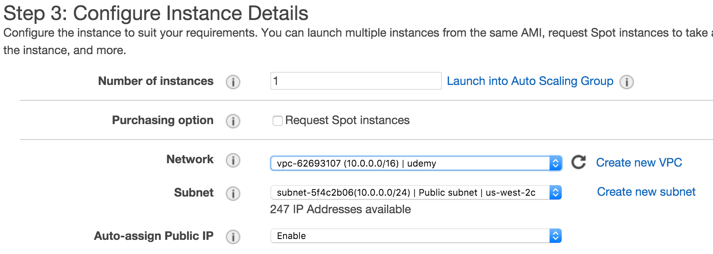
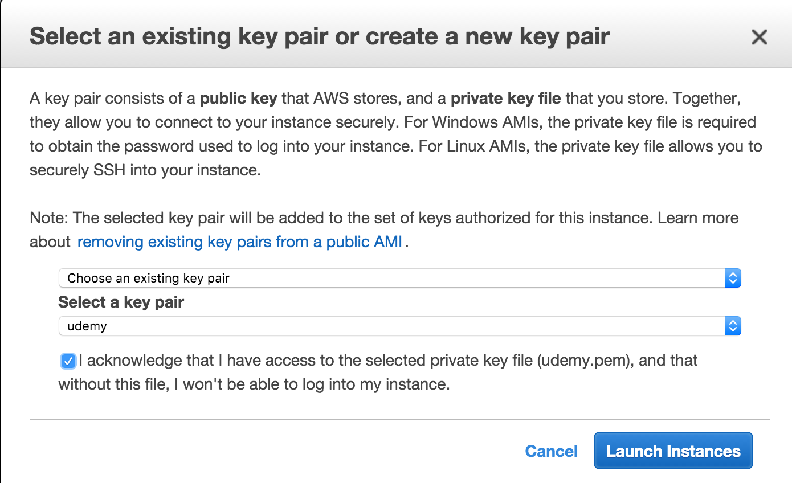

<p style="text-align:center">
</p>
**Resources**
<ul>
<li type="square"><a href="https://www.youtube.com/watch?v=n3oV9E4HzKE&list=UUq4pm1i_VZqxKVVOz5qRBIA&index=1" target='_blank'>YouTube Companion Video</a></li>

</ul>
<BR>
**Steps**
<ul>
<li type="square"><a href="#aws-instance"">Setting up an AWS Instance</a></li>
<li type="square"><a href="#vpc">Create a VPC</a></li>
<li type="square"><a href="#ec2-instance">Create an EC2 Instance</a></li>
<ul>
   <li type="square"><a href="#choose-image">Step 1: Choose an Amazon Machine Image (AMI) </a></li>
   <li type="square"><a href="#general-purpose-machine">Step 2: General Purpose Machine</a></li>
   <li type="square"><a href="#configure-instance">Step 3: Configure Instance Details</a></li>
   <li type="square"><a href="#advanced-details">Customize your Build - Advanced Details</a></li>
   <li type="square"><a href="#security-groups">Step 6: Configure Security Groups</a></li>
   <li type="square"><a href="#key-pair">Key Pair</a></li>
   <li type="square"><a href="#connect">Connect</a></li>
</ul>
<li type="square"><a href="#rstudio-server">RStudio</a></li>
<ul>
   <li type="square"><a href="#install-h2o">Install H2O Package</a></li>
   <li type="square"><a href="#run-demos">Run Built-in Demos</a></li>
</ul>
</ul>

<BR><BR>

In this article, I will show you the easy way to install <a href='https://en.wikipedia.org/wiki/H2O_(software)' target='_blank'>H2O</a> and **RStudio Server** on **Amazon Web Services (AWS)** from scratch. No need of customized AMIs or third party tools - no training wheels here. And the best part is that we can do everything from the Amazon Web Service wizard, we won’t need to terminal or putty anywhere! The key is passing all additional install commands for R, RStudio Server, and Curl in the configuration window in step 3 under **‘Advanced Details’**. We’ll even have it create our RStudio user account.

For those who don't yet know, ``H2O`` is an open-source software for machine learning and big-data analysis. It offers a various models such as **GLM**, **GBM** and **Random Forest**, but more importantly, offers a **deep learning neural network** and large-scale clustering!

For a great introduction to numerous features check out: <a href='https://h2o-release.s3.amazonaws.com/h2o/rel-slater/9/docs-website/h2o-docs/booklets/DeepLearning_Vignette.pdf' target='_blank'>DeepLearning_Vignette.pdf</a>
<BR><BR>
<h3><a id="aws-instance">Setting up an AWS Instance</a></h3>

Some important points, first, AWS isn’t free! If you follow along with the instance from this walk-through, it won’t cost you more than a few cents an hour. Just don’t forget to stop or terminate you instance once you're done!

<h3><a id="vpc">Create a VPC</a></h3>

<p style="text-align:center">
</p>
<br><br>

<h3><a id="ec2-instance">Create an EC2 Instance</a></h3>

<h4><a id="choose-image">Step 1: Choose an Amazon Machine Image (AMI)</a></h4>

<BR>
<p style="text-align:center">
</p>
<br><br>

<h4><a id="general-purpose-machine">Step 2: General Purpose Machine</a></h4>
<BR>
<p style="text-align:center">
</p>
<br><br>

<h4><a id="configure-instance">Step 3: Configure Instance Details</a></h4>
<BR>
<p style="text-align:center">
</p>
<br><br>


<h4><a id="advanced-details"> Customize your Build - Advanced Details</a></h4>
<BR>
**Check the latest RStudio Server URL**

Get the latest and greatest RStudio version - <a href='https://www.rstudio.com/products/rstudio/download-server/' target='_blank'>check the RStudio site</a>.

<p style="text-align:center">
</p>
<br><br>
Here are the commands to enter in the **Advanced Details** text box (partly from <a href='https://blogs.aws.amazon.com/bigdata/post/Tx3IJSB6BMHWZE5/Running-R-on-AWS' target='_blank'>AWS blog</a>):

```r
#!/bin/bash
# install R
yum install -y R
# install RStudio-Server
wget https://download2.rstudio.org/rstudio-server-rhel-0.99.489-x86_64.rpm
yum install -y --nogpgcheck rstudio-server-rhel-0.99.489-x86_64.rpm
yum install -y curl-devel
# add user
useradd manuel
echo manuel:testing | chpasswd
```
<BR><BR>
<h4><a id="security-groups">Step 6: Configure Security Groups</a></h4>
<BR>
Here add a custom TCP rule and add port 8787. If you have a static IP, enter it in **Source** for added security.
<BR><BR>
<p style="text-align:center">
</p>
<br><br>

<h4><a id="key-pair">Key Pair</a></h4>
<BR>
Enter a new key pair, or choose an old one. Check the acknowledgements and click the ``Launch Instances`` button:
<BR><BR>
<p style="text-align:center">
</p>
<br><br>

<h4><a id="connect">Connect</a></h4>
<BR>
Hit the launch button and once the light is green and checks successful, hit the **connect** button:

<p style="text-align:center">
</p>
<br><br>


<h3><a id="rstudio-server">RStudio Server</a></h3>
<BR>
That's it! We're over half-way there! Install the H2O package, initialize it and run some demos (check out the output of both demos to get familiar with some of the modeling commands)

<BR>
<h4><a id="install-h2o">Install H2O</a></h4>

```r
install.packages("h2o")
```

<BR><BR>
<h4><a id="run-demos">Run Built-in Demos</a></h4>
<BR>
Load and initialize H2O, then run a few built-in demos:

```r
library(h2o)
localH2O = h2o.init()

demo(h2o.glm)
demo(h2o.gbm)
```
<BR><BR>
**Enjoy!!**

<BR><BR>       
<i>A special thanks to Lucas A. for the H2O & Amazonian theme!</i>
<BR>   
