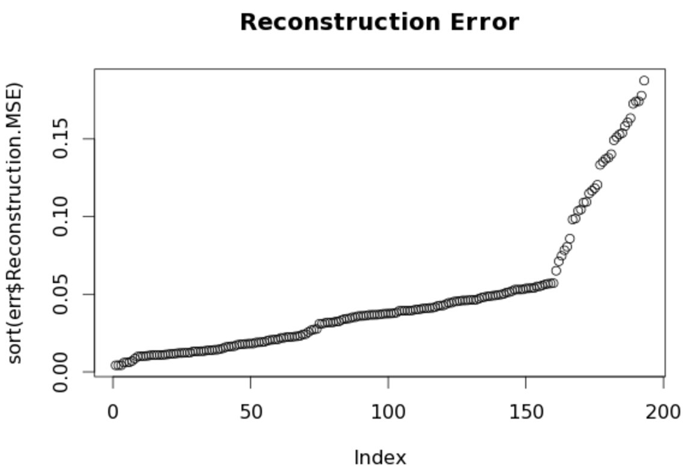
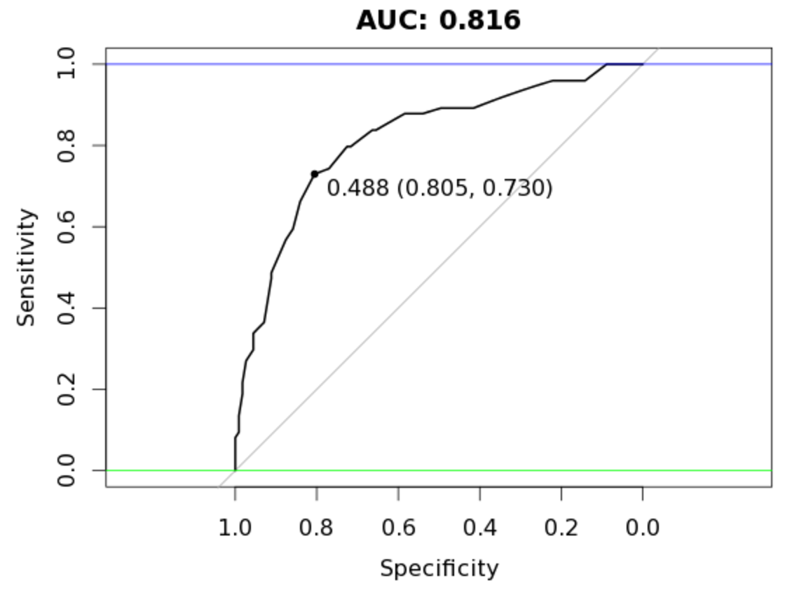

<BR>
<p style="text-align:center">
</p>


<BR><BR>
**Resources**
<ul>
<li type="square"><a href="https://www.youtube.com/user/mamunate/videos" target='_blank'>YouTube Companion Video</a></li>
<li type="square"><a href="#sourcecode">Full Source Code</a></li>
</ul>
<BR>
**Packages Used in this Walkthrough**
<ul>
<li type="square"><a href='https://cran.r-project.org/web/packages/h2o/index.html' target='_blank'>{h2o}: R Interface for H2O</a></li>
<li type="square"><a href='https://cran.r-project.org/web/packages/randomForest/index.html' target='_blank'>{randomForest}: Breiman and Cutler's Random Forests for Classification and Regression</a></li>
<li type="square"><a href='https://cran.r-project.org/web/packages/pROC/index.html' target='_blank'>{pROC} - Display and Analyze ROC Curves</a></li>
</ul>
<BR><BR><BR>

**Introduction**
<ul>
<li type="square"><a href="#intro">Anomaly Detection</a></li>
<li type="square"><a href="#h2o">H2O on AWS</a></li>
<li type="square"><a href="#code">Let's code!</a></li>
<li type="square"><a href="#benchmark">Benchmark Random Forest Model</a></li>
<li type="square"><a href="#autoencoder">Autoencoder</a></li>
<li type="square"><a href="#anomaly">Modeling With and Without Anomalies</a></li>
</ul>

Let's apply <a href='http://www.h2o.ai/product/' target='_blank'>H2O's</a> anomaly detection to separate a data set into **easy** and **hard** to model subsets and attempt to gain predictive accuracy.

For those who don't know yet, ``H2O`` is an open-source software for machine learning and big-data analysis. It offers various models such as **GLM**, **GBM** and **Random Forest**, but more importantly, offers a **deep learning neural network** and large-scale clustering!

For a great introduction to numerous features check out: <a href='https://h2o-release.s3.amazonaws.com/h2o/rel-slater/9/docs-website/h2o-docs/booklets/DeepLearning_Vignette.pdf' target='_blank'>DeepLearning_Vignette.pdf</a>
<BR><BR>
<h3><a id="intro">Anomaly Detection</a></h3>

<blockquote><i>Anomaly detection (or outlier detection) is the identification of items, events or observations which do not conform to an expected pattern or other items in a dataset</i> - <a href='https://en.wikipedia.org/wiki/Anomaly_detection' target='_blank'>Wikipedia.com</a></blockquote>

Anomaly Detection is a big scientific domain, and with such big domains, comes many associated techniques and tools. The <a href='https://en.wikipedia.org/wiki/Autoencoder' target='_blank'>autoencoder</a> is one of those tools and the subject of this walk-through. **H2O** offers an easy to use, unsupervised and non-linear ``autoencoder`` as part of its ``deeplearning`` model. Autoencoding mostly aims at reducing feature space in order to distill the essential aspects of the data versus more conventional deeplearning which blows up the feature space up to capture non-linearities and subtle interactions of the data. Autoencoding can also be seen as a non-linear alternative to <a href='http://amunategui.github.io/high-demensions-pca/' target='_blank'>PCA</a>.

Here is an interesting video from Arno Candel, the Chief Architect of H2O.ai, <a href='https://www.youtube.com/watch?v=fUSbljByXak' target='_blank'>Anomaly Detection and Feature Engineering</a> using the <a href='https://en.wikipedia.org/wiki/MNIST_database' target="_blank">MINST<a/> data set.

<BR><BR>
<h3><a id="h2o">H2O on AWS</a></h3>
I will use **H2O** on <a href='https://aws.amazon.com/' target='_blank'>Amazon Web Services (AWS)</a> as it is both trivial to set up and advantageous to your research (H2O supports cluster computing for distributed tasks). In the video, I quickly set up a new H2O Amazon Web Service (AWS) instance but won't cover it here as it is fully covered in my previous walk-through and video entitled <a href='http://amunategui.github.io/h2o-on-aws/' target='_blank'>H2O & RStudio Server on Amazon Web Services (AWS), the Easy Way!</a>.
<BR><BR>
<h3><a id="code">Let's code!</a></h3>

First thing we need to do once we have RStudio up and running is to install ``H2O``:

```{r}
install.packages("h2o")
```


In the output pane during the installation of H2O, you will see:

```{r}
## prostate                                html
```

This is the data set we will use to run our models. Let's go get it and assign it to ``prostate_df``:

```{r}
# point to the prostate data set in the h2o folder - no need to load h2o in memory yet
prosPath = system.file("extdata", "prostate.csv", package = "h2o")
prostate_df <- read.csv(prosPath)

# We don't need the ID field
prostate_df <- prostate_df[,-1]
summary(prostate_df)

```
```{r}
##     CAPSULE            AGE             RACE           DPROS      
##  Min.   :0.0000   Min.   :43.00   Min.   :0.000   Min.   :1.000  
##  1st Qu.:0.0000   1st Qu.:62.00   1st Qu.:1.000   1st Qu.:1.000  
##  Median :0.0000   Median :67.00   Median :1.000   Median :2.000  
##  Mean   :0.4026   Mean   :66.04   Mean   :1.087   Mean   :2.271  
##  3rd Qu.:1.0000   3rd Qu.:71.00   3rd Qu.:1.000   3rd Qu.:3.000  
##  Max.   :1.0000   Max.   :79.00   Max.   :2.000   Max.   :4.000  
##      DCAPS            PSA              VOL           GLEASON     
##  Min.   :1.000   Min.   :  0.30   Min.   : 0.00   Min.   :0.000  
##  1st Qu.:1.000   1st Qu.:  5.00   1st Qu.: 0.00   1st Qu.:6.000  
##  Median :1.000   Median :  8.75   Median :14.25   Median :6.000  
##  Mean   :1.108   Mean   : 15.41   Mean   :15.81   Mean   :6.384  
##  3rd Qu.:1.000   3rd Qu.: 17.12   3rd Qu.:26.45   3rd Qu.:7.000  
##  Max.   :2.000   Max.   :139.70   Max.   :97.60   Max.   :9.000
```
<BR><BR>
<h3><a id="benchmark">Benchmark Random Forest Model</a></h3>
Let's start by running a simple <a href='https://en.wikipedia.org/wiki/Random_forest' target='_blank'>random forest</a> model on the data by splitting it in two random portions (with a seed) - a training and a testing portion. This will give us a base score to measure our improvements using autoencoding.

```{r}
set.seed(1234)
random_splits <- runif(nrow(prostate_df))
train_df <- prostate_df[random_splits < .5,]
dim(train_df)
```
```{r}
## [1] 193   8
```
```{r}
validate_df <- prostate_df[random_splits >=.5,]
dim(validate_df)
```
```{r}
## [1] 187   8
```
<BR><BR>
Install packages **randomForest** and **pROC** and run a simple classification model on outcome variable ``CAPSULE``:

```{r}
install.packages('randomForest')
library(randomForest)

outcome_name <- 'CAPSULE'
feature_names <- setdiff(names(prostate_df), outcome_name)
set.seed(1234)
rf_model <- randomForest(x=train_df[,feature_names],
                         y=as.factor(train_df[,outcome_name]),
                         importance=TRUE, ntree=20, mtry = 3)

validate_predictions <- predict(rf_model, newdata=validate_df[,feature_names], type="prob")
```
<BR><BR>
Let's use the ``pROC`` library to calculate our AUC score (remember, an AUC of 0.5 is random and 1 is perfect) and plot a chart:

```{r}
install.packages('pROC')
library(pROC)
auc_rf = roc(response=as.numeric(as.factor(validate_df[,outcome_name]))-1,
             predictor=validate_predictions[,2])

plot(auc_rf, print.thres = "best", main=paste('AUC:',round(auc_rf$auc[[1]],3)))
abline(h=1,col='blue')
abline(h=0,col='green')
```
<BR><BR>
<p style="text-align:center">
</p>

We get an AUC of **0.757** with our current data split.
<BR><BR>
<h3><a id="autoencoder">Autoencoder</a></h3>
Let's see how an unsupervised **autoencoding** can assist us here. Start by initializing an h2o instance and create an H2O frame from the prostate data set:

```{r}
library(h2o)
localH2O = h2o.init()

prostate.hex<-as.h2o(train_df, destination_frame="train.hex")
```
<BR><BR>
Getting down to the heart of our business, let's call the deeplearning function with parameter ``autoencoder`` set to TRUE (we also set the ``reproducible`` flag to ``TRUE`` along with a seed so we all see the same results but this is substantially slower than setting the flag to ``FALSE``):

```{r}
prostate.dl = h2o.deeplearning(x = feature_names, training_frame = prostate.hex,
                               autoencoder = TRUE,
                               reproducible = T,
                               seed = 1234,
                               hidden = c(10,20,10), epochs = 50)
```
<BR><BR>
We now call the <a href='http://rpackages.ianhowson.com/cran/h2o/man/h2o.anomaly.html' target='_blank'>h2o.anomaly</a> function to reconstruct the original data set using the reduced set of features and calculate a means squared error between both. Here we set ``per_feature`` parameter to FALSE in the ``h2o.anomaly`` function call as we want a reconstruction meany error based on observations, not individual features (but you should definitely play around feature-level scores as it could lead to important insights into your data).

```{r}
prostate.anon = h2o.anomaly(prostate.dl, prostate.hex, per_feature=FALSE)
head(prostate.anon)
err <- as.data.frame(prostate.anon)
```
<BR><BR>
Let's sort and plot the reconstructed MSE. The autoencoder struggles from index 150 onwards as the error count accelerates upwards. We can determine that the model recognizes patterns in the first 150 observations that it can't see as easily in the latter 50.

```{r}
plot(sort(err$Reconstruction.MSE))
```
<BR><BR>
<p style="text-align:center">
</p>
<BR><BR>
<h3><a id="anomaly">Modeling With and Without Anomalies</a></h3>
The next logical step is to use the clean observations, those that the autoencoder reconstructed easily and model that with our random forest model. We use the ``err``'s ``Reconstruction.MSE`` vector to gather everything all observations in our prostate data set with an error below 0.1:

```{r}
# rebuild train_df_auto with best observations
train_df_auto <- obj_test[err$Reconstruction.MSE < 0.1,]

set.seed(1234)
rf_model <- randomForest(x=train_df_auto[,feature_names],
                         y=as.factor(train_df_auto[,outcome_name]),
                         importance=TRUE, ntree=20, mtry = 3)

validate_predictions_known <- predict(rf_model, newdata=validate_df[,feature_names], type="prob")

auc_rf = roc(response=as.numeric(as.factor(validate_df[,outcome_name]))-1,
             predictor=validate_predictions_known[,2])

plot(auc_rf, print.thres = "best", main=paste('AUC:',round(auc_rf$auc[[1]],3)))
abline(h=1,col='blue')
abline(h=0,col='green')

```
<BR><BR>
<p style="text-align:center">
</p>
<BR>
An AUC of 0.771, an improvement over our original random forest model of 0.757 while using less observations!

Let's try the same model on the hard to reconstruct portion:

```{r}
train_df_auto <- train_df[err$Reconstruction.MSE > 0.1,]

set.seed(1234)
rf_model <- randomForest(x=train_df_auto[,feature_names],
                         y=as.factor(train_df_auto[,outcome_name]),
                         importance=TRUE, ntree=20, mtry = 3)

validate_predictions_unknown <- predict(rf_model, newdata=validate_df[,feature_names], type="prob")

auc_rf = roc(response=as.numeric(as.factor(validate_df[,outcome_name]))-1,
             predictor=validate_predictions_unknown[,2])

plot(auc_rf, print.thres = "best", main=paste('AUC:',round(auc_rf$auc[[1]],3)))
abline(h=1,col='blue')
abline(h=0,col='green')
```
<BR><BR>
<p style="text-align:center">
</p>
<BR><BR>
It should be clear by now that these top portions behave very differently under the same model. What about bagging both prediction sets (adding both prediction vectors together and dividing the total by two)?

```{r}
valid_all <- (validate_predictions_known[,2] + validate_predictions_unknown[,2]) / 2

# AUC 0.806
library(pROC)
auc_rf = roc(response=as.numeric(as.factor(validate_df[,outcome_name]))-1,
             predictor=valid_all)

plot(auc_rf, print.thres = "best", main=paste('AUC:',round(auc_rf$auc[[1]],3)))
abline(h=1,col='blue')
abline(h=0,col='green')
```
<BR><BR>
<p style="text-align:center">
</p>
<BR>

Tremendous! We end up with an AUC of 0.806!! Awesome! In this case, random forest benefitted from the splitting of our data set into two groups of varying patterns. In essence it managed to create better trees for each type which it couldn't do with the larger original set. Mind you, this doesn't always pan out this way - a lot has to do on the type of data you are dealing with and the modeling algorithms.

<B>Note:</B> H2O is a fast moving development project, so if certain aspects of this walk-through don't work, check the documentation for changes in the library.
<BR><BR>       
<i>A special thanks to Lucas A. for the autoencoding fist artwork!</i>
<BR>  
<BR><BR>        
<a id="sourcecode">Full source code</a>:
<BR><BR>

```{r}
# install.packages("h2o")

# point to the prostate data set in the h2o folder - no need to load h2o in memory yet
prosPath = system.file("extdata", "prostate.csv", package = "h2o")
prostate_df <- read.csv(prosPath)

# We don't need the ID field
prostate_df <- prostate_df[,-1]
summary(prostate_df)

set.seed(1234)
random_splits <- runif(nrow(prostate_df))
train_df <- prostate_df[random_splits < .5,]
dim(train_df)

validate_df <- prostate_df[random_splits >=.5,]
dim(validate_df)

# Get benchmark score

# install.packages('randomForest')
library(randomForest)

outcome_name <- 'CAPSULE'
feature_names <- setdiff(names(prostate_df), outcome_name)
set.seed(1234)
rf_model <- randomForest(x=train_df[,feature_names],
                         y=as.factor(train_df[,outcome_name]),
                         importance=TRUE, ntree=20, mtry = 3)

validate_predictions <- predict(rf_model, newdata=validate_df[,feature_names], type="prob")


# install.packages('pROC')
library(pROC)
auc_rf = roc(response=as.numeric(as.factor(validate_df[,outcome_name]))-1,
             predictor=validate_predictions[,2])

plot(auc_rf, print.thres = "best", main=paste('AUC:',round(auc_rf$auc[[1]],3)))
abline(h=1,col='blue')
abline(h=0,col='green')

# build autoencoder model

library(h2o)
localH2O = h2o.init()
prostate.hex<-as.h2o(train_df, destination_frame="train.hex")
prostate.dl = h2o.deeplearning(x = feature_names, training_frame = prostate.hex,
                               autoencoder = TRUE,
                               reproducible = T,
                               seed = 1234,
                               hidden = c(6,5,6), epochs = 50)

# interesting per feature error scores
# prostate.anon = h2o.anomaly(prostate.dl, prostate.hex, per_feature=TRUE)
# head(prostate.anon)

prostate.anon = h2o.anomaly(prostate.dl, prostate.hex, per_feature=FALSE)
head(prostate.anon)
err <- as.data.frame(prostate.anon)

# interesting reduced features (defaults to last hidden layer)
# http://www.rdocumentation.org/packages/h2o/functions/h2o.deepfeatures
# reduced_new  <- h2o.deepfeatures(prostate.dl, prostate.hex)

plot(sort(err$Reconstruction.MSE))

# use the easy portion and model with random forest using same settings

train_df_auto <- train_df[err$Reconstruction.MSE < 0.1,]

set.seed(1234)
rf_model <- randomForest(x=train_df_auto[,feature_names],
                         y=as.factor(train_df_auto[,outcome_name]),
                         importance=TRUE, ntree=20, mtry = 3)

validate_predictions_known <- predict(rf_model, newdata=validate_df[,feature_names], type="prob")

auc_rf = roc(response=as.numeric(as.factor(validate_df[,outcome_name]))-1,
             predictor=validate_predictions_known[,2])

plot(auc_rf, print.thres = "best", main=paste('AUC:',round(auc_rf$auc[[1]],3)))
abline(h=1,col='blue')
abline(h=0,col='green')

# use the hard portion and model with random forest using same settings

train_df_auto <- train_df[err$Reconstruction.MSE >= 0.1,]

set.seed(1234)
rf_model <- randomForest(x=train_df_auto[,feature_names],
                         y=as.factor(train_df_auto[,outcome_name]),
                         importance=TRUE, ntree=20, mtry = 3)

validate_predictions_unknown <- predict(rf_model, newdata=validate_df[,feature_names], type="prob")

auc_rf = roc(response=as.numeric(as.factor(validate_df[,outcome_name]))-1,
             predictor=validate_predictions_unknown[,2])

plot(auc_rf, print.thres = "best", main=paste('AUC:',round(auc_rf$auc[[1]],3)))
abline(h=1,col='blue')
abline(h=0,col='green')


# bag both results set and measure final AUC score

valid_all <- (validate_predictions_known[,2] + validate_predictions_unknown[,2]) / 2

# AUC 0.806
library(pROC)
auc_rf = roc(response=as.numeric(as.factor(validate_df[,outcome_name]))-1,
             predictor=valid_all)

plot(auc_rf, print.thres = "best", main=paste('AUC:',round(auc_rf$auc[[1]],3)))
abline(h=1,col='blue')
abline(h=0,col='green')


```
