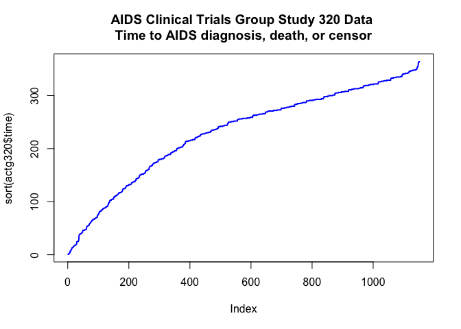
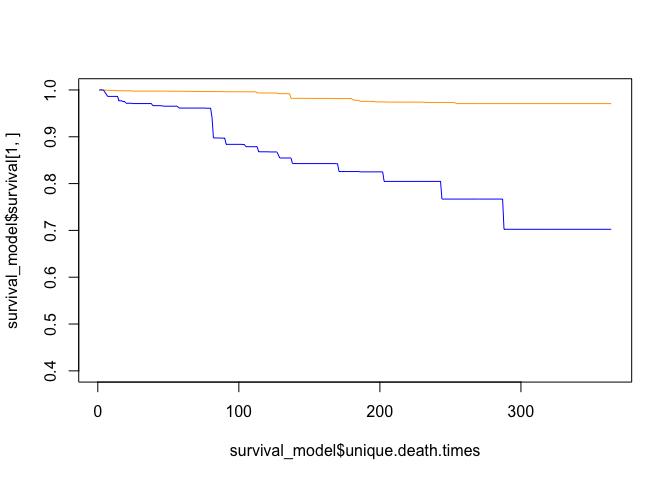
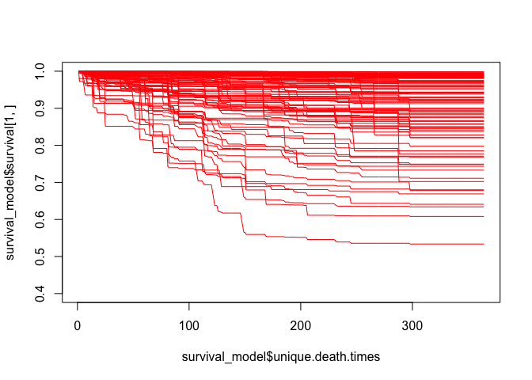

<BR>
<p style="text-align:center">
</p>

**Resources**
<ul>
<li type="square"><a href="https://www.youtube.com/user/mamunate/videos" target='_blank'>YouTube Companion Video</a></li>
<li type="square"><a href="#sourcecode">Full Source Code</a></li>
</ul>
<BR><BR>
 
If you need to predict a time-based event, most common models, whether regression, classification or survival, can get you there but the quality, type of answer, and path taken will vary. A regression model will return a time estimate, a classification model will return the probability of an event at x time, and a survival model will return probabilities of an event not happening over various time frames. We'll skip the regression model here as we're not only interested in the time estimate but also the probability of an outcome. With a regression model you would have to first model the outcome and then figure out the time estimate.

Instead, we'll use a survival model (<a href='https://cran.r-project.org/web/packages/ranger/index.html' target='_blank'>ranger: A Fast Implementation of Random Forests</a>) that will give us an outcome probability over a time continuum (flipping the non-event to event probability), and a classification model (<a href='https://cran.r-project.org/web/packages/gbm/index.html' target='_blank'>gbm: Generalized Boosted Regression Models</a>), where we'll measure the probability of the same event happening within x periods. We'll then look at two ways of ensembling the models and hope for synergy.

We will use the <a href='https://en.wikipedia.org/wiki/Receiver_operating_characteristic#Area_under_curve' target='_blank'>Area under the curve (AUC)</a> to measure the different approaches. We'll compare both estimates, then average out the results from both models, and then ensemble them.

We'll run our tests on the <a href='https://www.umass.edu/statdata/statdata/data/actg320.txt' target='_blank'>AIDS Clinical Trials Group Study 320 Data</a> from the <a href='https://www.umass.edu/' target='_blank'>University of Massachusetts Amherst</a>. The data represents a double-blind, placebo-controlled trial comparing two different sets of medication in HIV-infected patients. The outcome measures the time to AIDS diagnosis or death.
<BR><BR>
<H4>
Data Preparation
</H4>
Let's download the data set from `umass` and add them missing column headers.

``` r
actg320_colnames <- c('id','time','censor','time_d','censor_d','treatment','treatment_group',
                      'strat2','sex','raceth','ivdrug','hemophil','karnof','cd4','priorzdv','age')
actg320 <- read.table('https://www.umass.edu/statdata/statdata/data/actg320.dat', col.names = actg320_colnames)
dim(actg320)
```

    ## [1] 1151   16

``` r
head(actg320)
```

    ##   id time censor time_d censor_d treatment treatment_group strat2 sex
    ## 1  1  189      0    189        0         0               1      1   1
    ## 2  2  287      0    287        0         0               1      1   2
    ## 3  3  242      0    242        0         1               2      0   1
    ## 4  4  199      0    199        0         0               1      1   1
    ## 5  5  286      0    286        0         1               2      0   1
    ## 6  6  285      0    285        0         1               2      0   1
    ##   raceth ivdrug hemophil karnof   cd4 priorzdv age
    ## 1      1      1        0    100 169.0       39  34
    ## 2      2      1        0     90 149.5       15  34
    ## 3      1      1        1    100  23.5        9  20
    ## 4      1      1        0     90  46.0       53  48
    ## 5      1      3        0     90  10.0       12  46
    ## 6      1      1        0     70   0.0       24  51

<BR><BR> The data set offers two events and two time periods for survival modeling and we'll focus on the first event (AIDS or death) as it offers a more balanced outcome.

``` r
# we're removing time_d and censor_2 as it has a rarer outcome balance
actg320 <- actg320[,c('time', 'censor', 'treatment','treatment_group',
                                 'strat2','sex','raceth','ivdrug','hemophil','karnof','cd4','priorzdv','age')]
```

<BR><BR> Let's take a quick look at the time period range in the training portion of our data set:

``` r
plot(sort(actg320$time), pch='.', type='o', 
     col='blue', lwd=2 , 
     main = 'AIDS Clinical Trials Group Study 320 Data \nTime to AIDS diagnosis, death, or censor')
```


<BR><BR>

<H4>
Survival Modeling
</H4>
For a great overview on survival analysis, I highly recommend **Ani Katchova's** educational videos:
<ul>
<li>
<a href='https://www.youtube.com/watch?v=fTX8GghbBPc' target='_blank'>Survival Analysis</a>
</li>
<li>
<a href='https://www.youtube.com/watch?v=XFX6ukqHOWM' target='_blank'>Survival Analysis Example</a>
</li>
<li>
<a href='https://www.youtube.com/watch?v=qt2ufTPCWwI' target='_blank'>Survival Analysis in R</a>
</li>
</ul>
A survival model needs two outcome variables: a time variable and an outcome/event variable. Every observation in the data set needs a time period. The event outcome, on the other hand, doesn't need to be fully known, in contrast with a logistic regression or classification model which requires training on a known outcome. Instead of needing a true/false, sick/healthy, or dead/alive, a survival model uses the concept of the event, something either has happened or we don't know. <BR><BR>
<H4>
Random Forest Survival
</H4>
Here we will use a random forest survival model as it offers advantages like capturing non-linear effects that a traditional model cannot do and be easily distributed over multiple cores. The two models that I have used are the <a href='https://cran.r-project.org/web/packages/ranger/index.html' target='_blank'>ranger</a> package and the <a href='https://cran.r-project.org/web/packages/randomForestSRC/index.html' target='_blank'>randomForestSRC</a> package. We will focus on the `ranger` model as it doesn't require additional steps to get it to work on multiple cores. I have been able to work on fairly wide data set using it.

Let's set up our formula. Survival models require two values in the `Surv` function, the time period followed by the outcome. After the tilde we add our predictors as it typically done with most modeling formulas.

``` r
# install.packages('ranger')
library(ranger)
# install.packages('survival')
library(survival)

survival_formula <- formula(paste('Surv(', 'time', ',', 'censor', ') ~ ','treatment+treatment_group',
                              '+strat2+sex+raceth+ivdrug+hemophil+karnof+cd4+priorzdv+age'))
```

``` r

survival_formula
```

    ## Surv(time, censor) ~ treatment + treatment_group + strat2 + sex + 
    ##     raceth + ivdrug + hemophil + karnof + cd4 + priorzdv + age

``` r
survival_model <- ranger(survival_formula,
               data = actg320,  
               seed = 1234,
               importance = 'permutation',
               mtry = 2,
               verbose = TRUE,
               num.trees = 50,
               write.forest=TRUE)

# print out coefficients
sort(survival_model$variable.importance)
```

    ##          ivdrug             sex          raceth        priorzdv 
    ##   -0.0019809410   -0.0006365012   -0.0003737668   -0.0003718928 
    ##        hemophil             age       treatment treatment_group 
    ##    0.0002572973    0.0013409609    0.0022120503    0.0022544933 
    ##          strat2             cd4          karnof 
    ##    0.0024485078    0.0041989073    0.0053592447

<BR><BR> Once we have our `survival_model` model object, we can take a look at some probabilities of survival (this is just for illustrative purposes as we haven't split our data set yet). Let's look at two patients - row 1 and row 56:

``` r
plot(survival_model$unique.death.times, survival_model$survival[1,], type='l', col='orange', ylim=c(0.4,1))
lines(survival_model$unique.death.times, survival_model$survival[56,], col='blue')
```

 

The plots represent the probability of survival/not reaching event over time. In these cases, the orange line has a much higher provability of not being diagnosed with AIDS or dying than the blue line. This can be confusing, but a survival model yields a probability of **NOT** reaching event.

Let's look at why the model may see the orange line (row 1) with a higher probability of not reaching event than the blue line (row 56):

``` r
actg320[1,]
```

    ##   time censor treatment treatment_group strat2 sex raceth ivdrug hemophil
    ## 1  189      0         0               1      1   1      1      1        0
    ##   karnof cd4 priorzdv age
    ## 1    100 169       39  34

``` r
actg320[56,]
```

    ##    time censor treatment treatment_group strat2 sex raceth ivdrug hemophil
    ## 56  168      0         1               2      0   1      1      1        0
    ##    karnof  cd4 priorzdv age
    ## 56     90 16.5       10  63

<BR><BR> At a high level, the patient at row 1 is much younger and has a higher <a href='http://www.hospicepatients.org/karnofsky.html' target='_blank'>Karnofsky Performance Scale (karnof)</a>.

We can easily plot many other patients by creating a simple loop:

``` r
plot(survival_model$unique.death.times, survival_model$survival[1,], type='l', col='orange', ylim=c(0.4,1))
for (x in c(2:100)) {
     lines(survival_model$unique.death.times, survival_model$survival[x,], col='red')
}
```

 
<BR><BR>

<H4>
Area Under The Curve
</H4>
In order to measure the `AUC` of each model we need to split the data randomly (with seed) into two equal parts:

``` r
set.seed(1234)
random_splits <- runif(nrow(actg320))
train_df_official <- actg320[random_splits < .5,]
dim(train_df_official)
```

    ## [1] 568  13

``` r
validate_df_official <- actg320[random_splits >= .5,]
dim(validate_df_official)
```

    ## [1] 583  13

<BR><BR>
<H4>
Generalized Boosted Regression Model
</H4>
So going forward, and in order to align the survival and the classification models, we will focus on the probability of reaching event over the first 82 days.

``` r
period_choice <- 82 # 103 
table(train_df_official$time)
```

    ## 
    ##   1   2   3   7  13  14  16  17  18  20  25  26  27  35  39  42  46  47 
    ##   2   1   1   1   1   2   1   2   2   1   3   1   1   1   3   2   1   5 
    ##  54  55  56  58  59  61  62  63  65  66  68  69  70  75  76  77  82  84 
    ##   1   2   2   1   1   1   2   1   1   1   2   1   2   1   1   2   4   2 
    ##  85  86  88  90  91  98 100 103 104 105 110 112 113 114 115 116 117 118 
    ##   1   1   3   1   1   2   1   3   1   3   3   2   2   1   1   1   2   1 
    ## 123 124 125 126 127 129 130 131 132 133 136 137 138 139 140 143 144 145 
    ##   1   1   2   1   1   2   1   1   3   2   3   1   1   1   2   2   2   2 
    ## 146 151 152 153 154 158 159 160 161 166 168 171 172 173 174 175 178 179 
    ##   2   3   2   2   1   2   2   1   3   1   1   1   1   2   1   3   1   3 
    ## 180 181 182 186 187 188 189 190 192 193 194 196 200 201 202 203 208 210 
    ##   5   5   1   3   4   1   5   1   1   2   2   3   1   2   3   3   2   1 
    ## 213 214 215 216 217 220 221 222 223 224 227 228 229 230 231 235 236 237 
    ##   1   5   3   5   3   1   1   1   2   3   2   5   3   3   4   2   1   1 
    ## 238 241 242 243 244 248 250 251 252 255 256 257 258 259 262 263 264 265 
    ##   1   3   5   2   5   2   5   4   1   2   5   9   4   7   1   7   2   8 
    ## 266 269 270 271 272 273 276 277 278 279 280 283 284 285 286 287 290 291 
    ##   4   3   2   8   7   7   3   5   2   4   5   3   5   5   4   5   5   8 
    ## 292 293 294 297 298 299 300 301 304 305 306 307 308 311 312 313 314 315 
    ##   4   7   3   1   5   4   5   5   3   4   4   1   5   2   3   9   3   6 
    ## 318 319 320 321 322 326 327 328 329 332 333 334 335 336 339 341 342 343 
    ##   3   6   2   5   9   4   4   6   8   1   4   2   7   3   1   3   2   4 
    ## 346 347 348 349 350 353 354 362 364 
    ##   4   3   3   3   1   1   2   2   2

<BR><BR> We also need to create a classification-centric outcome variable. This will measure how many patients reached event or not within the chosen period. Here we look for a censor feature of 1 (i.e. the event happened) under the chosen period to set the outcome to 1, everything else is set to 0:

``` r
# classification data set
train_df_classificaiton  <- train_df_official 
train_df_classificaiton$ReachedEvent <- ifelse((train_df_classificaiton$censor==1 & 
                                                     train_df_classificaiton$time<=period_choice), 1, 0)
summary(train_df_classificaiton$ReachedEvent)
```

    ##    Min. 1st Qu.  Median    Mean 3rd Qu.    Max. 
    ## 0.00000 0.00000 0.00000 0.04401 0.00000 1.00000

``` r
validate_df_classification  <- validate_df_official 
validate_df_classification$ReachedEvent <- ifelse((validate_df_classification$censor==1 & 
                                                        validate_df_classification$time<=period_choice), 1, 0)
summary(validate_df_classification$ReachedEvent)
```

    ##    Min. 1st Qu.  Median    Mean 3rd Qu.    Max. 
    ## 0.00000 0.00000 0.00000 0.02916 0.00000 1.00000

<BR>Now we can easily get an AUC score on the probability of reaching event within our allotted period choice <BR><BR>
<H4>
Classification
</H4>
Let's run and score our classification GBM model:

``` r
feature_names <- setdiff(names(train_df_classificaiton), c('ReachedEvent', 'time', 'censor'))

# isntall.packages('gbm')
library(gbm)

classification_formula <- formula(paste('ReachedEvent ~ ','treatment+treatment_group',
                                  '+strat2+sex+raceth+ivdrug+hemophil+karnof+cd4+priorzdv+age'))

set.seed(1234)
gbm_model = gbm(classification_formula, 
                data =  train_df_classificaiton,
                distribution='bernoulli',
                n.trees=500,         
                interaction.depth=3,
                shrinkage=0.01,
                bag.fraction=0.5,
                keep.data=FALSE,
                cv.folds=5)

nTrees <- gbm.perf(gbm_model)

validate_predictions <- predict(gbm_model, newdata=validate_df_classification[,feature_names], type="response", n.trees=nTrees)

# install.packages('pROC')
library(pROC)
roc(response=validate_df_classification$ReachedEvent, predictor=validate_predictions)

```

    ## 
    ## Call:
    ## roc.default(response = validate_df_classification$ReachedEvent,     predictor = validate_predictions)
    ## 
    ## Data: validate_predictions in 566 controls (validate_df_classification$ReachedEvent 0) < 17 cases (validate_df_classification$ReachedEvent 1).
    ## Area under the curve: 0.771

<BR><BR>
<H4>
Scoring the Random Forest Survival Model
</H4>
Now let's score our RF survival model for the period in question.
``` r

survival_model <- ranger(survival_formula,
                data = train_df_official,
                seed=1234,
                verbose = TRUE,
                num.trees = 50,
                mtry = 2,
                write.forest=TRUE )
```

<BR><BR> The `survival_model` object can offer probabilities on periods it has trained on. In order to get that list:

``` r

survival_model$unique.death.times

```

    ##   [1]   1   2   3   7  13  14  16  17  18  20  25  26  27  35  39  42  46
    ##  [18]  47  54  55  56  58  59  61  62  63  65  66  68  69  70  75  76  77
    ##  [35]  82  84  85  86  88  90  91  98 100 103 104 105 110 112 113 114 115
    ##  [52] 116 117 118 123 124 125 126 127 129 130 131 132 133 136 137 138 139
    ##  [69] 140 143 144 145 146 151 152 153 154 158 159 160 161 166 168 171 172
    ##  [86] 173 174 175 178 179 180 181 182 186 187 188 189 190 192 193 194 196
    ## [103] 200 201 202 203 208 210 213 214 215 216 217 220 221 222 223 224 227
    ## [120] 228 229 230 231 235 236 237 238 241 242 243 244 248 250 251 252 255
    ## [137] 256 257 258 259 262 263 264 265 266 269 270 271 272 273 276 277 278
    ## [154] 279 280 283 284 285 286 287 290 291 292 293 294 297 298 299 300 301
    ## [171] 304 305 306 307 308 311 312 313 314 315 318 319 320 321 322 326 327
    ## [188] 328 329 332 333 334 335 336 339 341 342 343 346 347 348 349 350 353
    ## [205] 354 362 364

<BR><BR> Here is the tricky part, in order to get an AUC score out of a survival model, we need to choose our period (82nd day) and reverse the probability - as we're interested in the probability of reaching event versus the probability of not reaching event.

First we get the basic survival prediction using our validation split set and then we flip the probability of the period of choice and get the AUC score:

``` r

suvival_predictions <- predict( survival_model, validate_df_official[, c('treatment','treatment_group',
                                                 'strat2','sex','raceth','ivdrug',
                                                 'hemophil','karnof','cd4',
                                                 'priorzdv','age')])

roc(response=validate_df_classification$ReachedEvent, predictor=1 - suvival_predictions$survival[,which(suvival_predictions$unique.death.times==period_choice)])

```

    ## 
    ## Call:
    ## roc.default(response = validate_df_classification$ReachedEvent,     predictor = 1 - suvival_predictions$survival[, which(suvival_predictions$unique.death.times ==         period_choice)])
    ## 
    ## Data: 1 - suvival_predictions$survival[, which(suvival_predictions$unique.death.times == period_choice)] in 566 controls (validate_df_classification$ReachedEvent 0) < 17 cases (validate_df_classification$ReachedEvent 1).
    ## Area under the curve: 0.7534

<BR><BR> Now that both models can predict the same period and the probability of reaching the event, we average them together and see how they help each other (straight 50/50 here which may not be the best mix)

``` r

 # blend both together 
roc(predictor = (validate_predictions + (1 - suvival_predictions$survival[,which(suvival_predictions$unique.death.times==period_choice)]))/2, 
          response = validate_df_classification$ReachedEvent)

```

    ## 
    ## Call:
    ## roc.default(response = validate_df_classification$ReachedEvent,     predictor = (validate_predictions + (1 - suvival_predictions$survival[,         which(suvival_predictions$unique.death.times == period_choice)]))/2)
    ## 
    ## Data: (validate_predictions + (1 - suvival_predictions$survival[, which(suvival_predictions$unique.death.times == period_choice)]))/2 in 566 controls (validate_df_classification$ReachedEvent 0) < 17 cases (validate_df_classification$ReachedEvent 1).
    ## Area under the curve: 0.7583

<BR><BR>
<H4>
Ensembling Survival and Classification
</H4>
We need to split our data set into two smaller chunks. This will allow us to get a survival probability on all the data, not just our validation set. So, we split the training set into to parts, and validation into two parts, then use one training chunk to train and predict on the other training chunk and half of the validation chunk. We then train on the other half of our original training set, to predict on the first split chunk of training data and the second half of the testing data... yikes!

But in the end we can get a survival probability on all the data without ever peeking or cheating. Hang in there!

``` r
# split training into two datasets
set.seed(1234)
random_splits <- runif(nrow(train_df_official))
train_1 <- train_df_official[random_splits < .5,]
dim(train_1)
```

    ## [1] 267  13

``` r
train_2 <- train_df_official[random_splits >= .5,]
dim(train_2)
```

    ## [1] 301  13

``` r
# split testing set in two
set.seed(1234)
random_splits <- runif(nrow(validate_df_official))
test_1 <- validate_df_official[random_splits < .5,]
dim(test_1)
```

    ## [1] 275  13

``` r

test_2 <- validate_df_official[random_splits >= .5,]
dim(test_2)

```

    ## [1] 308  13

Now that we have our four chunks of data, we can start predicting each chunk:

``` r

surv_1 <- ranger(survival_formula,
                 data =  train_1,
                 verbose = TRUE,
                 seed=1234,
                 num.trees = 50,
                 mtry = 2,
                 write.forest=TRUE )

preds <- predict( surv_1, rbind(train_2[,feature_names], test_2[,feature_names]))
preds_1 <- data.frame(preds$survival)


surv_2 <- ranger(survival_formula,
                 data = train_2,
                 verbose = TRUE,
                 seed=1234,
                 num.trees = 50,
                 mtry = 2,
                 write.forest=TRUE )

preds <- predict( surv_2, rbind(train_1[,feature_names], test_1[,feature_names]))
preds_2 <- data.frame(preds$survival)

```

<BR><BR> So, this is the important part, we now rebuild the data set into the orginal training and validation portions with the an added feature: the survival probablity for our period of interest.

As an aside, in our process of splitting the data, we lost one period in the second training chunk, thus the model in preds\_2 doesn't contain our selected `period_choice`, so we pick the closes alternative (in this case it is 69 days as an alternative for 70).

``` r
# NOTE: can't use period_choice here as second data set doesn't have that period
surv_1$unique.death.times 
```

    ##   [1]   1   2   3  13  14  17  20  27  35  39  42  46  47  54  55  56  62
    ##  [18]  65  66  70  76  82  84  88 103 104 105 110 113 114 116 117 123 124
    ##  [35] 125 126 127 129 131 132 136 137 139 143 144 145 146 151 152 153 158
    ##  [52] 159 160 161 171 172 173 175 178 179 180 181 186 187 188 189 193 196
    ##  [69] 200 202 203 208 214 215 217 220 222 223 224 227 228 229 230 231 236
    ##  [86] 238 242 243 244 248 250 251 252 255 256 257 258 259 263 265 266 269
    ## [103] 271 272 273 276 277 278 279 280 283 284 285 287 290 291 292 293 294
    ## [120] 298 299 300 304 305 308 312 313 314 315 318 319 320 321 322 326 327
    ## [137] 328 329 333 335 336 341 342 343 346 347 348 349 350 354

``` r
train_2_ensemble <- cbind(train_2, preds_1[1:nrow(train_2),which(surv_1$unique.death.times == period_choice)])
names(train_2_ensemble)[ncol(train_2_ensemble)] <- 'survival_probablities'
dim(train_2_ensemble)
```

    ## [1] 301  14

``` r
names(train_2_ensemble)
```

    ##  [1] "time"                  "censor"               
    ##  [3] "treatment"             "treatment_group"      
    ##  [5] "strat2"                "sex"                  
    ##  [7] "raceth"                "ivdrug"               
    ##  [9] "hemophil"              "karnof"               
    ## [11] "cd4"                   "priorzdv"             
    ## [13] "age"                   "survival_probablities"

``` r
test_2_ensemble <- cbind(test_2, preds_1[((nrow(train_2_ensemble)+1):nrow(preds_1)),which(surv_1$unique.death.times == period_choice)])
names(test_2_ensemble)[ncol(test_2_ensemble)] <- 'survival_probablities'


surv_2$unique.death.times
```

    ##   [1]   1   7  14  16  17  18  25  26  39  42  47  56  58  59  61  62  63
    ##  [18]  68  69  75  77  82  84  85  86  88  90  91  98 100 103 105 110 112
    ##  [35] 113 115 117 118 125 130 132 133 136 138 140 143 144 145 146 151 152
    ##  [52] 154 158 159 161 166 168 173 174 175 179 180 181 182 186 189 190 192
    ##  [69] 194 196 201 203 208 210 213 214 215 216 217 221 223 228 230 231 235
    ##  [86] 237 241 242 243 244 248 250 251 255 256 257 258 259 262 263 264 265
    ## [103] 266 270 271 272 273 276 278 279 280 283 284 285 286 287 290 291 292
    ## [120] 293 294 297 298 299 300 301 305 306 307 308 311 312 313 314 315 318
    ## [137] 319 320 321 322 326 327 328 329 332 333 334 335 336 339 341 342 346
    ## [154] 347 348 353 362 364

``` r
train_1_ensemble <- cbind(train_1, preds_2[1:nrow(train_1),which(surv_2$unique.death.times == period_choice)])
names(train_1_ensemble)[ncol(train_1_ensemble)] <- 'survival_probablities'

test_1_ensemble <- cbind(test_1, preds_2[((nrow(train_1_ensemble)+1):nrow(preds_2)),which(surv_2$unique.death.times == period_choice)])
names(test_1_ensemble)[ncol(test_1_ensemble)] <- 'survival_probablities' 

# finally bring them both back together
train_df_final <- rbind(train_1_ensemble, train_2_ensemble)
validate_df_final <- rbind(test_1_ensemble, test_2_ensemble)
```

<BR><BR> We have to create our classification model outcome again on our new data set:

``` r
# enjoy fruits of our labor
train_df_final$ReachedEvent <- ifelse((train_df_final$censor==1 & 
                                            train_df_final$time <= period_choice), 1, 0)
summary(train_df_final$ReachedEvent)
```

    ##    Min. 1st Qu.  Median    Mean 3rd Qu.    Max. 
    ## 0.00000 0.00000 0.00000 0.04401 0.00000 1.00000

``` r
validate_df_final$ReachedEvent <- ifelse((validate_df_final$censor==1 & 
                                               validate_df_final$time<= period_choice), 1, 0)
```

<BR><BR> Finally, we can enjoy the fruits of our hard work by modeling our augmented data set with our GBM classification model:

``` r

feature_names <- setdiff(names(train_df_final), c('ReachedEvent', 'time', 'censor'))

classification_formula <- formula(paste('ReachedEvent ~ ','treatment+treatment_group',
                                        '+strat2+sex+raceth+ivdrug+hemophil+karnof+cd4+priorzdv+age+survival_probablities'))

set.seed(1234)
gbm_model = gbm(classification_formula, 
                data =  train_df_final,
                distribution='bernoulli',
                n.trees=500,         
                interaction.depth=1,
                shrinkage=0.01,
                bag.fraction=0.5,
                keep.data=FALSE,
                cv.folds=5)

nTrees <- gbm.perf(gbm_model)
validate_predictions <- predict(gbm_model, newdata=validate_df_final[,feature_names], type="response", n.trees=nTrees)
roc(response=validate_df_final$ReachedEvent, predictor=validate_predictions)

```

    ## 
    ## Call:
    ## roc.default(response = validate_df_final$ReachedEvent, predictor = validate_predictions)
    ## 
    ## Data: validate_predictions in 566 controls (validate_df_final$ReachedEvent 0) < 17 cases (validate_df_final$ReachedEvent 1).
    ## Area under the curve: 0.7971

<BR>
We did get a small boost from this approach. Truth be told, this data set is small that you will get different results if you change the period setting. The point here isn't about the better score on this data set, but the concept of brining different types of models together in different manners to see if you can benefit from the synergy effect.
<BR><BR>
And a big thanks to Thomas and Lucas for the survivalist artwork! 

<BR>        
<a id="sourcecode">Full source code</a>:

```r


# data laod ---------------------------------------------------------------


# download data set
actg320_colnames <- c('id','time','censor','time_d','censor_d','treatment','treatment_group',
                      'strat2','sex','raceth','ivdrug','hemophil','karnof','cd4','priorzdv','age')
actg320 <- read.table('https://www.umass.edu/statdata/statdata/data/actg320.dat', col.names = actg320_colnames)
dim(actg320)
head(actg320)

# we're removing time_d and censor_2 as it has a rarer outcome balance
actg320 <- actg320[,c('time', 'censor', 'treatment','treatment_group',
                      'strat2','sex','raceth','ivdrug','hemophil','karnof','cd4','priorzdv','age')]

# install.packages('ranger')
library(ranger)
# install.packages('survival')
library(survival)

survival_formula <- formula(paste('Surv(', 'time', ',', 'censor', ') ~ ','treatment+treatment_group',
                                  '+strat2+sex+raceth+ivdrug+hemophil+karnof+cd4+priorzdv+age'))

survival_formula

survival_model <- ranger(survival_formula,
                         data = actg320,  
                         seed = 1234,
                         importance = 'permutation',
                         mtry = 2,
                         verbose = TRUE,
                         num.trees = 50,
                         write.forest=TRUE)

# print out coefficients
sort(survival_model$variable.importance)

plot(survival_model$unique.death.times, survival_model$survival[1,], type='l', col='orange', ylim=c(0.4,1))
lines(survival_model$unique.death.times, survival_model$survival[56,], col='blue')

actg320[1,]
actg320[56,]


plot(survival_model$unique.death.times, survival_model$survival[1,], type='l', col='orange', ylim=c(0.4,1))
for (x in c(2:100)) {
     lines(survival_model$unique.death.times, survival_model$survival[x,], col='red')
}


set.seed(1234)
random_splits <- runif(nrow(actg320))
train_df_official <- actg320[random_splits < .5,]
dim(train_df_official)
validate_df_official <- actg320[random_splits >= .5,]
dim(validate_df_official)

period_choice <- 82 # 103 
table(train_df_official$time)


# classification data set
train_df_classificaiton  <- train_df_official 
train_df_classificaiton$ReachedEvent <- ifelse((train_df_classificaiton$censor==1 & 
                                                     train_df_classificaiton$time<=period_choice), 1, 0)
summary(train_df_classificaiton$ReachedEvent)

validate_df_classification  <- validate_df_official 
validate_df_classification$ReachedEvent <- ifelse((validate_df_classification$censor==1 & 
                                                        validate_df_classification$time<=period_choice), 1, 0)
summary(validate_df_classification$ReachedEvent)


feature_names <- setdiff(names(train_df_classificaiton), c('ReachedEvent', 'time', 'censor'))

# isntall.packages('gbm')
library(gbm)
classification_formula <- formula(paste('ReachedEvent ~ ','treatment+treatment_group',
                                        '+strat2+sex+raceth+ivdrug+hemophil+karnof+cd4+priorzdv+age'))

set.seed(1234)
gbm_model = gbm(classification_formula, 
                data =  train_df_classificaiton,
                distribution='bernoulli',
                n.trees=500,         
                interaction.depth=3,
                shrinkage=0.01,
                bag.fraction=0.5,
                keep.data=FALSE,
                cv.folds=5)

nTrees <- gbm.perf(gbm_model)
validate_predictions <- predict(gbm_model, newdata=validate_df_classification[,feature_names], type="response", n.trees=nTrees)

# install.packages('pROC')
library(pROC)
roc(response=validate_df_classification$ReachedEvent, predictor=validate_predictions)

survival_model <- ranger(survival_formula,
                         data = train_df_official,
                         seed=1234,
                         verbose = TRUE,
                         num.trees = 50,
                         mtry = 2,
                         write.forest=TRUE )

survival_model$unique.death.times


suvival_predictions <- predict( survival_model, validate_df_official[, c('treatment','treatment_group',
                                                                         'strat2','sex','raceth','ivdrug',
                                                                         'hemophil','karnof','cd4',
                                                                         'priorzdv','age')])

roc(response=validate_df_classification$ReachedEvent, predictor=1 - suvival_predictions$survival[,which(suvival_predictions$unique.death.times==period_choice)])


# blend both together -------------------------------------------------------
roc(predictor = (validate_predictions + (1 - suvival_predictions$survival[,which(suvival_predictions$unique.death.times==period_choice)]))/2, 
    response = validate_df_classification$ReachedEvent)


# split training into two datasets
set.seed(1234)
random_splits <- runif(nrow(train_df_official))
train_1 <- train_df_official[random_splits < .5,]
dim(train_1)
train_2 <- train_df_official[random_splits >= .5,]
dim(train_2)

# split testing set in two
set.seed(1234)
random_splits <- runif(nrow(validate_df_official))
test_1 <- validate_df_official[random_splits < .5,]
dim(test_1)
test_2 <- validate_df_official[random_splits >= .5,]
dim(test_2)


surv_1 <- ranger(survival_formula,
                 data =  train_1,
                 verbose = TRUE,
                 seed=1234,
                 num.trees = 50,
                 mtry = 2,
                 write.forest=TRUE )
surv_1$unique.death.times

preds <- predict( surv_1, rbind(train_2[,feature_names], test_2[,feature_names]))
preds_1 <- data.frame(preds$survival)

surv_2 <- ranger(survival_formula,
                 data = train_2,
                 verbose = TRUE,
                 seed=1234,
                 num.trees = 50,
                 mtry = 2,
                 write.forest=TRUE )
surv_2$unique.death.times

preds <- predict( surv_2, rbind(train_1[,feature_names], test_1[,feature_names]))
preds_2 <- data.frame(preds$survival)


# NOTE: can't use period_choice here as second data set doesn't have that period
surv_1$unique.death.times 
train_2_ensemble <- cbind(train_2, preds_1[1:nrow(train_2),which(surv_1$unique.death.times == period_choice)])
names(train_2_ensemble)[ncol(train_2_ensemble)] <- 'survival_probablities'
dim(train_2_ensemble)
names(train_2_ensemble)

test_2_ensemble <- cbind(test_2, preds_1[((nrow(train_2_ensemble)+1):nrow(preds_1)),which(surv_1$unique.death.times == period_choice)])
names(test_2_ensemble)[ncol(test_2_ensemble)] <- 'survival_probablities'


surv_2$unique.death.times
train_1_ensemble <- cbind(train_1, preds_2[1:nrow(train_1),which(surv_2$unique.death.times == period_choice)])
names(train_1_ensemble)[ncol(train_1_ensemble)] <- 'survival_probablities'

test_1_ensemble <- cbind(test_1, preds_2[((nrow(train_1_ensemble)+1):nrow(preds_2)),which(surv_2$unique.death.times == period_choice)])
names(test_1_ensemble)[ncol(test_1_ensemble)] <- 'survival_probablities' 

# finally bring them both back together
train_df_final <- rbind(train_1_ensemble, train_2_ensemble)
validate_df_final <- rbind(test_1_ensemble, test_2_ensemble)


# enjoy fruits of our labor
train_df_final$ReachedEvent <- ifelse((train_df_final$censor==1 & 
                                            train_df_final$time <= period_choice), 1, 0)
summary(train_df_final$ReachedEvent)

validate_df_final$ReachedEvent <- ifelse((validate_df_final$censor==1 & 
                                               validate_df_final$time<= period_choice), 1, 0)


feature_names <- setdiff(names(train_df_final), c('ReachedEvent', 'time', 'censor'))

classification_formula <- formula(paste('ReachedEvent ~ ','treatment+treatment_group',
                                        '+strat2+sex+raceth+ivdrug+hemophil+karnof+cd4+priorzdv+age+survival_probablities'))

set.seed(1234)
gbm_model = gbm(classification_formula, 
                data =  train_df_final,
                distribution='bernoulli',
                n.trees=500,         
                interaction.depth=1,
                shrinkage=0.01,
                bag.fraction=0.5,
                keep.data=FALSE,
                cv.folds=5)

nTrees <- gbm.perf(gbm_model)
validate_predictions <- predict(gbm_model, newdata=validate_df_final[,feature_names], type="response", n.trees=nTrees)
roc(response=validate_df_final$ReachedEvent, predictor=validate_predictions)


```

