 

  

**Resources**
<ul>
<li type="square"><a href="https://www.youtube.com/watch?v=Ijtn5AtPr90&list=UUq4pm1i_VZqxKVVOz5qRBIA&index=1" target='_blank'>YouTube Companion Video - Part 1</a></li>
</ul>
  

Hacker News is a fascinating site with a constant flow of news, current
events, general-interest articles vetted and posted by users and
commented on, liberally, by users as well. Hacker News is transparent
about its data and offers different ways of accessing it without
complicated hoops to go through or authentication schemes. Here we will
look at two ways of doing it. The first is to download all of it to a
PostgreSQL database using scripts from
<a href='https://github.com/minimaxir/get-all-hacker-news-submissions-comments' target='_blank'>Max
Woolf Github's repository</a> and the second is through the official
Hacker News
<a href='https://github.com/HackerNews/API' target='_blank'>web-service
API</a>.    ***Downloading Everything to PostgreSQL on EC2***

The first way offers a relatively easy way of getting all of it in one
call.
<a href='https://github.com/minimaxir/get-all-hacker-news-submissions-comments' target='_blank'>Max
Woolf Github's repository</a> offers two scripts, one for comments and
the other for news stories that calls the
<a href=' https://hn.algolia.com/api' target='_blank'>Algolia API</a>
and stores them in PostgreSQL. We’ll only look at comments but the same
concept applies with his news stories script. He also offers basic SQL
queries for aggregate analysis of the data.

The twist is that we’ll use an Amazon EC2 instance to do the downloading
and PostgreSQL storing. There is a good reason we’re doing it that way,
just the comments take over 10 hours to download and process. I only
have a notebook computer and I don’t want to wait that long nor is my
Internet connection as good as an EC2’s. We can get away with a small
EC2. We need to install PostgreSQL, a few python libraries and we’re
ready to go.

We'll call the python script on a background process so we can close the
EC2 terminal/Putty.    ***Getting Our EC2 Instance
Up-and-Running***

Log into <a href='https://aws.amazon.com/' target='_blank'>Amazon Web
Serivces</a>, click the orange cube in the upper left corner:

 

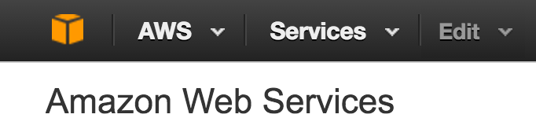

  

**VPC** Click `VPC`:

  

Click `Start VPC Wizard`:

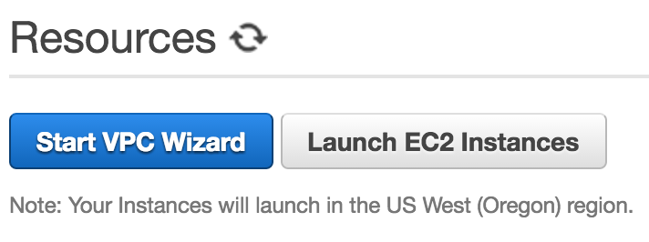

   The defaults are fine so click `Select`:

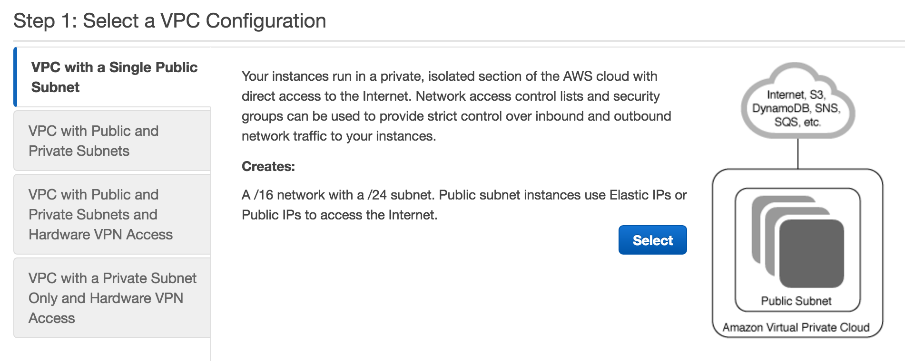

   Enter a `VPC` name and choose an availability zone. Finally, in
the bottom right, click `Create VPC`:

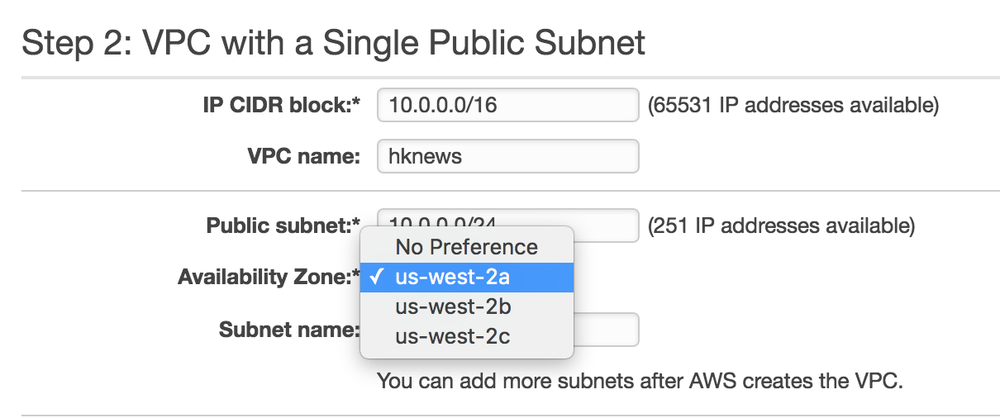

   **EC2**

Now let's set up our EC2 instance. Click the orange cube in the upper
left corner and select `EC2`:

   Choose `Launch Instance`:

   In `Step 1: Choose an Amazon Machine Image (AMI)` choose the
default instance:

   In `Step 3: Configure Instance Details` select the correct
`VPC` Network we just created, and enable `Auto-assign Public IP`:

   Click the `Review and Launch` button then the `Launch` button.
It will ask you to create a new key pair. It is a security file that
will live on your machine and is required to SSH into the instance. I
tend to create them and leave them in my downloads. Whatever you decided
to do, make sure you know where it is as you’ll need to pass a path to
it every time you want to connect to your instance. Create a new one,
check the acknowledgment box and download it to your local machine.

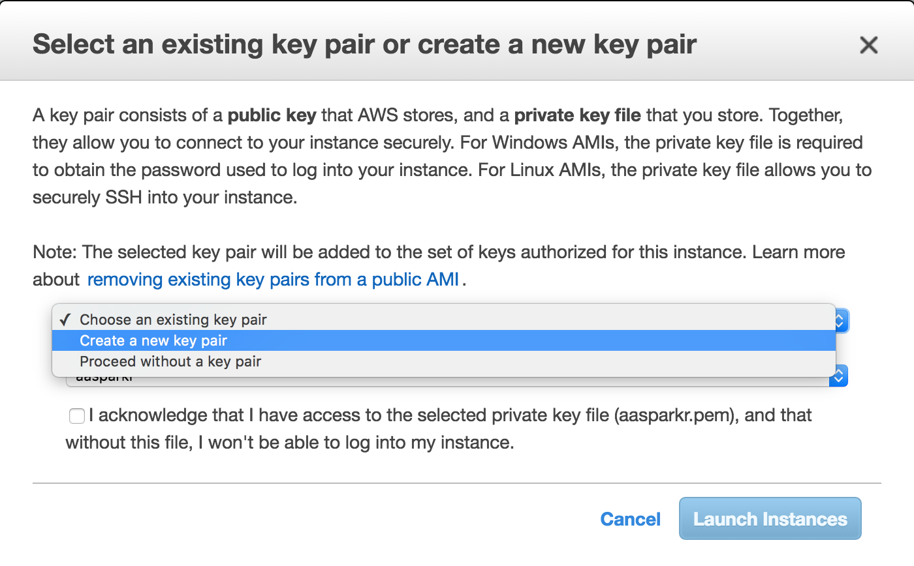

   ***Connect to your EC2 Instance***

Click the `View Instance` button or click the upper-left orange cube and
then `EC2`. There you should see your instance either running or
initializing.

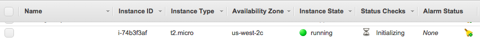

**Window Users**

If you're using windows, download
<a href='http://www.chiark.greenend.org.uk/~sgtatham/putty/download.html' target='_blank'>PuTTYgen
and PuTTY</a>.

Run `PuTTYgen`. Select load and choose your .pem file that you just
downloaded.

Save private key, in my case: `hknews.ppk` and remember its path.

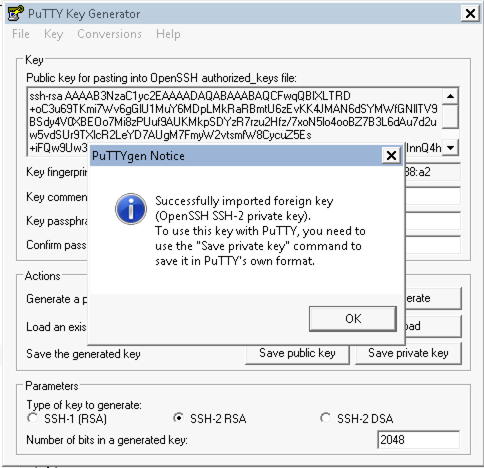

Now run `PuTTY`, and enter your instance public DNS in Host Name (in my
case: <ec2-user@ec2-54-246-27-243.eu-west-1.compute.amazonaws.com>) and
name you session hknews and hit save:

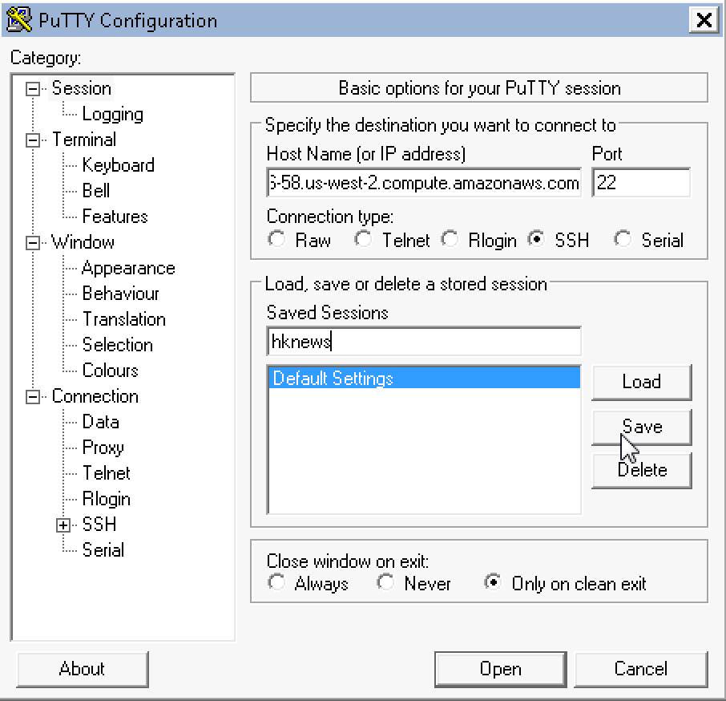

   Finally enter the .ppk file and path we created using PuTTYgen
under `SSH-Auth`:

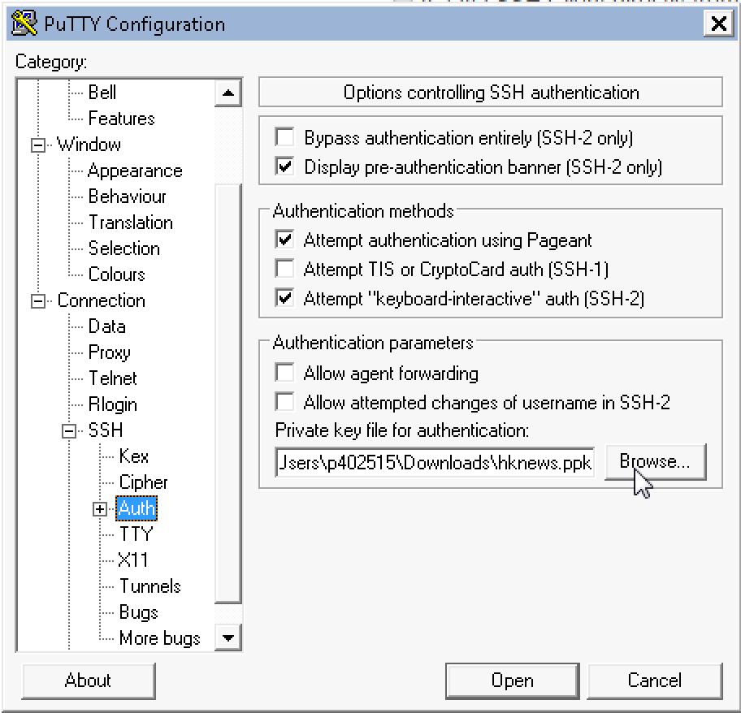

   Click `Open` and you will connect to your instance.   
**Mac/Linux Users**

In the AWS web console window, select your instance (check-box on left of
description) and click the ‘Connect’ button and copy the example line.
Copy the example line:

   Open a terminal window, navigate to the same folder where you
have your saved .pem file and paste the example ssh connection line:

   That's it, you're now connected to your instance!   
***Loading Software on our Instance***

Whether you're connected using PuTTY or the terminal window, the rest of
the steps should be identical.

Install PostgreSQL:

    sudo yum install postgresql postgresql-server postgresql-devel postgresql-contrib postgresql-docs

Initialize and start PostgreSQL database:

    sudo service postgresql initdb
    sudo service postgresql start

Set the `postgres` user password. Remember what you choose as you'll
need it through out this project.

    sudo passwd postgres 

Log into the database:

    sudo su - postgres
    psql -U postgres

Create our `hacker-news` database:

    CREATE DATABASE hacker_news WITH OWNER postgres;

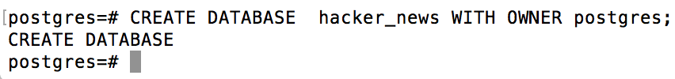

Connect to the `hacker_news` database:

    \c hacker_news

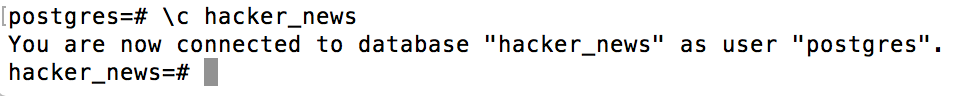

Run a test `INSERT` statement to verify that things are working. We'll
create a simple table named `ListOfNames`

    CREATE TABLE ListOfNames (first_name varchar(40), last_name varchar(40),  age int );

Now let's run the `\dt` command to list all avaiable tables in our
`hacker_news` database:

    \dt

One final test, let's insert a few names... myself and Bill Gates:

    INSERT INTO ListOfNames (first_name, last_name, age) VALUES ('Manuel', 'Amunategui', 48), ('Bill', 'Gates', 60);
    SELECT * FROM ListOfNames;

The `\q` command will get us out of PostgreSQL and `exit` will log us
back to the default `ec2-user` account:

    \q
    exit

We need to change the database access permissions in order to write to
it from our Python script. Edit the `pg_hba.conf` file:

    sudo vim /var/lib/pgsql9/data/pg_hba.conf

Around the end of the file (line 80), edit the following line so it says
`trust` instead of `peer`:

    local   all             all                                     trust

In order to 'edit' in `vim` you need to hit the `i` key to get in insert
mode. Make the edit then hit the escape key followed by colon and wq.
The colon gets you out of insert mode and `w` calls for saving your
changes and `q` to quit out of vim.

ESC : wq

Restart the PostgreSQL database:

    sudo service postgresql restart

Now let's add the needed Python libraries:

    sudo pip install pytz
    sudo yum -y install python-devel
    sudo yum -y install python-psycopg2
    sudo yum -y install libevent-devel
    sudo yum -y install gcc-c++
    sudo pip install psycopg2

   **Python Script**

We're going to make a few changes to Max Woolf's script
<a href='https://github.com/minimaxir/get-all-hacker-news-submissions-comments/blob/master/hacker_news_comments_all.py' target='_blank'>hacker\_news\_comments\_all.py</a>.
Because the script takes over 10 hours to collect all of Hacker News
comments, we need to remove all `print` statements so that it can run in
an unattended, background fashion.

So, open a vim window with the following command:

    sudo vim get-all-hacker-news-comments-background.py

Enter `insert` mode by hitting the escape key followed by `i` and paste
the following code in vim:

    ###
    import urllib2
    import json
    import datetime
    import time
    import pytz
    import psycopg2
    import re
    import HTMLParser

    ###
    ### Define database parameters here
    ###

    dbname = "hacker_news"
    user = "postgres"
    password = "testing" # swap with whatever password you used 

    # Set up database connection settings and other parameters

    ts = str(int(time.time()))
    hitsPerPage = 1000
    tag = re.compile(r'<[^>]+>')
    h = HTMLParser.HTMLParser()
    conn_string = "dbname=%s user=%s password=%s" % (dbname, user, password)
    db = psycopg2.connect(conn_string)
    cur = db.cursor()

    # Set up HN comment database table schema
    cur.execute("DROP TABLE IF EXISTS hn_comments;")
    cur.execute("CREATE TABLE hn_comments (objectID int PRIMARY KEY, story_id int, parent_id int, comment_text varchar, num_points int, author varchar, created_at timestamp);")

    num_processed = 0

    while True:
        try:
            # Retrieve HN comments from the Algolia API; finds all comments before timestamp of last known submission time
            url = 'https://hn.algolia.com/api/v1/search_by_date?tags=comment&hitsPerPage=%s&numericFilters=created_at_i<%s' % (hitsPerPage, ts)
            req = urllib2.Request(url)
            response = urllib2.urlopen(req)

            data = json.loads(response.read())
            comments = data['hits']
            ts = comments[-1 + len(comments)]['created_at_i']

            for comment in comments:

                # if a comment does *not* have a parent_id key, it's definitely [dead] and should not be recorded
                if 'parent_id' in comment.keys():

                    # make sure we remove smartquotes/HTML tags/other unicode from comment text
                    comment_text = tag.sub(' ', h.unescape(comment['comment_text'])).translate(dict.fromkeys([0x201c, 0x201d, 0x2011, 0x2013, 0x2014, 0x2018, 0x2019, 0x2026, 0x2032])).encode('utf-8')

                    # EST timestamp since USA activity reflects majority of HN activity
                    created_at = datetime.datetime.fromtimestamp(int(comment['created_at_i']), tz=pytz.timezone('America/New_York')).strftime('%Y-%m-%d %H:%M:%S')

                    parent_id = None if comment['parent_id'] is None else int(comment['parent_id'])
                    story_id = None if comment['story_id'] is None else int(comment['story_id'])

                    SQL = "INSERT INTO hn_comments (objectID, story_id, parent_id, comment_text, num_points, author, created_at) VALUES (%s,%s,%s,%s,%s,%s,%s)"
                    insert_data = (int(comment['objectID']), story_id, parent_id, comment_text, comment['points'], comment['author'], created_at,)

                    try:
                        cur.execute(SQL, insert_data)
                        db.commit()

                    except Exception, e:
                        # print insert_data
                        # print e
                        continue

            # If there are no more HN comments, we're done!
            if (data["nbHits"] < hitsPerPage):
                break

            num_processed += hitsPerPage

            # make sure we stay within API limits
            time.sleep(3600/10000)

        except Exception, e:
            # print e
            continue

    # Create sensible indices and vacuum the inserted data
    cur.execute('CREATE UNIQUE INDEX objectID_commentx ON hn_comments (objectID);')
    cur.execute('CREATE INDEX created_at_commentx ON hn_comments (created_at);')
    cur.execute('CREATE INDEX story_id_commentx ON hn_comments (story_id);')
    db.commit()

    db.set_isolation_level(0)
    cur.execute('VACUUM ANALYZE hn_comments;')
    db.close()

Save your script by hitting the escape key, followed by `:wq`:

You can also check that your script is working:

    python get-all-hacker-news-comments-background.py

Let it run for a short while and hit `ctrl-c` to break out of it. Then
go to PostgreSQL to verify that your table and some data did indeed get
written to the `hn_comments` table:

    sudo su - postgres
    psql -U postgres
    \c hacker_news
    \dt

  

If you see both tables, then things are looking good. Let's take a peek
at some of the comments:

    SELECT count(*) FROM hn_comments;
    SELECT comment_text FROM hn_comments limit 1;
    \q
    exit

**Running the Script in Background Mode** Now that we confirmed
everything is working, let's fire up the script on a background process
so that we can safely close the PuTTY/Terminal window:

    nohup python get-all-hacker-news-comments-background.py &

Before closing the terminal window (you can leave it open if you want),
let's make sure we're getting collecting data:

    sudo su - postgres
    psql -U postgres
    \c hacker_news
    SELECT count(*) FROM hn_comments;

   

***Some Analysis on Hacker News Comments***

I ran it overnight and it ended after collecting some 9.5 million comments. 
 
    sudo su - postgres
    psql -U postgres
    \c hacker_news
    SELECT count(*) FROM hn_comments;

    count  
    ---------
     9507873
    (1 row)

So, what is the date range of the data?

    SELECT MIN(created_at), MAX(created_at) FROM hn_comments;

  

Let's run <a href='https://github.com/minimaxir/get-all-hacker-news-submissions-comments' target='_blank'>the example</a> that Max shares on his GitHub repo for table ``hn_comments``.

    SELECT nth_comment, COUNT(num_points) AS users_who_made_num_comments, AVG(num_points) AS avg_points FROM (SELECT num_points, ROW_NUMBER() OVER (PARTITION BY author ORDER BY created_at ASC) AS nth_comment FROM hn_comments WHERE num_points IS NOT NULL) AS foo WHERE nth_comment <= 25 GROUP BY nth_comment ORDER BY nth_comment;

  

**Exporting it to a text file**

It is easy to export a PostgreSQL query to text. First we need to create a directory with the appropriate permission to receive the data:

    \q
    exit
    cd ../../tmp/
    mkdir hacker-news
    cd ..
    sudo chmod -R 777 /tmp/

Now we go back to PostgreSQL and use the <a href='https://www.postgresql.org/docs/9.3/static/sql-copy.html' target='_blank'>\copy</a> command on a SQL query. For example, let's get 500 comments saved to text:

    sudo su - postgres
    psql -U postgres
    \c hacker_news
    \copy (Select comment_text from hn_comments limit 500) To '/tmp/hacker-news/hn_comments.txt'  

  
**EC2 – to local machine**

Downloading the file to your local machine is very easy using either <a href='https://en.wikipedia.org/wiki/Cyberduck  target='_blank'>Cyberduck</a> or <a href='https://filezilla-project.org/' target='_blank'>FileZilla</a>. I hear great things for either package and both work on Mac or Windows. I will demo <a href='http://cyberduck.en.softonic.com/mac' target='_blank'>Cyberduck</a> for the Mac.

Select ``SFTP``, enter the ``DNS`` server name of your instance, the user name ``ec2-user`` and click ``Connect``.

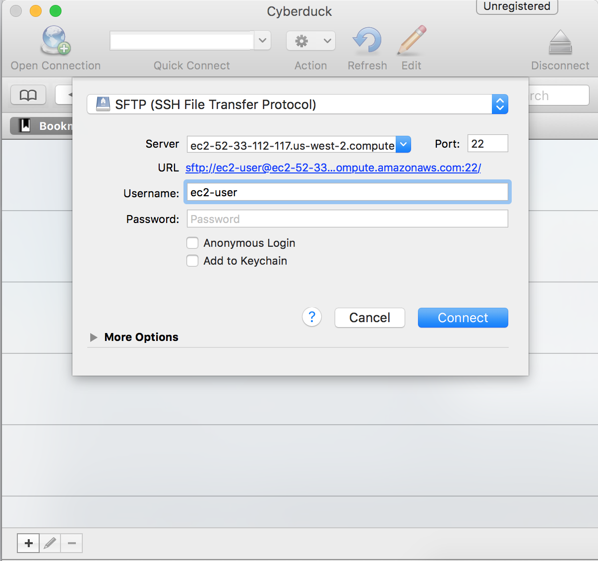

  

It will come back with a ``Login failed`` message, simply check the ``Use Public Key Authentication`` and browse to your ``.pem`` file.

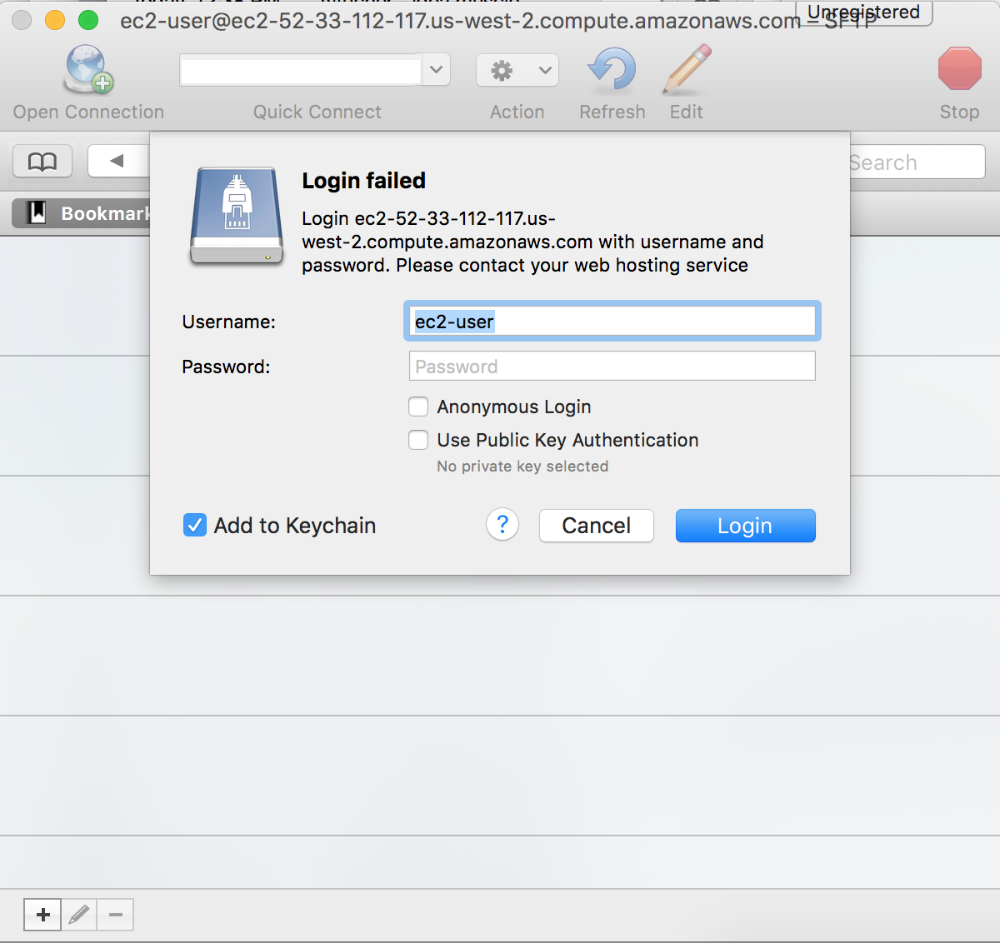

  

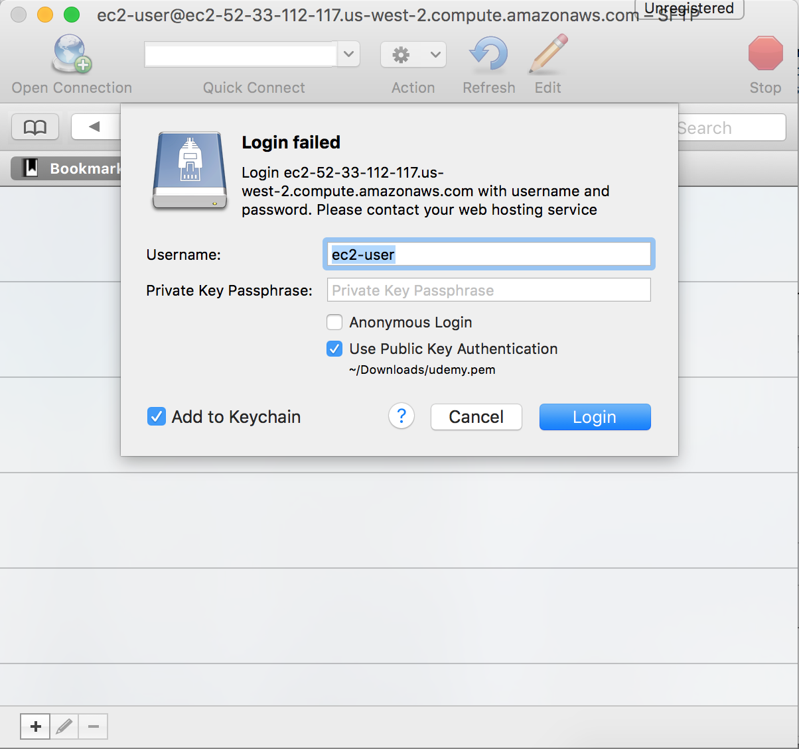

  

Click ``Login`` and you should be able to see your instance's directory. 

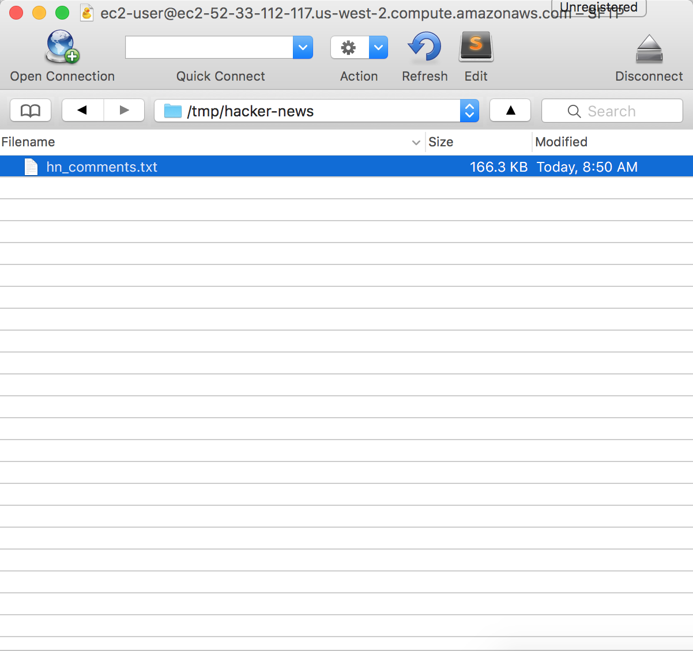

  

Double-click on the file and it will download it to your local directory.

  
**Moving Files from EC2 to local machine or S3**

A method I use a lot is to move my data to an Amazon S3 bucket. You can then make that file public and access it from anywhere via a URL or keep it private and mount the drive using your authenthetication crdentials.

  

The following command will allow you to push your EC2 data into your bucket marked as public (<a href='http://docs.aws.amazon.com/cli/latest/userguide/using-s3-commands.html' target='_blank'>a more complete view of S3 commands</a>). 

Navigate to the folder where you have the file you want to transfer, append your AWS access keys, the region of your instance (do not add the last letter of the region if it ends with and alphabetic character, and the bucket you want it in:

    AWS_ACCESS_KEY_ID=xxxx.. AWS_SECRET_ACCESS_KEY=xxxx... aws s3 cp --region us-west-2  hn_comments.txt s3://amunategui.bucket 
    upload: ./hn_comments.txt to s3://amunategui.bucket/hn_comments.txt

Once in ``S3``, you can make the file public, get the ``URL``, and simple you R, Python, whatever language and access the data that way.

  
***Hacker News/Firebase API***

Hacker News partnered with <a href='https://firebase.google.com/' target='_blank'>Firebase</a> to offer a web served <a href='https://github.com/HackerNews/API' target='_blank'>Hacker News API</a>. They describe it as follows: 

<blockquote>'The v0 API is essentially a dump of our in-memory data structures'</blockquote>

It is simple but it is your job to figure out what was returned. It is a global and incremental ID for any data event. The returned data could be a link to an article, a comment or a deletion. You also need to figure to whom this data event belongs to.

For example, you can retrieve the last/max ID by pasting the following line in your browser: ``https://hacker-news.firebaseio.com/v0/maxitem.json?print=pretty``

  
This ID represents the last data event on Hacker News. Here is a Python way to access the last ID:

    # max item posting
    import requests
    import json
    max_number = requests.get("https://hacker-news.firebaseio.com/v0/maxitem.json?print=pretty")
    last_ID = int(max_number.text)
    print(last_ID)

    >>> last_ID
    12154781

And to see what the ID contains, enter the following in your browser: ``https://hacker-news.firebaseio.com/v0/item/12154781.json?print=pretty``

    {
      "by" : "aexaey",
      "id" : 12154781,
      "parent" : 12154612,
      "text" : "Why can&#x27;t I? For the purpose of this argument, Windows and Mac keyboards aren&#x27;t all that different. See for yourself - modern mac keyboards have two layouts:
- Full &#x2F; 105-key layout, which is a copy of Windows 105-key layout with renamed and re-shuffled lower row, featuring: control, option(alt), command(win), space, command, option, control; [1]
- Compact (laptop &#x2F; magic), where lower row has: fn, control, option(alt), command(win), space, command option; [2]
Other (Windows) layouts of the bottom row:
- Full&#x2F;Desktop 105-key: Ctrl, Win, Alt, Space, Alt, Win, Menu, Ctrl;
- Lenovo laptop: Fn, Ctrl, Win, Alt, Space, Alt, Win[4]. Ctlr; [3]
- Dell laptop: Ctrl, Fn, Win, Alt, Space, Alt, Ctrl. [5]
...etc.
Now, <i>this</i> is ridiculous.
So my point is: sure, there are (ad-hoc) standards, but way too many of them, and all of them try to pack too many keys around core QWERTY field, especially lower row. Chromebook is the first one on record to prune this and offer a clean, usable layout.
[1] <a href=\"http:&#x2F;&#x2F;www.apple.com&#x2F;shop&#x2F;product&#x2F;MB110LL&#x2F;B&#x2F;apple-keyboard-with-numeric-keypad-english-usa\" rel=\"nofollow\">http:&#x2F;&#x2F;www.apple.com&#x2F;shop&#x2F;product&#x2F;MB110LL&#x2F;B&#x2F;apple-keyboard-w...</a>
[2] <a href=\"http:&#x2F;&#x2F;www.apple.com&#x2F;shop&#x2F;product&#x2F;MLA22LL&#x2F;A&#x2F;magic-keyboard-us-english\" rel=\"nofollow\">http:&#x2F;&#x2F;www.apple.com&#x2F;shop&#x2F;product&#x2F;MLA22LL&#x2F;A&#x2F;magic-keyboard-u...</a>
[3] <a href=\"http:&#x2F;&#x2F;www.lenovo.com&#x2F;images&#x2F;gallery&#x2F;main&#x2F;lenovo-convertible-tablet-thinkPad-helix-keyboard-view-9.jpg\" rel=\"nofollow\">http:&#x2F;&#x2F;www.lenovo.com&#x2F;images&#x2F;gallery&#x2F;main&#x2F;lenovo-convertible...</a>
[4] On some models, PrintScreen takes place of second Win key
[5] <a href=\"http:&#x2F;&#x2F;kbimg.dell.com&#x2F;library&#x2F;KB&#x2F;DELL_ORGANIZATIONAL_GROUPS&#x2F;DELL_GLOBAL&#x2F;Content%20Team&#x2F;5450_5250_kybd.JPG\" rel=\"nofollow\">http:&#x2F;&#x2F;kbimg.dell.com&#x2F;library&#x2F;KB&#x2F;DELL_ORGANIZATIONAL_GROUPS&#x2F;...</a>",
      "time" : 1469392810,
      "type" : "comment"
    }

  
Now that we have this ``ID``, let's see what is attached to it:

    >>> entry = requests.get("https://hacker-news.firebaseio.com/v0/item/" + str(last_ID) + ".json?print=pretty")

    >>> entry.json()
    {u'parent': 12154612, u'text': u'Not sure what would you consider being conflated. Modern mac keyboards have two layouts:
- Full &#x2F; 105-key layout with lower row featuring control, option(alt), command(win), space, command, option, control; [1]
- Compact (laptop &#x2F; magic), lower row has: fn, control, option(alt), command(win), space, command option; [2]
Other (Windows) layouts of the bottom row:
- Full&#x2F;Desktop 105-key: Ctrl, Win, Alt, Space, Alt, Win, Menu, Ctrl;
- Lenovo laptop: Fn, Ctrl, Win, Alt, Space, Alt, Win[4]. Ctlr; [3]
- Dell laptop: Ctrl, Fn, Win, Alt, Space, Alt, Ctrl. [5]
...etc.
So my point is: sure, there are standards, but way too many of them, and all of them try to pack way to many keys around core QWERTY field, especially lower row. Chromebook is the first one on record to prune this and offer a clean, usable layout.
[1] <a href="http:&#x2F;&#x2F;www.apple.com&#x2F;shop&#x2F;product&#x2F;MB110LL&#x2F;B&#x2F;apple-keyboard-with-numeric-keypad-english-usa" rel="nofollow">http:&#x2F;&#x2F;www.apple.com&#x2F;shop&#x2F;product&#x2F;MB110LL&#x2F;B&#x2F;apple-keyboard-w...</a>
[2] <a href="http:&#x2F;&#x2F;www.apple.com&#x2F;shop&#x2F;product&#x2F;MLA22LL&#x2F;A&#x2F;magic-keyboard-us-english" rel="nofollow">http:&#x2F;&#x2F;www.apple.com&#x2F;shop&#x2F;product&#x2F;MLA22LL&#x2F;A&#x2F;magic-keyboard-u...</a>
[3] <a href="http:&#x2F;&#x2F;www.lenovo.com&#x2F;images&#x2F;gallery&#x2F;main&#x2F;lenovo-convertible-tablet-thinkPad-helix-keyboard-view-9.jpg" rel="nofollow">http:&#x2F;&#x2F;www.lenovo.com&#x2F;images&#x2F;gallery&#x2F;main&#x2F;lenovo-convertible...</a>
[4] On some models, PrintScreen.
[5] <a href="http:&#x2F;&#x2F;kbimg.dell.com&#x2F;library&#x2F;KB&#x2F;DELL_ORGANIZATIONAL_GROUPS&#x2F;DELL_GLOBAL&#x2F;Content%20Team&#x2F;5450_5250_kybd.JPG" rel="nofollow">http:&#x2F;&#x2F;kbimg.dell.com&#x2F;library&#x2F;KB&#x2F;DELL_ORGANIZATIONAL_GROUPS&#x2F;...</a>', u'id': 12154781, u'time': 1469392810, u'type': u'comment', u'by': u'aexaey'}

  
What are the keys return by our ``JSON`` query?

    >>> entry.json().keys()
    [u'parent', u'text', u'id', u'time', u'type', u'by']

  
Let's find out the ``type``:

    >>> entry.json()['type']
    u'comment'

  
What's the parent ``ID``:

    >>> entry.json()['parent']
    >>> entry = requests.get("https://hacker-news.firebaseio.com/v0/item/12154612.json?print=pretty")
    >>> entry.json()['type']
    >>> entry.json()['text']

  
Work your way up to the story?

    >>> entry.json()['type']
    u'story'

  
To the a list of the top stories (i.e. what you see on the landing page of https://news.ycombinator.com/): ``https://hacker-news.firebaseio.com/v0/topstories.json?print=pretty``

   
Big thanks to Lucas for the "Big Data Surveillance" artwork!

