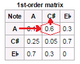

 

  

A
<a href='https://en.wikipedia.org/wiki/Andrey_Markov' target='_blank'>Markov
Chain</a> offers a probabilistic approach in predicting the likelihood
of an event based on previous behavior
(<a href='http://setosa.io/blog/2014/07/26/markov-chains/' target='_blank'>learn
more about Markov Chains here</a>).

 
<H2>
Past Performance is no Guarantee of Future Results
</H2>
If you want to experiment whether the stock market is influence by
previous market events, then a Markov model is a perfect experimental
tool.

We'll be using Pranab Ghosh's methodology described in
<a href='https://pkghosh.wordpress.com/2015/07/06/customer-conversion-prediction-with-markov-chain-classifier/' target='_blank'>Customer
Conversion Prediction with Markov Chain Classifier</a>. Even though he
applies it to customer conversion and I apply it to the stock market,
the point is that it doesn't matter where it comes from as long as you
can collect enough sequences, even of varying lengths, to find patterns
in past behavior.

Some notes: this is just my interpretation using the R language as
Pranab uses pseudo code along with a Github repository with Java
examples. I hope a am at least capturing his high-level vision as I did
take plenty of low-level programming liberties. And, for my fine print,
this is only for entertainment and shouldn't be construed as financial
nor trading advice.

 
<H2>
Cataloging Patterns Using S&P 500 Market Data
</H2>
In its raw form, 10 years of S&P 500 index data represents only one
sequence of many events leading to the last quoted price. In order to
get more sequences and, more importantly, get a better understanding of
the market's behavior, we need to break up the data into many samples of
sequences leading to different price patterns. This way we can build a
fairly rich catalog of market behaviors and attempt to match them with
future patterns to predict future outcomes. For example, below are three
sets of consecutive S&P 500 price closes. They represent different
periods and contain varying amounts of prices. Think of each of these
sequences as a pattern leading to a final price expression. Let's look
at some examples:

<b>2012-10-18 to 2012-11-21</b>

1417.26 --\> 1428.39 --\> 1394.53 --\> 1377.51 --\> <b>1379.85 --\>
1380.03</b> (<i>final price higher than previous price</i>)

<b>2016-08-12 to 2016-08-22</b>

2184.05 --\> 2190.15 --\> 2178.15 --\> 2182.22 --\> 2187.02 --\>
<b>2183.87 --\> 2182.64</b> (<i>final price lower than previous
price</i>)

<b>2014-04-04 to 2014-04-10</b>

1865.09 --\> 1845.04 --\> <b>1872.18 --\> 1833.08</b> (<i>final price
lower than previous price</i>)

Take the last example, imagine that past three days of the current
market match historical behaviors of day 1, 2 and 3. You now have a
pattern that matches current market conditions and can use the future
price (day 4) as an indicator for tomorrow's market direction (i.e.
market going down). This obviously isn't using any of Markov's ideas and
is just predicting future behavior on the basis of an up-down-up market
pattern.

If you collect thousands and thousands of these sequences, you can build
a rich catalog of S&P 500 market behavior. We won't just compare the
closing prices, we'll also compare the day's open versus the day's
close, the previous day's high to the current high, the previous day's
low to the current low, the previous day's volume to the current one,
etc (this will become clearer as we work through the code).

 
<H2>
Binning Values Into 3 Buckets
</H2>
An important twist in Pranab Ghosh's approach is to simplify each event
within a sequence into a single feature. He splits the value into 3
groups - Low, Medium, High. The simplification of the event into three
bins will facilitate the subsequent matching between other sequence
events and, hopefully, capture the story so it can be used to predict
future behavior.

To better generalize stock market data, for example, we can collect the
percent difference between one day's price and the previous day's. Once
we have collected all of them, we can bin them into three groups of
equal frequency using the
<a href='https://cran.r-project.org/web/packages/infotheo/index.html' target='_blank'>InfoTheo</a>
package. The small group is assigned 'L', the medium group, 'M' and the
large, 'H'.

Here are 6 percentage differences between one close and the previous
one:

     -0.00061281019 -0.00285190466  0.00266118835  0.00232492640  0.00530862595  0.00512213970

Using equal-frequency binning we can translate the above numbers into:

     "M" "L" "M" "M" "H" "H"

 
<H2>
Combining Event Features into a Single Event Feature
</H2>
You then paste all the features for a particular event into a single
feature. If we are looking at the percentage difference between closes,
opens, highs, lows, we'll end up with a feature containing four letters.
Each representing the bin for that particular feature:

     "MLHL"

Then we string all the feature events for the sequence and end up with
something like this along with the observed outcome:

     "HMLL" "MHHL" "LLLH" "HMMM" "HHHL" "HHHH" --> Price Up

 
<H2>
Creating Two Markov Chains, One for Days with Volume Jumps, and another
for Volume Drops
</H2>
Another twist in Pranab Ghosh's approach is to separate sequences of
events into separate data sets based on the outcome. As we are
predicting volume changes, one data set will contain sequences of volume
increases and another, decreases. This enables each data set to offer a
probability of a directional volume move and the largest probability,
wins.

 
<H2>
First-Order Transition Matrix
</H2>
A
<a href='http://techeffigytutorials.blogspot.com/2015/01/markov-chains-explained.html' target='_blank'>transition
matrix</a> is the probability matrix from the Markov Chain. In its
simplest form, you read it by choosing the current event on the y axis
and look for the probability of the next event off the x axis. In the
below image from
<a href='https://en.wikipedia.org/wiki/Markov_chain#Music' target='_blank'>Wikipedia</a>,
you see that the highest probability for the next note after `A` is
`C#`.

   In our case, we will analyze each event in a sequence and
catalog the market behavior. We then tally all the moves

we will have two probability matrices of volume action, one for up moves
and another for down moves. We then match each move

 
<H2>
Predicting Stock Market Behavior
</H2>
And now for the final piece you've all waited for - let's turn this
thing on and see how well it predicts stock market behavior. We

    #install.packages('quantmod)
    library(quantmod)
    #install.packages('dplyr)
    library(dplyr)
    #install.packages('infotheo)
    library(infotheo)

    # get market data
    getSymbols(c("^GSPC"))
    head(GSPC)
    tail(GSPC)
    plot(GSPC$GSPC.Volume)

    # transfer market data to a simple data frame
    GSPC <- data.frame(GSPC)

    # extract the date row name into a date column
    GSPC$Close.Date <- row.names(GSPC)

    # take random sets of sequential rows 
    new_set <- c()
    for (row_set in seq(10000)) {
         row_quant <- sample(10:15, 1)
         print(row_quant)
         row_start <- sample(1:(nrow(GSPC) - row_quant), 1)
         market_subset <- GSPC[row_start:(row_start + row_quant),]
         market_subset <- dplyr::mutate(market_subset, 
                                        Close_Date = max(market_subset$Close.Date),
                                        Close_Gap=(GSPC.Close - lag(GSPC.Close))/lag(GSPC.Close) ,
                                        High_Gap=(GSPC.High - lag(GSPC.High))/lag(GSPC.High) ,
                                        Low_Gap=(GSPC.Low - lag(GSPC.Low))/lag(GSPC.Low),
                                        Volume_Gap=(GSPC.Volume - lag(GSPC.Volume))/lag(GSPC.Volume),
                                        Daily_Change=(GSPC.Close - GSPC.Open)/GSPC.Open,
                                        Outcome_Next_Day_Direction= (lead(GSPC.Volume)-GSPC.Volume)) %>%
              dplyr::select(-GSPC.Open, -GSPC.High, -GSPC.Low, -GSPC.Close, -GSPC.Volume, -GSPC.Adjusted, -Close.Date) %>%
              na.omit
         market_subset$ID <- row_set
         new_set <- rbind(new_set, market_subset)
    }

    dim(new_set)

    new_set_bak -> new_set
    dim(new_set_bak)
    # only  keep big moves
    summary(new_set$Outcome_Next_Day_Direction)
     

    # create sequences
    # simplify the data by binning values into three groups
    # 
    # # High_Gap
    # range(new_set$High_Gap)
    # data_dicretized <- discretize(new_set$High_Gap, disc="equalfreq", nbins=3)
    # new_set$High_Gap <- data_dicretized$X
    # new_set$High_Gap_LMH <- ifelse(new_set$High_Gap == 1, 'L', 
    #                                ifelse(new_set$High_Gap ==2, 'M','H'))
    # 
    # # Low_Gap
    # range(new_set$Low_Gap)
    # data_dicretized <- discretize(new_set$Low_Gap, disc="equalfreq", nbins=3)
    # new_set$Low_Gap <- data_dicretized$X
    # new_set$Low_Gap_LMH <- ifelse(new_set$Low_Gap == 1, 'L', 
    #                               ifelse(new_set$Low_Gap ==2, 'M','H'))

    # Close_Gap
    range(new_set$Close_Gap)
    data_dicretized <- discretize(new_set$Close_Gap, disc="equalfreq", nbins=3)
    new_set$Close_Gap <- data_dicretized$X
    new_set$Close_Gap_LMH <- ifelse(new_set$Close_Gap == 1, 'L', 
                                    ifelse(new_set$Close_Gap ==2, 'M','H'))

    # Volume_Gap
    range(new_set$Volume_Gap)
    data_dicretized <- discretize(new_set$Volume_Gap, disc="equalfreq", nbins=3)
    new_set$Volume_Gap <- data_dicretized$X
    new_set$Volume_Gap_LMH <- ifelse(new_set$Volume_Gap == 1, 'L', 
                                     ifelse(new_set$Volume_Gap ==2, 'M','H'))

    # Daily_Change
    range(new_set$Daily_Change)
    data_dicretized <- discretize(new_set$Daily_Change, disc="equalfreq", nbins=3)
    new_set$Daily_Change <- data_dicretized$X
    new_set$Daily_Change_LMH <- ifelse(new_set$Daily_Change == 1, 'L', 
                                       ifelse(new_set$Daily_Change ==2, 'M','H'))

    # new set
    new_set <- new_set[,c("ID", "Close_Date", "Close_Gap_LMH", "Volume_Gap_LMH", "Daily_Change_LMH", "Outcome_Next_Day_Direction")]

    new_set$Event_Pattern <- paste0(new_set$Close_Gap_LMH,      
                                    new_set$Low_Gap_LMH,
                                    new_set$High_Gap_LMH,
                                    new_set$Volume_Gap_LMH, 
                                    new_set$Daily_Change_LMH) 

    # reduce set 
    compressed_set <- dplyr::group_by(new_set, ID, Close_Date) %>%
         dplyr::summarize(Event_Pattern = paste(Event_Pattern, collapse = ",")) %>%
         data.frame
    compressed_set <- merge(x=compressed_set,y=dplyr::select(new_set, ID, Outcome_Next_Day_Direction) %>%
                                 dplyr::group_by(ID) %>% 
                                 dplyr::slice(n()) %>%
                                 dplyr::distinct(ID), by='ID')

    # use last x days of data for validation
    library(dplyr)
    compressed_set_validation <- dplyr::filter(compressed_set, Close_Date >= Sys.Date()-120)
    dim(compressed_set_validation)
    compressed_set <- dplyr::filter(compressed_set, Close_Date < Sys.Date()-120)
    dim(compressed_set)

    compressed_set <- dplyr::select(compressed_set, -Close_Date)
    compressed_set_validation <- dplyr::select(compressed_set_validation, -Close_Date)

    # only keep big moves
    summary(compressed_set$Outcome_Next_Day_Direction)
    compressed_set <- compressed_set[abs(compressed_set$Outcome_Next_Day_Direction) > 5260500,]
    compressed_set$Outcome_Next_Day_Direction <- ifelse(compressed_set$Outcome_Next_Day_Direction > 0, 1, 0)
    summary(compressed_set$Outcome_Next_Day_Direction)
    dim(compressed_set)
    compressed_set_validation$Outcome_Next_Day_Direction <- ifelse(compressed_set_validation$Outcome_Next_Day_Direction > 0, 1, 0)

    # create two data sets - won/not won
    compressed_set_pos <- dplyr::filter(compressed_set, Outcome_Next_Day_Direction==1) %>% dplyr::select(-Outcome_Next_Day_Direction)
    dim(compressed_set_pos)
    compressed_set_neg <- dplyr::filter(compressed_set, Outcome_Next_Day_Direction==0) %>% dplyr::select(-Outcome_Next_Day_Direction)
    dim(compressed_set_neg)

    # build the markov transition grid
    build_grid <- function(compressed_grid, unique_patterns) {
         grids <- c()
         for (from_event in unique_patterns) {
              print(from_event)
              
              # how many times 
              for (to_event in unique_patterns) {
                   pattern <- paste0(from_event, ',', to_event)
                   OpportunityIds_matches <- compressed_grid[grep(pattern, compressed_grid$Event_Pattern),]
                   if (nrow(OpportunityIds_matches) > 0) {
                        Event_Pattern <- paste0(OpportunityIds_matches$Event_Pattern, collapse = ',', sep='~~')
                        found <- gregexpr(pattern = pattern, text = Event_Pattern)[[1]]
                        grid <- c(pattern,  length(found))
                   } else {
                        grid <- c(pattern,  0)
                   }
                   grids <- rbind(grids, grid)
              }
         }
         
         # create to/from grid
         grid_Df <- data.frame(pairs=grids[,1], counts=grids[,2])
         grid_Df$x <- sapply(strsplit(as.character(grid_Df$pairs), ","), `[`, 1)
         grid_Df$y <- sapply(strsplit(as.character(grid_Df$pairs), ","), `[`, 2)
         head(grids)
         
         all_events_count <- length(unique_patterns)
         transition_matrix = t(matrix(as.numeric(as.character(grid_Df$counts)), ncol=all_events_count, nrow=all_events_count))
         transition_dataframe <- data.frame(transition_matrix)
         names(transition_dataframe) <- unique_patterns
         row.names(transition_dataframe) <- unique_patterns
         head(transition_dataframe)
         
         # replace all NaN with zeros
         transition_dataframe[is.na(transition_dataframe)] = 0
         # transition_dataframe <- opp_matrix
         transition_dataframe <- transition_dataframe/rowSums(transition_dataframe) 
         return (transition_dataframe)
    }
    unique_patterns <- unique(strsplit(x = paste0(compressed_set$Event_Pattern, collapse = ','), split = ',')[[1]])

    grid_pos <- build_grid(compressed_set_pos, unique_patterns)
    grid_neg <- build_grid(compressed_set_neg, unique_patterns)

    # predict on out of sample data
    actual = c()
    predicted = c()
    for (event_id in seq(nrow(compressed_set_validation))) {
         patterns <- strsplit(x = paste0(compressed_set_validation$Event_Pattern[event_id], collapse = ','), split = ',')[[1]]
         pos <- c()
         neg <- c()
         log_odds <- c()
         for (id in seq(length(patterns)-1)) {
              
              # logOdds = log(tp(i,j) / tn(i,j)
              log_value <- log(grid_pos[patterns[id],patterns[id+1]] / grid_neg[patterns[id],patterns[id+1]])
              if (is.na(log_value) || (length(log_value)==0) || (is.nan(log(grid_pos[patterns[id],patterns[id+1]] / grid_neg[patterns[id],patterns[id+1]]))==TRUE)) {
                   log_value <- 0.0
              } else if (log_value == -Inf) {
                   log_value <- log(0.00001 / grid_neg[patterns[id],patterns[id+1]])
              } else if (log_value == Inf) {
                   log_value <- log(grid_pos[patterns[id],patterns[id+1]] / 0.00001)
                   
              }
              log_odds <- c(log_odds, log_value)
              
              pos <- c(pos, grid_pos[patterns[id],patterns[id+1]])
              neg <- c(neg, grid_neg[patterns[id],patterns[id+1]])
         }
         print(paste('outcome:', compressed_set_validation$Outcome_Next_Day_Direction[event_id]))
         print(sum(pos)/sum(neg))
         print(sum(log_odds))
         
         actual <- c(actual, compressed_set_validation$Outcome_Next_Day_Direction[event_id])
         predicted <- c(predicted, sum(log_odds))
         
    }

    library(caret)
    result <- confusionMatrix(ifelse(predicted>0,1,0), actual)
    result 

 

     Confusion Matrix and Statistics
     
               Reference
     Prediction   0   1
              0  83  36
              1 110  98
                                               
                    Accuracy : 0.5535          
                      95% CI : (0.4978, 0.6082)
         No Information Rate : 0.5902          
         P-Value [Acc > NIR] : 0.9196          
                                               
                       Kappa : 0.1488          
      Mcnemar's Test P-Value : 1.527e-09       
                                               
                 Sensitivity : 0.4301          
                 Specificity : 0.7313          
              Pos Pred Value : 0.6975          
              Neg Pred Value : 0.4712          
                  Prevalence : 0.5902          
              Detection Rate : 0.2538          
        Detection Prevalence : 0.3639          
           Balanced Accuracy : 0.5807          
                                               
            'Positive' Class : 0  
            

 
<h2>
What To Try Next
</H2>
Adding more complex or simpler patterns into the sequence (symbol at
beginning of sequence versus end with differing weights). sequence
number sample size sample(5:10, 1)
